# Ascend 知识体系设计与实施手册

> 一份让 AI 助手（**本方案支持 Cursor 与 Claude Code**）在任何新会话里稳定"精通 Ascend 编程"的设计方案。
>
> 适用对象：个人或小团队，手上已有或将要获取三类资料——Ascend 官方文档、示例代码库、他人总结的 skill——希望把这些资料变成 AI 的持久能力，且不让上下文爆炸、不让成本失控。

---

## 1. 摘要（TL;DR）

- **问题**：怎么让 AI 精通 Ascend，且跨会话不丢、token 不爆、不大搜特搜？
- **核心判断**："精通 ≠ 知识量"；精通 = **给定任务时能在第一步就调用到正确的知识**。即"路由精度"比"知识总量"重要。
- **核心架构**：项目内单一真源（`<project>/.ai-knowledge/`）+ **六层分工**：
  - L1 常驻路由（路由表 + 硬约束 + 回答协议 + Wiki schema）
  - L2 按需 skill（方法论 / 工作流）
  - L3 外部检索（文档走**已有外部 RAG MCP**如 `user-local-rag-9.0_a5`；代码走**客户端原生代码搜索能力**（最低 `Grep` / `Glob` / `Read`，若有 `SemanticSearch` 则增强），本知识库不再建 RAG）
  - L4 速记卡片（cards-，命中即答，不触发 RAG）
  - L5 经验回写（episodic：FAQ / bug-note / recipe，越用越强）
  - **L6 Wiki 综合层（entity / concept / compare / topic，AI 持续维护、人读的"消化层"，跨源综合）**
- **token 预算**：每会话固定开销 3–5K，典型任务合计 20–30K（200K 窗口的 10–15%）；命中卡片或 wiki 综合页时甚至可降到 8–15K。
- **持久化**：一切资产文件化，全部放在**项目根下的 `.ai-knowledge/`**，与代码一起 git 版本化。没有用户级 / 全局级知识库的概念：跨项目要复用的资产靠**项目之间显式 `cp`**，不靠转发。重装电脑只需 `git clone` 项目即恢复项目能力。
- **活的知识系统**：不止摄入已有资料，三类动态运维同时存在——L5 **回写**会话经验（bug-note/recipe），L6 **ingest** 新材料到 wiki 综合页，L6 **lint** 周期性体检（找矛盾/孤立页/过期声明）。知识库随使用越用越强。
- **有度量**：带评测集（事实问答 / 代码任务 / 调试任务），回答协议强制"标明来源、版本意识、证据不足先问、知识问题 wiki 优先 / 仓内事实代码优先、证据不足先问"，防止"看起来很懂，其实在瞎编"。

### 1.1 整体架构一图

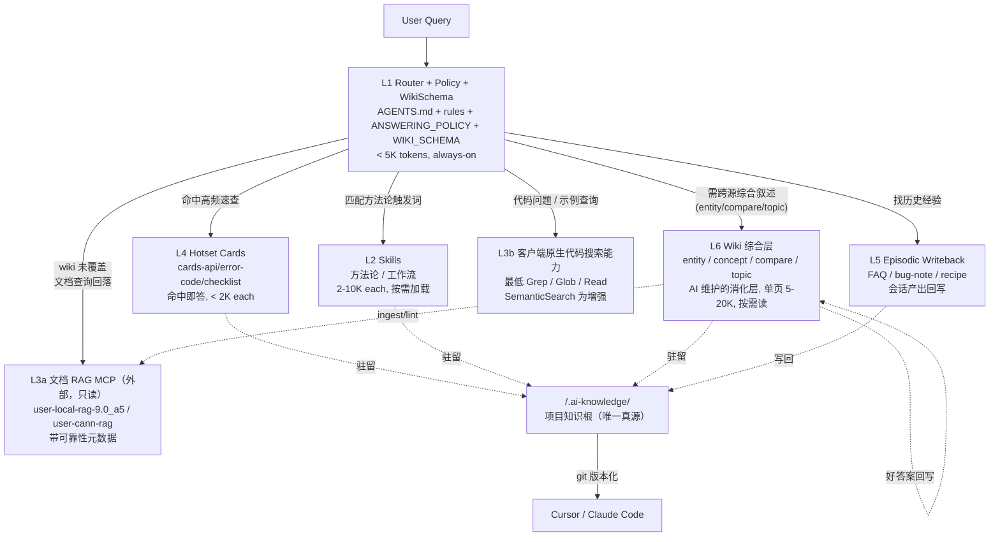

### 1.2 一次查询的实际流程（时序图）

上图回答"谁在哪"，这张图回答"发生顺序"——AI 收到一条用户查询时，各层按什么顺序被访问，何时回写。

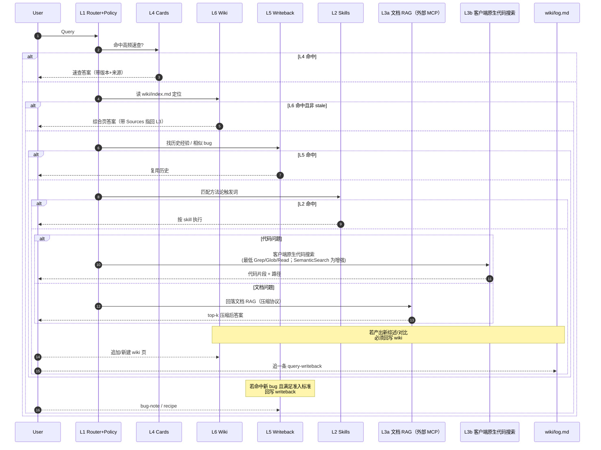

关键纪律：**L4 → L6 → L5 → L2 → L3a/L3b** 依次下钻，命中即止；**L3a 走外部文档 RAG MCP、L3b 走客户端原生代码搜索能力**，按"文档问题 / 代码问题"分流；**新产出的综述/对比回写 L6，新 bug/决策按准入标准回写 L5**，不回写高价值结论 = 资产流失。

---

## 2. 问题定义

要让 AI 真正"精通 Ascend 编程"，必须同时满足四个硬约束，缺一不可：


| 编号  | 硬约束          | 失败表现                              |
| --- | ------------ | --------------------------------- |
| C1  | 能力覆盖完整       | 只会写 kernel 不会调通信；或只知 API 签名不知调试流程 |
| C2  | 跨会话/重启/换平台不丢 | 新开 chat 后回到"小白"状态;换到 Claude 就失忆   |
| C3  | 上下文占用可控      | 启动就吃掉 50K tokens，实际工作空间压缩到一半      |
| C4  | 不大搜特搜        | 每次任务都尝试三个 MCP、读十个文件，延迟和成本飙升       |


"精通"不是某一个单点的强化，而是这四个约束的**联合解**。本文的整体方案就是围绕这个联合解来设计的。

### 为什么"直接把资料贴进系统提示"不行

- 官方文档动辄数百页，整篇灌入立即把上下文撑满。
- 系统提示一旦确定，后续难以按需加载，等同于"每会话都付全量税"。
- 系统提示在不同 AI 平台的载体不同（Cursor 的 rules、Claude 的 CLAUDE.md、Codex 的 AGENTS.md），硬写死一份无法跨平台。
- 无法版本化、无法回滚、无法 diff。

### 为什么"全靠 RAG 现场查"也不行

- 每次任务都至少 1 轮 RAG 查询，累积成本高。
- RAG 对"方法论/工作流"类知识命中率低（这类知识本就是结构化文本，不适合向量相似度）。
- 查询 query 本身需要经验——AI 不知道"查什么"的时候，RAG 再强也没用。

正确的方案必须是**分层的**：把不同形态的知识放在不同层、用不同机制加载。

---

## 3. 第一性原理：AI "精通" = 什么

> 一个大模型对某个领域"精通"，不是靠把所有资料塞进上下文，而是靠**在每个具体子任务上，都能在正确的时机调用正确的知识**。

这句话可以拆成六层，每层的技术手段和 token 经济学完全不同：


| 层               | token 成本 | 加载时机                | 典型单位容量               | 适合放的内容                                                    |
| --------------- | -------- | ------------------- | -------------------- | --------------------------------------------------------- |
| L1 常驻层          | 每轮都付     | 会话开始                | < 5K tokens 合计       | 路由表、硬约束、回答协议、Wiki schema、术语表                              |
| L2 按需层          | 触发才付     | 触发词匹配时加载            | 2–10K tokens / 单元    | 方法论、工作流、排障顺序                                              |
| **L3a 文档外挂层**   | 查询才付     | 显式调用**外部**文档 RAG MCP | 海量（GB 级，外部维护）       | 全文官方文档 / 白皮书（外部 RAG 维护，本知识库只引用，不建库）                 |
| **L3b 代码原生层**   | 查询才付     | 显式调用客户端原生代码搜索能力 | 海量（按 glob 搜）         | 代码库现场检索（最低 `Grep` / `Glob` / `Read`，若有 `SemanticSearch` 则增强），本知识库不建 Code RAG |
| L4 速记层          | 命中才付     | 路由判定高频主题时           | < 2K tokens / 卡片     | API 速查卡、错误码速查卡、checklist                                  |
| L5 经验层          | 回写/检索付   | 新问题解决后回写；下次类似问题优先命中 | < 1K tokens / 条目     | FAQ、bug-note、decision-record                              |
| **L6 Wiki 综合层** | **读单页付** | **需跨源叙述/对比/追溯时读**   | **5–20K tokens / 页** | **entity 页、concept 页、compare 对比页、topic 综合页（AI 维护的"消化层"）** |


**核心结论**：精通的关键不是让 AI "记住一切"，而是让它**在第一步就判断出该去 L4 的哪张卡片、L6 的哪个 wiki 页、L2 的哪个 skill、L3a 的哪个文档 RAG、L3b 该走哪种客户端原生工具、L5 的哪条历史经验**。这个"路由决策"本身必须廉价（几千 token 之内），决策之后的加载才按需付费。

这一路由精度的上限由四个因素决定：

1. **L1 路由表的质量**：能否把"任务 → 资源"的映射表达得足够清晰，让 AI 一眼命中？
2. **L2/L4 的 frontmatter 元数据**：每个单元的 description 字段是否精准地写清了"什么情况下触发我"？
3. **L3a 外部文档 RAG 的路由**：能否按 CANN 版本 / 产品线把查询分流到正确的 MCP（`user-local-rag-9.0_a5` / `user-cann-rag`）？
4. **L3b 代码检索的战术选择**：AI 是否知道"精确符号用 `Grep`，文件模式用 `Glob`，语义概念若客户端支持则用 `SemanticSearch`，否则走分组 `Grep` 收敛"？（详见第 10.3 节）
5. **L5 的回写闭环**：新经验是否被持续沉淀？没有回写，知识库只会老化不会成长。

做好这四点，整个体系的效率就立住了；做不好，无论资料多丰富，都是"知识富、决策穷"。

### 3.1 为什么要分出 L4（速记层）

L2 和 L4 看起来都是"小文件按需加载"，但**目标完全不同**：

- L2 回答"**怎么做**"：方法论、流程、排查顺序。典型长度 2–10K，读完要 AI 自己推理。
- L4 回答"**是什么**"：具体数值、签名、错误码映射、checklist 条目。典型长度 < 2K，读完直接出答案。

如果把速查内容塞进 L2 的 skill 正文，会发生两件坏事：

- skill 越长越杂，触发精度下降（AI 不确定到底该不该加载）
- 每次命中都付 2–10K 而不是 < 2K，浪费典型场景的 token

所以 **L4 是"命中即答、不经推理"的缓存层**，必须独立出来。

### 3.2 为什么要分出 L5（经验回写层）

L3 是"静态摄入"（把外部资料灌进知识库），L5 是"动态产出"（把每次会话解决的新问题沉淀成资产）。

如果没有 L5，知识库只会**老化**——上游文档更新、新踩的坑、团队摸索出的新套路都留在聊天记录里，聊天关掉就丢。L5 的回写闭环让知识库**随使用越用越强**，这是从"静态文档仓库"升级到"活的知识系统"的关键。

### 3.3 为什么要分出 L6（Wiki 综合层）

L2/L4/L5 都有自己特定形态的内容，唯独缺一种：**对一个主题跨越多份来源、多轮会话的"累积性综合叙述"**。这类内容不是方法论（L2）、不是速查（L4）、不是单次经验（L5），也不适合散落在聊天记录里重新 RAG 一次。

灵感来自 Karpathy 的"LLM Wiki"模式：**raw 文档是 immutable 的只读源，AI 维护一份结构化、互相链接的 md 集合作为"消化层"，每次新增材料都把要点整合进已有页面，而不是每次 query 都从原文重新拼接。**

翻译到我们的工程语境，L6 的四类页面正好解决工程团队常见的四种知识碎片：


| 页面类型         | 典型场景                                            | 例子                                                                          |
| ------------ | ----------------------------------------------- | --------------------------------------------------------------------------- |
| entity（实体页）  | 某一个 API / 芯片 / 算子组件被反复查到，每次查都要重新拼接官方文档 + 踩过的坑   | `wiki/api/DataCopy.md`、`wiki/chips/910B.md`、`wiki/ops/MatMulV3.md`          |
| concept（概念页） | 某个编程模型 / 原理被多份文档从不同角度讲，需要一份统一叙述                 | `wiki/concepts/pipeline-sync.md`、`wiki/concepts/shmem-programming-model.md` |
| compare（对比页） | 多种方案 / 算法 / 实现的 trade-off 对比，聊天里临时做一次就消失，下次又要重做 | `wiki/compare/allreduce-topologies.md`、`wiki/compare/mc2-vs-shmem.md`       |
| topic（综合页）   | 某一个大主题的全景综述，作为入门或回顾的"总览图"                       | `wiki/topics/mc2-overview.md`、`wiki/topics/tiling-design-landscape.md`      |


**与其他层的边界（必读，防止混淆）**：


| 层            | 回答的问题                | 形态                 | 谁写                          |
| ------------ | -------------------- | ------------------ | --------------------------- |
| L2 skill     | "怎么做"                | 方法论/工作流，2–10K      | 人初始化 + AI 增补                |
| L3a 文档 RAG  | "原文里怎么说的"            | **外部文档 RAG，本知识库只引用** | 外部（`user-local-rag-9.0_a5` 等维护者）|
| L3b 代码检索   | "代码里怎么写的"            | 客户端原生代码搜索，现场搜       | 无（不建索引，靠客户端能力）          |
| L4 card      | "是什么"                | 速查卡片，单 API/错误码，<2K | 人或 AI 预蒸馏                   |
| L5 writeback | "这次遇到啥了"             | 单次事件/bug/决策，<1K    | AI 会话结束时回写                  |
| **L6 wiki**  | **"为什么/来龙去脉/对比/证据"** | **综合叙述，5–20K/页**   | **AI 持续 ingest 新材料时整合进已有页** |


核心判别：**如果一个内容需要跨多份资料综合、且会随着新资料不断被更新**，就放 L6 wiki；如果是单源即可定死的速查，放 L4；如果是方法论步骤，放 L2；如果是一次会话的具体事件，放 L5。

---

## 4. 三类资料的天然归属

你常见的三类资料，各自有最适合的层级归属，不能随便乱放。


| 资料类型                             | 形态特征          | 天然归属层                           | 理由                                     |
| -------------------------------- | ------------- | ------------------------------- | -------------------------------------- |
| 官网文档（API 参考、教程、白皮书）              | 体量大、结构化、查询式   | **L3a（外部 RAG MCP）+ L4（热点 API 卡片）** | 本知识库**不再自建文档 RAG**，直接引用已有的 `user-local-rag-9.0_a5` / `user-cann-rag`；高频 API 做速查卡，低频走外部 RAG |
| 示例代码库（CANN samples、catlass、ops-） | 体量大、可运行、高度模式化 | **L3b（客户端原生代码搜索）+ L2（patterns- 模式提取）** | **不建 Code RAG**（业界共识，Cody 等已放弃对代码用向量检索）；现场用最低 `Grep` / `Glob` / `Read`，若有 `SemanticSearch` 则作为增强；复用模式提炼成 L2 patterns |
| 他人总结的 skill（方法论、checklist）       | 精炼、小、指导性      | L2（按需加载）+ L4（checklist 抽成卡片）    | 方法论进 skill；硬清单（一二三四五步）独立成 cards-       |
| 会话产出的新经验（bug 修复、踩坑记录）            | 零碎、具体、情境化     | L5（episodic）                    | 不沉淀就丢失；沉淀后下次类似问题优先命中                   |


这里最容易被忽视的是三件事：

- **代码的"双层检索"**：客户端原生代码搜索解决"怎么写的"；但"该用哪种套路"必须离线提炼成 patterns- skill（见第 10 章）。现场搜 + 沉淀模式，两件事都要做。
- **热点知识的"二次蒸馏"**：高频问到的 API 签名、错误码映射、环境 checklist 不要每次都 RAG 查，应该预蒸馏成 L4 卡片。
- **会话经验的"主动回写"**：每次解决新问题产出一条 L5 沉淀，否则知识库永远不会"越用越强"。

---

## 5. 核心辩证关系（权衡）

这个体系本质上是在 7 对相互制约的关系中寻找动态平衡。把这些权衡摆在台面上，有助于在后续实施和维护中不走偏。


| 关系对                  | 片面做法                                             | 统筹做法                                                               |
| -------------------- | ------------------------------------------------ | ------------------------------------------------------------------ |
| 能力全面 vs 上下文小         | 全塞进 L1 → 爆窗口；全放 L3 → 每次都搜                        | 六层分工：L1 只放路由和协议，L2 方法论，L3a 外部文档 RAG / L3b 代码原生检索按需付费，L4 高频卡片，L5 经验回写     |
| 持久化 vs 维护成本          | 写死在系统提示 → 无法更新；全靠人脑记 → 容易流失                      | 文件化 + 机器可读的目录结构 + git 版本化                                          |
| 精准 vs 速度             | 每次大搜特搜 → 慢且贵                                     | 多级缓存：L4 卡片 → L5 历史经验 → L2 skill → L3a 外部文档 RAG / L3b 代码原生检索           |
| 通用 vs 具体             | 抽象方法论无法落地；具体清单缺乏指导                               | 方法论 skill + 可执行 checklist 并存；硬清单独立为 cards-                         |
| 单 AI 跨会话 vs 多 AI 跨平台 | 绑定特定工具 → 换平台就失忆                                  | 用项目内文件系统做真源（Cursor + Claude Code 共用 AGENTS.md / CLAUDE.md / .cursor/rules）   |
| 通识 vs 项目特有           | 全塞外部共享库（污染、依赖外部状态）                              | 全放 `<project>/.ai-knowledge/`；跨项目复用靠**项目之间显式拷贝**，不靠共享机制     |
| 静态摄入 vs 动态产出         | 只往里灌，不沉淀会话产出 → 只会老化                              | L5 回写闭环：每次解决新问题产出 FAQ/bug-note/recipe                              |
| 原文检索 vs 综合叙述         | 每次 query 从 RAG 重新拼接 → 浪费、不累积；只写综合页不留原文 → 失真、不可追溯 | L3a 外部文档 RAG 保留 raw 原文（只读），L6 wiki 持续维护"消化层"综合页；wiki 页面总是带反向引用回 L3a 源     |


每一对关系都没有"最优解"，只有"当前阶段合理的平衡点"。例如 L1 的大小上限是 5K tokens 这个数字并非绝对——如果项目极简，3K 够用；如果要处理的子领域极多，可放宽到 8K，但再往上就得考虑拆分入口。

---

## 6. 架构总览：项目内 SSOT + 六层

### 6.1 单一真源：项目内 `.ai-knowledge/`

所有知识资产放在**项目根下的一个目录**，这是跨会话、跨平台、跨重启不丢失的根基，路径固定为：

```
<project>/.ai-knowledge/
```

这个目录是本项目**唯一**的知识真源：

- **没有"全局 / 用户级"知识库**。不存在 `~/ascend-knowledge/` 之类的共享结构，也不依赖 `~/.cursor/skills/` 之类的用户目录。
- **跨项目复用靠项目之间的显式 `cp`**：新项目要用老项目的某个 skill / card / wiki 页，就直接拷文件过来，随新项目的 git 独立演化，不做软链、不共享状态。
- **与代码一起 git 版本化**：任何人 `git clone` 下来就能用，不依赖本机 `$HOME` 状态。

### 6.2 六层分工的纪律

纪律有七条，必须写进 HARD_RULES.md 并让 AI 每次会话启动时读到：

1. **L1 永远只放路由表、硬约束、回答协议、Wiki schema**，严格 < 5K tokens。任何"方法论""工作流"都不应出现在 L1。
2. **L2 永远不整体加载**，AI 只读 `_INDEX.md` 做路由决策，命中才读具体 `SKILL.md` 正文。
3. **L3a 文档 RAG 是外部 MCP，本知识库不自建**——只通过已挂载的 MCP server（如 `user-local-rag-9.0_a5`、`user-cann-rag`）查询；查询结果必须经过 10.6 节压缩协议，不许原文透传。
4. **L3b 代码检索走客户端原生代码搜索能力**——最低保证是 `Grep` / `Glob` / `Read`，若客户端提供语义检索（如 Cursor `SemanticSearch`）则作为增强能力使用；**禁止自建 Code RAG**。用哪个工具的战术选择见第 10.4 节。
5. **L4 只在路由判定高频主题时加载**，且每张 < 2K tokens；同一会话里最多加载 2 张卡片。
6. **L5 只对可复用的新经验回写**：满足"根因非直觉 / 以后高概率再遇到 / 官方文档未明确 / 需要保留决策原因"之一才写入；不回写高噪声一次性事件。
7. **L6 Wiki 对知识问题优先于 L3a**——能从 wiki 综合页拿到答案就不再跑外部文档 RAG；wiki 未覆盖或用户明确要求溯源时才回落 L3a。**对仓内代码现状、当前实现、当前参数/行为的核查，代码优先于 wiki**：先查 L3b，再把 wiki 当背景资料。好的对比/综述答案必须回写 wiki，一次性聊天分析视为资产流失。
8. **`scripts/run-eval.sh` 可以先以 scaffold 形态存在，但至少要覆盖 wiki frontmatter 最小字段检查与 `wiki/index.md` 到目标页的死链检查。**

### 6.2.1 唯一路由决策表（权威版）

为避免不同章节各自表述造成执行漂移，路由顺序统一收敛为**先判问题类型，再走该类型的固定优先级**。除用户明确要求溯源原文或指定某一层外，一律按下表执行。

| 问题类型 | 识别信号 | 固定优先级 | 说明 |
| --- | --- | --- | --- |
| fact / 速查 | 签名、参数、错误码、硬清单、对齐/容量/支持矩阵 | **L4 → L6 entity → L3a** | 先命中 card；card 不够再读 wiki 实体页；最后才查外部文档 |
| workflow / 方法论 | "怎么做"、开发流程、排障步骤、设计套路 | **L2 → L6 topic/concept → L3a/L3b** | 方法论先看 skill；需要背景综述再读 wiki；最后补原始证据 |
| compare / 综述 | 方案优劣、trade-off、全景理解、来龙去脉 | **L6 compare/topic → L3a/L3b** | 这类问题优先看 wiki 消化层，不从 raw 现场拼接开始 |
| incident / debug | 报错、挂起、精度异常、历史相似问题 | **L5 → L2 debug/workflow → L3a/L3b** | 先复用历史经验；不够再走系统化排障；最后补证据 |
| code / 仓内事实 | 当前实现、当前参数、当前调用链、当前文件位置 | **L3b → L5/L2 → L6** | 这类问题以代码现状为最高权威；wiki 只作背景，不可覆盖仓内事实 |

补充约束：
- **知识问题**（fact / workflow / compare）默认 wiki 优先于外部文档 RAG。
- **仓内事实问题**（code / 当前状态核查）默认代码优先于 wiki。
- 一次任务若已命中上层，不为了"求全"继续下钻；只有证据不足或用户明确要求时才继续。
- 超过本表仍无法收敛时，先向用户确认问题边界，而不是并行尝试所有层。 

### 6.3 目录骨架

> 当前项目实际落地时，在设计骨架基础上进一步扩展了 `cards/examples/`、`cards/patterns/`、`cards/primitives/` 等子目录，以及面向 PTO/MC2 的 topic/compare 页面；这些属于设计允许的派生扩展，不改变六层职责边界。

**客户端入口（项目根）**：

```
<project>/
├── AGENTS.md                  文档式入口（Cursor + Claude Code 共用）
├── CLAUDE.md                  Claude Code 入口（内容与 AGENTS.md 相同）
├── .cursor/
│   ├── rules/                 Cursor 硬约束（.mdc，每条一文件）
│   └── skills/                可选：按 Cursor 惯例放的项目 skill（与 .ai-knowledge/skills 等价）
└── .ai-knowledge/             本方案的知识真源（见下）
```

**知识真源 `.ai-knowledge/`**：

```
<project>/.ai-knowledge/
├── router/                    L1 常驻层
│   ├── ROUTER.md              任务到资源的路由总表
│   ├── HARD_RULES.md          硬约束集合（源，拆出 .mdc 到 .cursor/rules/）
│   ├── ANSWERING_POLICY.md    回答协议（版本意识、来源标注、证据不足先问、wiki 优先 RAG 回落）
│   └── WIKI_SCHEMA.md         L6 wiki 维护规约（页面类型、命名、ingest/query/lint 流程）
├── skills/                    L2 按需层（方法论 / 工作流）
│   ├── _INDEX.md              skill 索引（路由用）
│   ├── ascendc-env-check/
│   ├── ascendc-tiling-design/
│   ├── comm-architecture-overview/
│   ├── patterns-double-buffer/
│   └── meta-authoring-*/      维护类 skill：如何新建 skill / card / writeback / wiki 页
├── cards/                     L4 速记层（命中即答的小卡片）
│   ├── _INDEX.md
│   ├── api/                   API 速查卡
│   ├── error-codes/           错误码映射
│   ├── checklists/            硬清单
│   └── tables/                参数对照表
├── wiki/                      L6 综合层（AI 持续维护、人读的"消化层"）
│   ├── index.md               内容目录
│   ├── log.md                 append-only 时间线
│   ├── api/                   entity 页：API 综合
│   ├── chips/                 entity 页：芯片规格
│   ├── ops/                   entity 页：算子
│   ├── concepts/              concept 页：编程模型 / 原理
│   ├── compare/               compare 页：方案对比
│   └── topics/                topic 页：主题全景综述
├── writeback/                 L5 经验回写层
│   ├── _INDEX.md
│   ├── faq/
│   ├── bug-notes/
│   ├── recipes/
│   ├── decision-records/
│   └── pitfalls/
├── eval/                      评测集
│   ├── qa-benchmark/
│   ├── coding-tasks/
│   └── debugging-cases/
├── cache/                     查询缓存（可选，不入 git）
│   └── query-cache.jsonl
├── meta/
│   ├── VERSION.md             本知识库的版本号
│   ├── PROJECT_POLICY.md      项目特有回答追加协议（例如"本项目只用 fp16"）
│   ├── CHANGELOG.md
│   └── README.md
└── scripts/                   真要被执行的流水线脚本
    └── run-eval.sh            跑评测集（含 wiki 结构体检：孤立页 / 过期时间戳 / 死链）
```

> **为什么 `.ai-knowledge/` 里不再有 `rag/` 子树、`scripts/` 只剩一个脚本？** 见第 6.4 节。

### 6.4 `scripts/` 与 `skills/` 的分工

**本知识库不自建任何 RAG**——文档检索靠外部 MCP（`user-local-rag-9.0_a5` / `user-cann-rag`），代码检索靠客户端原生代码搜索能力（最低 `Grep` / `Glob` / `Read`，若有 `SemanticSearch` 则增强）。所以原本用来"建索引"的脚本全部不需要。

`.ai-knowledge/scripts/` 里**只放真要在 shell 里执行的命令**：评测跑分（含 wiki 体检）。这是数据流水线里唯一属于"可执行的基础设施"的部分。

**"怎么新建一个 skill / card / writeback / wiki 页"这类流程规范不放 `scripts/`，而是放在 `skills/meta-authoring-*/`**。理由：

- 这些规范本质是"按约定写文件"，约定会演化，脚本很难跟上；写成 skill 后 AI 每次按最新规范生成即可。
- 脚本模板 vs skill 规范容易产生双源漂移；统一为 skill 消除这种漂移。
- AI 直接"读 skill → 产出文件"比"读 skill → 复述脚本命令 → 跑脚本 → 再填模板"少一跳，触发链更短。

具体的维护类 skill（可按需建）：

| skill                          | 职责                                              |
| ------------------------------ | ----------------------------------------------- |
| `meta-authoring-skill/`              | 怎么新建一个 skill：命名、frontmatter、正文段落、触发词写法、反例 |
| `meta-authoring-card/`               | 怎么新建一张 card：4 类（api / error-codes / checklists / tables）各自的模板 |
| `meta-authoring-writeback/`          | 怎么写一条 writeback：bug-note / recipe / decision-record / pitfalls 模板 |
| `meta-authoring-wiki-page/`          | 怎么新建一页 wiki：4 类页面的 frontmatter、必备段落、Sources 段规则 |
| `patterns-harvest-from-codebase/`    | 从示例代码库自动收割 patterns：客户端原生代码搜索扫描 → 摘要卡 → 归并 → 生成 `[DRAFT]` skill（详见 10.4 节） |
| `code-search-tactics/`               | **新增**：面对代码问题时，何时用 `Grep`（精确符号）、何时用 `Glob`（文件模式）、何时用 `SemanticSearch`（语义概念）的战术决策表（详见 10.4 节）|
| `docs-rag-query/`                    | **新增**：查外部文档 RAG 时的 query 写法、结果压缩协议、冲突处理（详见 10.6 节）|
| `pto-knowledge-routing/`             | **项目化扩展**：PTO 问题在 wiki/cards/code/docs 之间的第一跳路由规则 |
| `pto-writeback-rules/`               | **项目化扩展**：PTO 探索结论如何回写到 `.ai-knowledge` |
| `kb-ingest-new-source/`              | 怎么接入一份新文档：扫描受影响的 L2 skill / L4 card / L6 wiki 并更新（外部 RAG 更新由 RAG 维护方负责）|

### 6.5 只新增、不改旧——派生层的更新原则

本知识库**不管理原始资料**（文档由外部 RAG 维护方管，代码由项目代码仓管），所以"只新增不改旧"的原则应用于**本知识库自己产出的派生层**——L2 skills / L4 cards / L6 wiki：

- **新文档 / 新 CANN 版本的信号**：外部 RAG 升级、召回结果里出现新 API / 新错误码 / 新概念 → 触发派生层更新。
- **新代码库接入的信号**：项目代码仓新增了一整块子模块（新算子族、新通信实现）→ 扫一遍，看是否需要补 skills / cards / wiki。
- **派生层更新方式**：**新增新版本页**（例如 `wiki/api/DataCopy.v2.md`），旧页保留供回溯，不在旧页原位覆盖。
- **版本比对转嫁给路由**："查 DataCopy"命中新旧两页，AI 看 frontmatter 的 `version` 字段决定用哪一页。
- **好处**：没有"差分脚本""索引重建"这些本该存在于建库方的设施——本知识库永远只写 markdown，从不跑 RAG 流水线。

#### 新源到达时的扇出（Ingest 影响面）

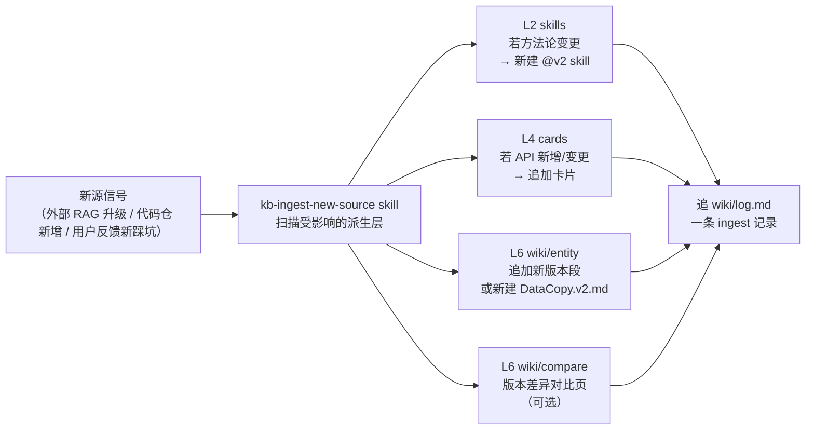

**关键纪律**：
- 本知识库**只负责派生层**，不存、不索引任何原始文档或代码；原始数据在外部 RAG 和项目代码仓里。
- 派生层（skill / card / wiki）更新以**新增新版本页**为主，**不在旧页原位覆盖**；需要标明版本差异时在 frontmatter 的 `version` 字段和 Sources 段落里说明。
- 整个扇出没有"必做"的 shell 命令——AI 根据扫描结果按需写/改 markdown，完事即可。

---

## 7. L1 常驻层设计

### 7.1 职责

L1 只做两件事：

1. **路由**：告诉 AI 在遇到任何 Ascend 相关任务时，第一步该去哪个 skill / MCP / 文件。
2. **硬约束**：列出一旦违反就出大问题的铁律（禁止读大文件、禁止全文灌入、MCP 查询优先级等）。

不做的事：

- 不讲方法论（那是 L2 的事）
- 不给代码示例（放在 L2 的 patterns- 里）
- 不做术语长段介绍（只保留"术语 → 标准名"的极简映射）

### 7.2 token 预算


| 文件                            | 建议上限          | 说明                          |
| ----------------------------- | ------------- | --------------------------- |
| AGENTS.md（入口）                 | 500 tokens    | 只讲"我是谁、去哪读路由表、去哪找 skill"    |
| ROUTER.md                     | 2000 tokens   | 任务 → 资源的映射表 + MCP 优先级 + 术语表 |
| HARD_RULES.md 或 rules/.mdc 总和 | 2000 tokens   | 每条 < 200 字，只写铁律             |
| 合计                            | < 5000 tokens | 作为每会话"固定开销"                 |


### 7.3 AGENTS.md 模板

```markdown
# Ascend Knowledge Entry

你正在接入一个结构化的 Ascend 知识体系。本项目的知识真源在 `<project>/.ai-knowledge/`（下文所有路径均相对该目录）。

## 重要约束

- 本体系采用分层加载：L1 路由 / L2 skill / L3a 外部文档 RAG / L3b 客户端原生代码搜索 / L4 card / L5 writeback / L6 wiki。
- 本知识库**不自建 RAG**：文档查外部 MCP，代码用客户端原生代码搜索能力。严禁把整篇文档或整个代码文件读入上下文。
- 所有查询遵循 `router/ROUTER.md` 的收敛规则，不重复尝试多个 MCP。
- 本项目之外的任何 Ascend 知识目录（全局 / 用户级 / 他项目）都不是本项目的可靠来源，不要读。

## 使用流程

1. 面对新任务先读 `router/ROUTER.md`，按任务类型找到推荐资源。
2. 若推荐资源是 skill，先读 `skills/_INDEX.md` 确认触发匹配，再 Read 对应 `SKILL.md` 正文。
3. 若推荐资源是 MCP，按 ROUTER 指定的 server 和 query 模板发起查询。
4. 硬约束见 `router/HARD_RULES.md`（拆分版本在项目根 `.cursor/rules/*.mdc`），每次会话启动必读。

## 版本

当前知识库版本见 `meta/VERSION.md`；本项目特有回答条款见 `meta/PROJECT_POLICY.md`。
```

### 7.4 HARD_RULES.md 风格

每条规则一个子标题，主体 5–10 行，说明"做什么 / 为什么 / 反例"。例如：

```markdown
## no-full-doc-ingest

禁止将整篇文档或整个代码文件读入上下文。

理由：
- 单篇文档常 > 100KB，读入即挤爆窗口
- 精通不依赖"知识量"，而依赖"路由精度"

正确做法：
- 查 API 用 **L3a 外部文档 RAG MCP**（`user-local-rag-9.0_a5` / `user-cann-rag`）
- 查代码用 **L3b 客户端原生代码搜索**（最低 `Grep` / `Glob` / `Read`，若有 `SemanticSearch` 则增强）
- 查模式/模板用 L2 的 patterns-* skill

反例：
- `Read("/path/to/cann-doc-全集.pdf")` —— 整篇 PDF 读入
- `Read("kernels/manual/a2a3/gemm_ar/xxx.cpp")` 然后再 `Read` 整个目录 —— 对代码滥用 Read
```

### 7.5 ANSWERING_POLICY.md ——"怎么回答"的协议

HARD_RULES 解决的是"AI 操作工具时的技术约束"（别读大文件、别灌全文档）；但还有一类约束必须单独管理：**AI 生成答案时的行为协议**。这一类约束如果没写出来，模型就会"看起来很懂，其实在瞎编"。

放在 `router/ANSWERING_POLICY.md`，作为 L1 的第三个文件（和 AGENTS.md、HARD_RULES.md 并列）。

#### 7.5.1 协议核心条款

```markdown
# Answering Policy

## 版本意识

- 每次涉及 API / 参数 / 行为的回答，必须标明适用版本和芯片（或明确说"不区分"）。
- 如果用户没提版本，先判断问题是否版本敏感；敏感 → 先问后答；不敏感 → 给答案并附"未指定版本，以下基于 CANN 9.0 beta2"。

## 来源标注

- 回答里每个事实性断言后面括号标注 [source: official/example/note + path/url]。
- 社区笔记（source=note）的结论必须加"根据某社区笔记，请验证"类措辞。
- 多源冲突时显式说："官方文档 A 说 X，社区笔记 B 说 Y，以 A 为准，但 Y 的场景值得注意。"

## 证据不足先问

- 证据不足时不许编，用以下三句之一：
  - "我没有找到官方证据，请问你能提供 <X> 吗？"
  - "需要先确认 <版本/芯片/环境>，然后再回答。"
  - "根据 <社区笔记>，可能是 X，但这是推测。"

## 推测与事实分离

- 用"根据 <source>，X"表述事实。
- 用"我推测 X，原因是 <reason>"表述推测。
- 不要把推测说得像事实。

## 冲突要标明

- 两个来源给出不同结论 → 必须摆出来，让用户知道选择。
- 不要自己"调和"出一个中间答案。

## 适用范围声明

- 如果答案只对某个芯片 / 某个版本有效，显式说"此答案仅适用于 <arch> + CANN <ver>"。

## Wiki 优先，L3 回落

- **知识问题**（概念解释、方案对比、API 综合、主题综述）优先读 `wiki/` 下对应的 entity / concept / compare / topic 页（它们已经做过跨源综合，比 RAG 拼接更准）。
- wiki 未覆盖、页面标 `stale`、或用户明确要求溯源 → 才回落到 L3：
  - 文档类问题：跑外部文档 RAG MCP；
  - 代码类知识问题：用客户端原生代码搜索能力（最低 `Grep` / `Glob` / `Read`，若有 `SemanticSearch` 则作为增强）。
- **仓内事实问题**（当前实现、当前参数、当前调用链、当前文件位置）不适用"wiki 优先"：这类问题先查代码，再把 wiki 当背景资料。
- 如果本轮产出了 wiki 上没有的新对比 / 新综述 / 新整理，**答完必须回写到 `wiki/` 对应目录**（参见第 9 章 ingest/query-writeback 规则）。视情况决定是新建页还是追加已有页。
- 每次从 wiki 取答，附注"基于 wiki/<path> 的综合叙述，原始证据见该页 Sources 段"。

## 回写承诺

- 解决新 bug / 踩新坑 / 做新决策 → 回写 L5 `writeback/`（一次事件一条）。
- 产出新对比 / 新综述 / 新方案评估 → 回写 L6 `wiki/`（按 schema 归入 compare/topics/ 等）。
- 不回写 = 知识流失；回写缺失本身是答题不合格的信号之一。
```

#### 7.5.2 典型场景对比

**坏的回答**：

> DataCopy 要 32 字节对齐，否则会报错。

没有源、没版本、没芯片——AI 无法确认这是"一直如此"还是"9.0 才这样"。

**好的回答**：

> DataCopy 要求 src/dst 32 字节对齐 [source: official, CANN 9.0 beta2, `cards/api/datacopy.md`]。此约束在 8.1 及以上版本同样有效。违反会在运行时触发 161003 错误 [source: official, `cards/error-codes/aclnn-161xxx.md`]。

有源、有版本、有相关卡片链接、可校验。

#### 7.5.3 这一层为何必须独立

- 放在 HARD_RULES 会让后者混杂"技术约束"和"行为约束"，触发匹配混乱
- 放在单独文件便于独立演进：回答协议半年一修改，HARD_RULES 每月一修改
- 项目内的 `meta/PROJECT_POLICY.md` 承载本项目特有回答条款（例如"本项目回答必须用中文"、"本项目只用 fp16"），作为 `ANSWERING_POLICY.md` 的追加项

---

## 8. L2 按需层设计

### 8.1 skill 定义

一个 skill = 一个 `<skill-name>/SKILL.md` 文件，必须包含 YAML frontmatter + 正文两部分。

### 8.2 YAML frontmatter 规范

```yaml
---
name: patterns-double-buffer
description: |
  触发：设计双缓冲/ping-pong pipeline、需要在 MTE 与 Cube/Vector 之间实现计算搬运重叠、
       优化 kernel 吞吐、减少 MTE 等待、Queue EnQue/DeQue 配合使用时。
  Trigger: Design double-buffer / ping-pong pipelines, overlap compute with data
           movement across MTE and Cube/Vector, optimize kernel throughput by
           hiding MTE latency, or when coordinating Queue EnQue/DeQue.
---
```

规范要点：

- `name`：小写连字符（kebab-case），跨平台通用；与目录名保持一致。
- `description`：**必须中英双语**。不同 AI 平台对触发词的匹配策略不一致，双语覆盖最稳。
- 触发段落用"动宾短语 + 分号分隔"的句式，避免长句。

### 8.3 `_INDEX.md` 格式

目的：AI 读完 `_INDEX.md` 就能做路由决策，不必去读每个 `SKILL.md` 正文。

```markdown
# Skills Index

按分类列出所有 skill 的 name 和一句话触发说明。

## ascendc-* — Kernel 开发方法论

- `ascendc-env-check`：检查 CANN 环境、NPU 设备、驱动版本
- `ascendc-kernel-develop-workflow`：算子开发完整 7 阶段流程
- `ascendc-tiling-design`：多核切分、UB 切分、Buffer 规划
- `ascendc-api-best-practices`：DataCopy/Mul/Cast 等 API 正确用法与陷阱
- `ascendc-precision-debug`：精度问题诊断与修复

## comm-* — 通信/融合

- `comm-architecture-overview`：HCCL/HCOMM/SHMEM 选型
- `comm-compute-fusion-develop`：MatMul+AllReduce 等融合开发
- `comm-debug-troubleshooting`：通信死锁、HCCL 错误、mssanitizer

## patterns-* — 代码模板（从示例库提炼）

- `patterns-double-buffer`：2-stage ping-pong 的标准骨架
- `patterns-tiling-2d-split`：二维切分的 tiling 计算骨架
- `patterns-cube-mte-overlap`：cube + mte 协同流水

## debug-* — 调试类

- `debug-runtime-error-codes`：aclnn 161xxx/361xxx/561xxx 解读
- `debug-plog-analysis`：plog 日志定位方法
```

**约束**：每个 skill 在 `_INDEX.md` 里严格占 1–2 行。超过 30 个 skill 就按分类拆子目录、按子目录重建索引。

### 8.4 加载决策流程

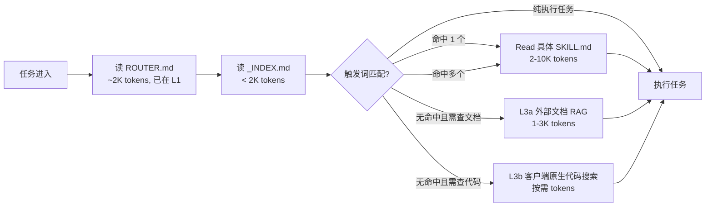


### 8.5 SKILL.md 正文结构建议

```markdown
---
name: xxx
description: ...
---

# <Skill 名>

## 触发判断

列出具体的触发场景（何时读我，何时不必读我）。

## 核心方法

3–8 条要点，或一段结构化流程。不堆砌理论。

## 可执行清单

能被 AI 直接执行的步骤清单（命令、代码骨架、检查项）。

## 反模式

常见错误 / 踩坑案例，每条带"为什么错、正确做法"。

## 相关 skill

与本 skill 联用或替代的其他 skill。
```

### 8.6 skill 分类命名标准


| 前缀           | 含义            | 典型 skill                                                              |
| ------------ | ------------- | --------------------------------------------------------------------- |
| `ascendc-*`  | Kernel 层面的方法论 | env-check, tiling-design, precision-debug, api-best-practices         |
| `comm-*`     | 通信/融合方法论      | architecture-overview, operator-develop, hw-transport, fusion-develop |
| `patterns-*` | 从示例代码提炼的可复用模板 | double-buffer, tiling-2d-split, cube-mte-overlap                      |
| `debug-*`    | 调试类           | runtime-error-codes, plog-analysis, precision-diff                    |
| `workflow-*` | 跨 skill 的编排   | kernel-develop-workflow, fusion-autoresearch                          |


新建 skill 前先选前缀，避免命名漂移。

### 8.7 L4 速记层（cards-）—— 与 L2 skill 严格区分

L4 的 cards- 从形态上看也是"带 frontmatter 的小 markdown"，但**目标和写法与 L2 skill 完全不同**，必须分开管理。

#### 8.7.1 L2 与 L4 的本质区别


| 维度         | L2 skill             | L4 card           |
| ---------- | -------------------- | ----------------- |
| 回答什么       | "怎么做"（方法论）           | "是什么"（事实 / 具体值）   |
| 加载后 AI 做什么 | 读完再推理                | 读完直接答             |
| 典型长度       | 2–10K tokens         | < 2K tokens       |
| 典型内容       | 流程、排查顺序、checklist    | API 签名、错误码表、硬约束参数 |
| 正文结构       | 触发 / 核心方法 / 清单 / 反模式 | 事实条目（表格/列表优先）     |
| 更新频率       | 方法论变化才更新（低频）         | 版本升级就要更新（高频）      |


**判断口诀**：

- 读完还需要"想一下"→ L2 skill
- 读完直接能抄 → L4 card

#### 8.7.2 card 的目录与命名

```
cards/
├── _INDEX.md
├── api/                  高频 API 速查卡
│   ├── datacopy.md
│   ├── cast.md
│   └── allreduce.md
├── error-codes/          错误码映射
│   ├── aclnn-161xxx.md
│   └── hccl-errors.md
├── checklists/           硬清单
│   ├── env-setup.md
│   └── tiling-sanity.md
└── tables/               参数对照
    ├── chip-specs.md
    └── cann-version-matrix.md
```

命名规范：`<category>/<concrete-topic>.md`。不用 `cards-<name>` 平铺目录（因为条目会快速膨胀到几十上百张）。

#### 8.7.3 card 的 frontmatter 与正文模板

```markdown
---
name: card-api-datacopy
description: |
  触发：查 DataCopy 的签名、参数约束、对齐要求、常见陷阱、repeatTimes 限制。
  Trigger: Lookup DataCopy signature, alignment, repeatTimes constraints, common pitfalls.
card_type: api
version: CANN 9.0 beta2
chip: [Atlas 800I A2, Atlas 900 A3]
source: official
last_updated: 2026-04-18
---

# DataCopy 速查卡

## 签名

```cpp
template <typename T>
__aicore__ inline void DataCopy(
    LocalTensor<T> dstLocal,
    GlobalTensor<T> srcGlobal,
    uint32_t calCount);
```

## 约束


| 项        | 约束                        |
| -------- | ------------------------- |
| 对齐       | src/dst 必须 32 字节对齐        |
| calCount | 必须 <= UB 剩余容量 / sizeof(T) |
| 数据类型     | 见"支持类型表"                  |


## 支持类型表


| T      | 支持  | 备注    |
| ------ | --- | ----- |
| half   | yes |       |
| float  | yes |       |
| int8_t | yes | v9.0+ |


## 常见陷阱

1. src 非对齐 → 运行时报错 161xxx（见 `cards/error-codes/aclnn-161xxx.md`）
2. calCount 超 UB → 编译通过但运行时挂
3. 混用 GM 和 UB 地址 → 类型错配

## 参考

- 官方文档：通过 MCP `user-local-rag-9.0_a5` 查 `"DataCopy signature alignment"`
- 相关 skill：`ascendc-api-best-practices`

```

#### 8.7.4 cards vs patterns 的边界

| 情形 | 归属 |
|----|----|
| "DataCopy 的参数是什么" | cards/api/ |
| "怎么用 DataCopy + Queue 组织一个双缓冲 kernel" | patterns-double-buffer |
| "161003 错误码什么意思" | cards/error-codes/ |
| "遇到 161003 怎么一步步排查" | debug-runtime-error-codes（skill） |
| "UB 总容量多少" | cards/tables/chip-specs.md |
| "如何规划 UB Buffer 分配" | ascendc-tiling-design（skill） |

**关键差异**：cards 负责"快速查", skills 负责"推着做"。同一个主题在 cards 和 skills 里都可能出现，但**切入角度不同**。

#### 8.7.5 初始 card 清单（建议优先做的 30 张）

刚起步时不必也不应做全，按"高频命中"筛一批：

**API 速查（10 张）**：
- DataCopy, DataCopyPad, Cast, Mul, Add, Duplicate, AllReduce, AllGather, ReduceScatter, MatMul

**错误码映射（5 张）**：
- aclnn-161xxx（参数类）、aclnn-361xxx（运行时类）、aclnn-561xxx（内核类）、HCCL 错误、驱动错误

**Checklist（8 张）**：
- env-setup（环境变量、驱动、CANN 版本）
- tiling-sanity（tiling 合法性检查）
- align-constraints（对齐约束汇总）
- queue-config（Queue 深度配置）
- mc2-launch-check（MC2 启动前检查）
- profiling-setup（profiling 配置）
- precision-validation（精度校验项）
- perf-baseline-check（性能基线检查）

**参数对照表（7 张）**：
- chip-specs（各芯片 UB/L1/L2/MTE 并行度）
- cann-version-matrix（API 可用版本）
- datatype-support-matrix（数据类型支持矩阵）
- comm-topology（通信拓扑映射）
- rank-layout-rules（rank 布局规则）
- memory-hierarchy（存储层级大小）
- op-arch-matrix（算子-架构支持矩阵）

这 30 张卡片建成后，大量高频 Ascend 问题会直接在 L4 命中，不再触发 RAG，token 成本显著下降。

---

## 9. L6 Wiki 综合层设计（消化 raw、沉淀综合叙述）

> L3 是 raw（原文、不可改）；L6 是 wiki（综合、AI 持续维护、人读）。这是整个知识体系"从静态资料仓库进化到活的知识系统"的核心环节。

### 9.1 L6 的定位与核心思想

灵感直接来自 Karpathy 的 "LLM Wiki" 模式——**把 LLM 当作一个持续在岗的 wiki 维护者，把每次新接触的材料和每次会话的新见解整合进一个结构化、互相链接的 md 集合**。

核心差别（相对纯 RAG）：

| 维度 | 纯 RAG | 本方案 L3 + L6 |
|----|----|----|
| 知识是否累积 | 每次 query 都从原文重新检索、重新拼接 | wiki 是累积式制品；见过的每份材料都已整合进对应页面 |
| 跨源综合 | 必须在每次 query 的上下文里临时完成 | 已经在 wiki 页里完成，下次直接读一页 |
| 对比与追溯 | 无处安放 | `wiki/compare/` 专门存放对比；每页 Sources 段指回 L3a 外部 RAG 的 query 或 L3b 的代码路径 |
| 维护负担 | 需建索引、定期重建 | **本知识库不建索引**（文档 RAG 外部维护、代码走客户端原生搜索）；只维护 wiki 消化层：ingest / lint / 回写；AI 来做，人只需 review |

### 9.2 四种页面类型（内容视角）

| 类型 | 目录 | 一页回答什么 | 典型长度 | 更新触发 |
|----|----|----|----|----|
| entity | `wiki/api/` / `wiki/chips/` / `wiki/ops/` | 对某一个具体实体（API / 芯片 / 算子组件）的综合页 | 5–15K | 新版本文档 / 新踩坑 / 用户反复问到 |
| concept | `wiki/concepts/` | 对某一个编程模型 / 原理的统一叙述 | 5–20K | 新论文 / 新白皮书 / 概念被误解后的澄清 |
| compare | `wiki/compare/` | 多方案 / 多实现 / 多算法的 trade-off 对比 | 3–10K | 新方案加入 / 数据更新 |
| topic | `wiki/topics/` | 某一个大主题的全景综述（作入门或回顾） | 10–20K | 定期 lint 时发现缺综述入口 |

**什么内容不进 wiki**（防止滥用）：
- 原始文档原文 → 在外部 RAG 里，不搬到本知识库。
- 原始代码 → 在项目代码仓里，靠客户端原生代码搜索现场取。
- 方法论 / 工作流 → 进 L2 skill，不是 wiki。
- 单次 bug 或决策 → 进 L5 writeback，不是 wiki（但 L5 条目被反复命中可以提升进 wiki 的 entity 页"常见坑"段）。
- 一句话速查 → 进 L4 card。

### 9.3 Wiki 页面 frontmatter 规范

每页统一 YAML 头：

```markdown
---
page_type: entity | concept | compare | topic
title: DataCopy
status: stable | draft | stale
version: [CANN 9.0 beta2, CANN 8.1 RC1]
chip: [910B, 910A3, 800IA2]
sources:
  - origin: mcp:user-local-rag-9.0_a5
    query: "DataCopy signature alignment CANN 9.0"
    reliability: high
    ingested_at: 2026-04-18
  - path: writeback/bug-notes/2026-03-12-datacopy-align.md
    reliability: medium
last_updated: 2026-04-18
related:
  - wiki/concepts/pipeline-sync.md
  - wiki/api/Cast.md
  - cards/api/datacopy.md
---
```

- `status=stale` 是体检（lint）标记，触发"下次 query 命中本页前必须先复核"。
- `sources` 一定要写，这是"从综合页回溯 L3 原文"的唯一途径。
- `related` 是 wiki 自身的交叉引用；lint 会检查断链。

### 9.4 wiki/index.md —— 内容目录

`index.md` 是 content-oriented：列出所有 wiki 页，按 entity/concept/compare/topic 分类，一行一页、带一句话描述、带状态标签。

```markdown
# Wiki Index

## Entity / API
- [DataCopy](api/DataCopy.md) — UB↔GM 数据搬运，CANN 9.0 主用法 + 3 个常见陷阱 (stable, v9.0)
- [Cast](api/Cast.md) — 类型转换，含 FP16/BF16/FP32/INT8 支持矩阵 (stable, v9.0/v8.1)

## Entity / Chip
- [910B](chips/910B.md) — AICore×20 + VectorCore×40 规格 (stable)

## Concept
- [Pipeline Sync](concepts/pipeline-sync.md) — EnQue/DeQue/SetFlag/WaitFlag 统一模型 (stable)

## Compare
- [AllReduce Topologies](compare/allreduce-topologies.md) — Ring vs Tree vs HD 对比 (draft)

## Topic
- [MC2 Overview](topics/mc2-overview.md) — 计算通信融合体系全景 (stable)
```

AI 启动"查一个主题"的第一步：读 index.md（约 1–2K tokens）→ 命中候选页 → 读那一页（5–20K tokens）。**不读 index 就跑 RAG 是反模式**，会在纪律第 6 条被否。

### 9.5 wiki/log.md —— 时间线日志

append-only 时间线，每条以固定格式开头便于 `grep` / `sed`：

```markdown
# Wiki Log

## [2026-04-18 10:23] ingest | CANN 9.0 beta2 新增 DataCopy 模板
- 源：mcp:user-local-rag-9.0_a5 / query "DataCopy template cann 9.0"
- 更新页：wiki/api/DataCopy.md（新增"模板化 DataCopy"段），wiki/concepts/pipeline-sync.md（交叉引用）
- 触达：Q4 增补 6.2 节

## [2026-04-18 14:02] query-writeback | 对比 MC2 aclnn 与手写 SHMEM 融合
- 用户询问："MC2 aclnn 相对手写 SHMEM 的优劣"
- 新建页：wiki/compare/mc2-vs-shmem.md
- 更新页：wiki/topics/mc2-overview.md（追加交叉引用）

## [2026-04-18 22:10] lint | 月度体检
- 发现 stale 页：wiki/api/Cast.md（sources 最新 ingested_at 为 2025-11）
- 发现孤立页：wiki/concepts/shmem-programming-model.md（无入链）
- 建议：给 shmem-programming-model 在 mc2-overview 加链接；Cast 安排下次 ingest
```

约定：`## [YYYY-MM-DD HH:MM] <op> | <title>`，其中 `<op>` ∈ `ingest` / `query-writeback` / `lint` / `restructure`。这样最近事件一条命令可查：

```bash
grep "^## \[" .ai-knowledge/wiki/log.md | tail -10
```

### 9.6 WIKI_SCHEMA.md —— 维护规约

`router/WIKI_SCHEMA.md` 放在 L1 常驻（< 1K tokens），是 AI 维护 wiki 的"工作说明书"，所有会话启动时都读到。模板骨架：

```markdown
# Wiki Schema

## 页面类型
- entity：单一实体（API/芯片/算子组件）综合页，目录 wiki/{api,chips,ops}/
- concept：编程模型/原理页，目录 wiki/concepts/
- compare：方案/算法对比页，目录 wiki/compare/
- topic：大主题全景综述，目录 wiki/topics/

## 命名
- 文件名与实体原名一致：DataCopy.md（保留大小写），ReduceScatter.md
- 概念用小写连字符：pipeline-sync.md
- 对比页：<a>-vs-<b>.md 或 <domain>-topologies.md

## 必备段落（entity 页最小集）
1. 签名 / 规格 / 定义（1–2 段）
2. 关键约束与边界
3. 常见陷阱（可来自 writeback/bug-notes 回写）
4. 版本差异（若有）
5. Sources（引用 L3 原文 + writeback）
6. Related（交叉引用 wiki 其他页）

## 三操作的精确流程
详见主手册第 12 章（Distill / Ingest / Lint 三轨）——
- Ingest 流程见 12.2
- Query 流程见主手册第 1.2 节时序图 + 第 7.5 节 ANSWERING_POLICY
- Lint 流程见 12.3 和 15.5

本文件只作为 AI 常驻的简要提醒；细节一律以主手册为准，避免双源漂移。
```

### 9.7 三种操作：Ingest / Query / Lint（语义定义）

这三种操作是 wiki 层的全部语义，其它所有动词（"更新""修复""整理"）都可归约到这三种。**精确流程和触发节奏集中在第 12 章**，本节只给一句话语义和相互关系。

| 操作 | 一句话语义 | 输入 | 输出 | 详见 |
|----|----|----|----|----|
| Ingest | 发现新材料（外部 RAG 升级/新代码模块/新踩坑）时，AI 把要点整合进对应 wiki 页 | 新源信号 | wiki 页更新 + log | 12.2 |
| Query | 用户提问时先查 wiki，未命中再回落 L3（文档 RAG 或客户端原生代码搜索），综述结果应按价值回写 | 用户查询 | 答案 + 按需 wiki 回写 | 1.2 时序图 / 7.5 |
| Lint | 周期性体检，只产建议不改结构 | 整个 wiki | log 里一条 lint 条目 | 12.3 / 15.5 |

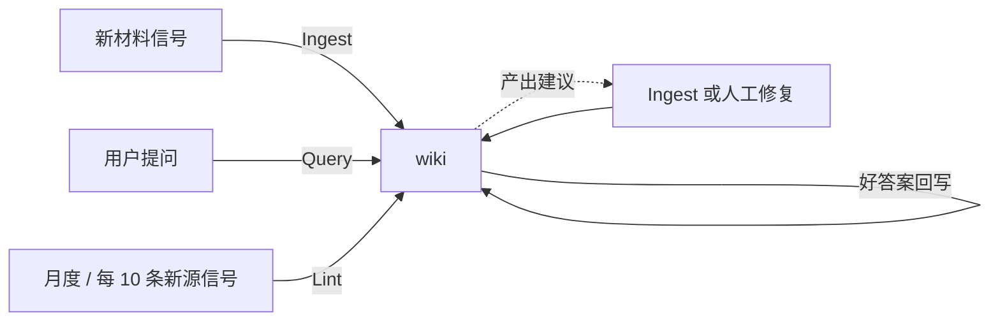

### 9.8 L6 的 token 经济学


| 场景                              | token 成本              |
| ------------------------------- | --------------------- |
| 启动时读 `index.md`                 | 1–2K                  |
| 命中并读一页 wiki（典型 entity）          | 5–15K                 |
| 回写一页（AI 产出）                     | 产出成本计 ≈ 读该页 + 1–2K 追加 |
| lint 单次（扫 index + sample pages） | 3–6K                  |
| 对比 L3a/L3b 原文拼接（反模式）             | 典型 15–30K，且无累积        |


所以 wiki 命中一次的成本 ≈ RAG 的 1/2，且"命中一次 = 历史所有相关材料一次性整合完毕"。ROI 越用越高。

### 9.9 L6 与其他层的协作细则


| 场景                                    | 走哪层          | 备注                                         |
| ------------------------------------- | ------------ | ------------------------------------------ |
| 一个 API 的签名 + 一个已知陷阱                   | L4 card      | card 要简短，复杂情况自动 refer 到 L6 entity 页        |
| 一个 API 的完整综述（约束 + 版本差异 + 常见陷阱 + 生态用法） | L6 entity    | 从多源综合                                      |
| "AllReduce 怎么做"                       | L2 skill     | 方法论                                        |
| "AllReduce 的 Ring / Tree / HD 拓扑比较"   | L6 compare   | 对比类一定进 wiki，不留聊天                           |
| "我昨天修了一个 MC2 的死锁"                     | L5 writeback | 单次事件；若多次出现，晋升到 L6 ops/AllReduce.md 的"常见坑"段 |
| "MC2 的整体架构"                           | L6 topic     | 大主题综述                                      |
| "MC2 接口签名和 errno 对照"                  | L4 card      | 速查                                         |


#### L5 → L6 / L4 / L2 的晋升通道

一条 L5 条目不是终点——足够高频 / 足够共性的经验会被周期性地晋升到更稳定的层：

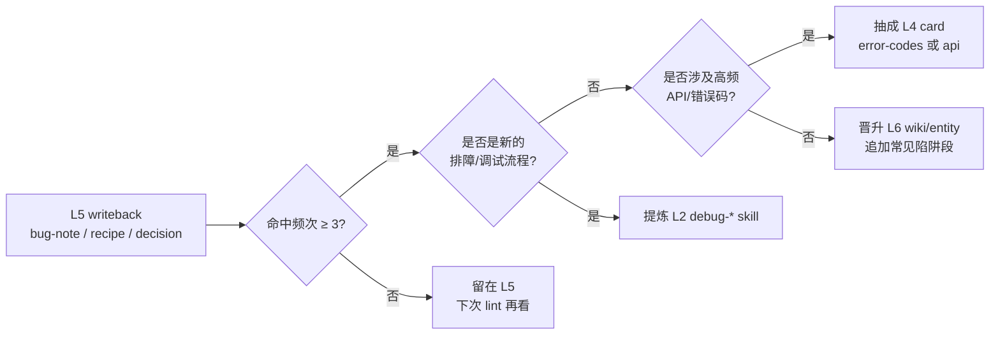

触发时机：由 Lint（12.3 / 15.5）发现并建议，实际晋升动作在下一次 Ingest 时顺带做。**这是一个"经验→综合知识"的升级路径**，也是"知识库越用越强"的核心机制。

---

## 10. L3 外挂层设计（文档 RAG 引用 + 代码原生检索 + patterns- 提炼）

**本知识库不自建 L3 基础设施**——文档 RAG 由外部 MCP 维护，代码检索由客户端原生代码搜索能力提供。本章的核心任务是**规约怎么用**这两条外部能力，并从中提炼 L2 patterns。

核心设计选择（为什么这样分）：

| 维度 | 文档 | 代码 |
|---|---|---|
| 查询形态 | 语义模糊（"AllReduce 在 910B 上怎么用"） | 符号精确（"ReduceScatter kernel 的 Queue 怎么声明"） |
| 业界主流 | RAG（向量 + BM25 + rerank） | 符号/关键词/结构化定位，必要时辅以语义搜索 |
| 本知识库对接 | **L3a 外部 MCP**（`user-local-rag-9.0_a5` / `user-cann-rag`） | **L3b 客户端原生代码搜索能力**（最低 `Grep` / `Glob` / `Read`，若有 `SemanticSearch` 则增强） |
| 本知识库不做 | 不建索引、不维护向量库 | 不建 Code RAG、不额外维护代码索引 |

### 10.1 元数据与来源可靠性

虽然本知识库不管理原始资料，但**在 wiki 页、cards、writeback 里引用外部来源时**，必须维护一致的元数据和可靠性分级——否则跨源综合会退化成"瞎编"。

#### 10.1.1 统一元数据

在派生层（wiki / cards / writeback）frontmatter 里写来源时，采用统一结构：

```yaml
sources:
  - origin: mcp:user-local-rag-9.0_a5      # 外部 RAG；或 code:<repo-path>；或 writeback:<path>
    query: "DataCopy signature alignment"   # 若是 RAG，记录 query 文本
    version: CANN 9.0 beta2                 # 可选，按需记
    chip: [Atlas 800I A2, Atlas 900 A3]
    source_type: official                   # official / example / note
    reliability: high                       # high / medium / low
    ingested_at: 2026-04-18
```

| 字段 | 用途 |
|---|---|
| `origin` | 来源类型：`mcp:<server>` / `code:<path>` / `writeback:<path>` |
| `query` | 若通过 RAG 命中，记录检索 query 以便复现；若是代码，填 `code:<file>#Lstart-Lend` |
| `version` / `chip` | 避免版本/芯片混淆（CANN 8.1 的参数不能当 9.0 用） |
| `source_type` | 可靠性分级的核心维度 |
| `reliability` | 同 source_type 内的细分 |
| `ingested_at` | 追溯"这条断言是什么时候沉淀的"，用于 Lint 判 stale |

#### 10.1.2 来源可靠性分级（防止"瞎编"的关键）

GPT 模型天生倾向"有信息就采信"，不会区分信息源权威度。光靠 prompt 约束不够，在**引用阶段**就要把可靠性差异体现出来：

| source_type | 含义 | 回答时的处理 |
|---|---|---|
| `official` | 官方文档、官方 API 手册、官方 release note（通过外部 RAG 召回） | 可直接作为事实引用；注明版本即可 |
| `example` | 官方示例代码、官方 samples 仓库（通过 Cursor 检索命中） | 作为"标准写法"引用；需要说明"这是示例，实际项目可能差异" |
| `note` | 社区笔记、博客、内部经验总结、writeback 里的推测 | **必须降低语气强度**：用"根据某社区笔记"、"有人总结"等措辞；不能作为唯一依据；与 official 冲突时 official 优先 |

检索/引用逻辑：

- 同一个问题同时命中 official 和 note → 只采纳 official，note 作为补充
- 只命中 note → 回答里必须明确"目前只有社区笔记支持，请验证"
- 完全没命中 → 按"证据不足"处理（见 ANSWERING_POLICY）

### 10.2 L3a：怎么用外部文档 RAG

本项目已挂载两个文档 RAG MCP（详见 `.cursor/rules/mcp-doc-routing-cann.mdc`）：

| MCP | 覆盖范围 | 用于什么 |
|---|---|---|
| `user-local-rag-9.0_a5` | CANN 9.0 beta2 官方文档（4500+ 份，基于 `hiascend_cann_900beta2`） | 查 950 a5 / 910 a3 / CANN 9.0 beta2 的 API 签名、参数、Tiling/Kernel 细节 |
| `user-cann-rag` | 跨产品线：CANN 多版本 + PyTorch + MindIE + MindStudio + Atlas 200I A2 + FAQ | 非 CANN 9.0 的问题；跨产品线；术语展开 |

路由决策写在 L1 `ROUTER.md` 和 `.cursor/rules/mcp-doc-routing-cann.mdc`，典型决策：

1. **查 CANN 9.0 beta2 相关**（950 a5 / 910 a3 / 9.0 API / Tiling / Kernel 细节）→ 首选 `user-local-rag-9.0_a5`
2. **首选命中不足 / 跨产品线 / 非 CANN 9.0** → 回落 `user-cann-rag`
3. **调用任何 MCP tool 前，先读对应 server 的 tool descriptor / schema**（在 `/home/ntlab/.cursor/projects/.../mcps/<server>/tools/*.json`），再决定参数

查询结果压缩协议见 10.6。

### 10.3 L3b：怎么用客户端原生代码搜索能力

**不自建 Code RAG** 的理由（业界共识）：

- 代码问题的有效 query 往往是**符号精确**（函数名、类名、调用点、错误串），不是纯语义模糊
- 客户端通常已经提供足够好的原生搜索能力；额外再建一层 Code RAG，维护成本高、收益低
- 因此本知识库只规定**战术选择**，不规定必须依赖某个特定客户端的某个专有工具

所以本知识库的代码检索战术是"**根据 query 形态选客户端原生工具**"：

| Query 形态 | 最低保证工具 | 若客户端支持的增强工具 | 典型示例 |
|---|---|---|---|
| 精确符号 / 字符串 / 错误信息 | `Grep` | 无需增强 | `class ReduceScatter`、`SetFlag<PIPE_MTE2>`、`error: 0x7010` |
| 文件按名字 / 路径模式找 | `Glob` | 无需增强 | `**/kernel/*.cpp`、`ops-transformer/src/*.h` |
| 语义 / "在哪做 / 怎么做" 的概念性问题 | `Grep` + 目录分组迭代 | `SemanticSearch` | "双缓冲 pipeline 是怎么实现的"、"DataCopyPad 的对齐处理" |
| 已知文件，只读具体函数 | `Read`（带 offset/limit） | 无需增强 | 已经定位到 `kernel/foo.cpp` 第 200–260 行 |

#### 10.3.1 战术决策与反模式

| 情形 | 正确做法 | 反模式 |
|---|---|---|
| 找一个函数的所有调用 | `Grep pattern="FuncName\\("` | 用宽泛语义搜索找调用点 |
| 找"implementing interface X" 的类 | `Grep pattern="class \\w+ : public X"` | 先语义搜，召回噪声大 |
| 探索"这个项目是怎么做流水线的" | 若客户端支持则用 `SemanticSearch`；否则先按目录分组，再 `Grep` 关键术语逐步收敛 | 一上来全仓 `Read` 或宽泛 `Grep pipeline` |
| 读一个中等文件（< 500 行） | 一次 `Read` 整个文件 | 多次小段 Read |
| 读一个大文件（> 2000 行） | 先 `Grep` 定位行号 → `Read offset+limit` | 读整文件 |

具体战术说明统一写在 `skills/code-search-tactics/` skill 里，避免规范在本文件里漂移。

#### 10.3.2 为什么不建 L3b 元数据

客户端的 `Grep` / `Glob` / `Read` 已能稳定提供路径和行号；若提供 `SemanticSearch`，其结果同样应能回溯到文件位置。这已经足够作为引用代码时的元数据来源。本知识库只在引用代码时（在 wiki / writeback 里）用 `origin: code:<path>#Lstart-Lend` 形式记录来源即可，不额外建索引、不额外维护 meta.yaml。

### 10.4 patterns- skill 提炼（示例代码价值放大的关键步骤）

这是**从代码检索层面升维到 L2 方法论层面**的关键步骤——光有 Cursor 检索，AI 只能答"怎么写"；要答"该用哪种套路"，必须把代码里反复出现的骨架提炼成模板。

提炼的执行方式是 **AI 驱动、人 review**，而不是纯手工：在 `skills/` 下放一个 `patterns-harvest-from-codebase/` skill，规定"怎么用客户端原生代码搜索能力分批扫读、怎么归并、怎么生成草稿"，之后交给 AI 按这份 skill 跑。提炼结果**必须以 `[DRAFT]` 标签入库**，由人 review 后再摘标签——这一步不能省，因为 AI 会把偶然写法当 pattern，也会把具体 tiling 参数写死进骨架。

#### 10.4.1 哪些代码值得提炼成 skill

触发条件（满足其一即值得）：

- 代码中出现的"骨架结构"在示例库里重复出现 3+ 次（说明是可复用模式）
- 代码涉及 Ascend 架构强约束（UB 大小、MTE 并行度、对齐要求等）
- 有配套的反模式（容易写错、容易精度偏差）

#### 10.4.2 提炼流程（5 步，AI 按 skill 指引执行）

```mermaid
flowchart LR
    A["1. 仓库结构扫描<br/>(Glob + 目录级语义检索/关键词检索)"]
    B[2. 按组取样阅读<br/>每文件产出摘要卡]
    C[3. 跨摘要归并<br/>找 ≥ 3 次的骨架]
    D[4. 生成 SKILL.md 草稿<br/>标 [DRAFT]]
    E[5. 人 review 摘掉 [DRAFT]]

    A --> B --> C --> D --> E
```

1. **仓库结构扫描**：用 `Glob` 先拿目录结构；若客户端支持语义检索，则按"双缓冲""tiling 切分""通算重叠"这类概念词做目录级语义搜；若不支持，则按目录分组后用 `Grep` 关键术语逐步收敛，挑出候选文件集。此步**不读文件内容**，避免违反"no-full-doc-ingest"铁律。
2. **按组取样阅读**：每组挑 5–10 个文件，用 `Read`（可 offset/limit）读关键段，对每个文件产出一张**统一格式的摘要卡**（用了什么 API、主循环骨架、Queue 深度、对齐处理、强约束），摘要卡尺寸严格控制在 20–40 行。
3. **跨摘要归并**：把这一批摘要卡放在一起比对，找出在**至少 3 个文件**里重复的骨架结构。只重复 1–2 次的**一律丢弃**（偶然写法，不是 pattern）。
4. **生成 `SKILL.md` 草稿**：对每个入选骨架，AI 按 `patterns-*` 模板产出一份 `SKILL.md`，压到 10–30 行骨架 + 触发段 + 反模式 + 相关 skill 链接，**frontmatter 里标 `status: draft`**。
5. **人 review 摘掉 draft 标签**：人必须过一眼，检查"是不是真的 pattern（不是硬编码了具体 shape/dtype）、触发段是否清晰、骨架里 `<placeholder>` 是否合理"。通过才摘掉 draft 标签正式入库。这一步不能跳过。

整个流程的**执行规范**写在一个专门的 skill 里（例如 `patterns-harvest-from-codebase/`），不写在本章正文——理由和其他 `meta-authoring-*` skill 一样：规范会演化，用 skill 承载比把流程写死在文档里更易维护。

#### 10.4.3 反模式

- 把整个 kernel 粘进 skill 正文（skill 应该 < 10K tokens，整 kernel 动辄几百行）
- 把框架代码和业务代码混在一个 patterns 里（会让"触发条件"变模糊）
- 给骨架但不写触发条件（AI 不知道何时读，等于没做）
- 骨架里硬编码具体 shape/dtype（应该用 `<placeholder>` 而非 `float16 [1024, 4096]`）

#### 10.4.4 具体实例：patterns-double-buffer

**触发段**：设计双缓冲/ping-pong pipeline、需要隐藏 MTE 搬运延迟、Queue 深度选择、kernel 吞吐优化。

**归纳出的套路**（示意）：

```cpp
// patterns-double-buffer 骨架（示意，非可编译）
class <KernelName> {
public:
    __aicore__ inline void Init(...) {
        pipe.InitBuffer(inQueue, /*depth*/ 2, <tile_bytes>);   // depth=2 是双缓冲关键
        pipe.InitBuffer(outQueue, /*depth*/ 2, <tile_bytes>);
    }
    __aicore__ inline void Process() {
        for (int i = 0; i < <tile_count>; ++i) {
            CopyIn(i);
            Compute(i);
            CopyOut(i);
        }
    }
private:
    __aicore__ inline void CopyIn(int i) {
        auto buf = inQueue.AllocTensor<T>();
        DataCopy(buf, gm_in[i * <tile_len>], <tile_len>);
        inQueue.EnQue(buf);
    }
    __aicore__ inline void Compute(int i) {
        auto in  = inQueue.DeQue<T>();
        auto out = outQueue.AllocTensor<T>();
        <user_compute>(out, in);
        inQueue.FreeTensor(in);
        outQueue.EnQue(out);
    }
    __aicore__ inline void CopyOut(int i) {
        auto buf = outQueue.DeQue<T>();
        DataCopy(gm_out[i * <tile_len>], buf, <tile_len>);
        outQueue.FreeTensor(buf);
    }
};
```

**反模式段**：Queue depth 写 1（退化成单缓冲）、忘记 FreeTensor、EnQue/DeQue 不成对。

**相关 skill**：`ascendc-tiling-design`（决定 `<tile_len>` 和 `<tile_count>`）、`ascendc-api-best-practices`（DataCopy 对齐约束）、`debug-precision`（双缓冲下的脏数据排查）。

这样一个 skill 就能指导 AI 生成大部分双缓冲 kernel 的初稿，而整个 skill 本身不到 3K tokens。

### 10.5 外部 RAG 是否已"混合检索 + rerank"——使用时的风险管理

业界好 RAG 的关键是混合检索（向量 + BM25）+ rerank，否则召回上限有限。外部 RAG 的实现细节我们不可控，因此使用时要假设**召回可能不准**，在引用层主动做防御：

1. **同一 query 变体发 2 次**：例如先用中文术语 + 再用英文术语，把召回集合并去重。
2. **多 chunk 交叉验证**：一个结论至少有 2 条 chunk 支持再下断言；只有 1 条支持且是 `note` 级 → 标"待验证"。
3. **冲突立刻显式化**：多 chunk 给出冲突结论 → 按 10.1.2 的可靠性分级选一条为主，另一条作"备择说法"显式摆出来。
4. **wiki 页回写时固化 query**：在 `sources[].query` 字段里记录**实际触发召回的 query 文本**，下次 Lint 或复核时可重跑 query 验证结果是否变化。

这些防御机制代替了"自建 RAG 时在检索阶段加的 rerank"，把不确定性管住。

### 10.6 查询结果压缩协议（L3a/L3b 都要遵守）

外部 RAG 或客户端原生代码搜索查回来的**原始内容不能整篇塞进上下文**。一次查询常返回 3–10 个 chunk（文档）或 10+ 命中行（代码），累积很快就 10K+。正确做法是统一的"检索后压缩"协议：

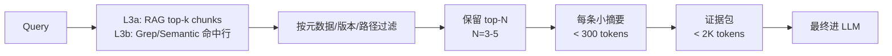

具体规则：

| 步骤 | 规则 |
|---|---|
| 返回上限 | 文档 RAG 返回最多 10 个 chunk，按元数据过滤后保留 3–5 个；代码检索返回最多 20 个命中，按路径 / 目录归组后保留 3–5 个典型文件 |
| 单条长度上限 | 单 chunk / 单代码段 > 1K tokens 时必须先做摘要，不许原文透传 |
| 证据包总量 | 最终进 LLM 上下文的检索结果总量 < 2K tokens |
| 证据包格式 | 文档：`[official/v9.0/cann-docs] <摘要>`；代码：`[code:<path>#Lstart-Lend] <摘要>` |
| 冲突处理 | 多条结论冲突时，保留最高可靠性源 + 标注冲突 |

**反例**：`Read` 工具把 RAG 命中的 PDF 整页 / 命中的整个 kernel 文件都读进来——这等于绕过压缩协议。正确做法是先读 chunk 摘要或 `Grep` 命中行，再决定是否深入某个具体文件。

这一步是实际使用中最容易被忽视的——不做压缩，L3a/L3b 的 token 成本就失控。

---

## 11. 客户端接入机制（Cursor + Claude Code）

本方案只支持两类客户端：**Cursor** 和 **Claude Code**。其它工具（Codex、社区 CLI 等）不在当前设计范围内；需要时由使用者自行扩展。

### 11.1 入口约定

运行时所有知识资产以 **项目根下的 `.ai-knowledge/`** 为准，客户端读的入口文件也都放在 **项目根**：

| 客户端         | 入口                    | 说明                                                   |
| ----------- | --------------------- | ---------------------------------------------------- |
| Cursor      | `.cursor/rules/*.mdc` | 硬约束每条一个 `.mdc`；项目 skill 放 `.cursor/skills/`         |
| Claude Code | `CLAUDE.md`           | 项目根一份，内容与 `AGENTS.md` 相同                            |
| 两者共用        | `AGENTS.md`           | 文档式入口，ROUTER / ANSWERING_POLICY / WIKI_SCHEMA 索引都从这里走 |

不使用软链、不使用用户目录转发。所有入口文件都是**项目内的真实文件**，`git clone` 下来就能用。

### 11.2 接入流程

每个项目接入一次即可，之后随项目走 git。分两种情况：

**A. 第一次建库**（从零开始）：

```bash
cd <project-root>

# 1) 建项目知识根（不包含 rag/，因为本知识库不自建 RAG）
mkdir -p .ai-knowledge/{router,skills,cards,wiki,writeback,eval,meta,scripts}

# 2) 新建入口文件
touch AGENTS.md CLAUDE.md
mkdir -p .cursor/rules
# 然后按第 7 章（L1 设计）的内容填 AGENTS.md / HARD_RULES.md 等
# 确认外部文档 RAG MCP 已在 .cursor/mcp.json 中挂载（user-local-rag-9.0_a5 / user-cann-rag）
```

**B. 从老项目复用**（常见路径）：

```bash
cd <project-root>

# 1) 建骨架
mkdir -p .ai-knowledge/{router,skills,cards,wiki,writeback,eval,meta,scripts}

# 2) 从老项目复制入口与你确定本项目要用的 skill / card
cp <other-project>/AGENTS.md     ./AGENTS.md
cp <other-project>/CLAUDE.md     ./CLAUDE.md
mkdir -p .cursor/rules
cp -r <other-project>/.cursor/rules/*.mdc                    .cursor/rules/
cp -r <other-project>/.ai-knowledge/skills/<具体skill>/        .ai-knowledge/skills/
cp    <other-project>/.ai-knowledge/cards/<具体分类>/<卡片>.md .ai-knowledge/cards/<具体分类>/

# 3) 按项目实际情况改 AGENTS.md / PROJECT_POLICY.md / ROUTER.md
# 4) 确认外部 MCP 路由 (`.cursor/rules/mcp-doc-routing-cann.mdc`) 指向正确的 RAG server
```

**关键点**：

- 项目 `.ai-knowledge/` 里的内容是**项目自身的可提交资产**，团队成员 clone 后立即可用，不依赖本机 `$HOME` 状态，也不依赖任何"用户级 / 全局级"知识库。
- **跨项目复用只通过 `cp`**：要在新项目里用老项目的某个 skill / card / wiki 页，就显式拷过来，之后随新项目的 git 独立演化。两个项目之间**没有共享目录、没有转发、没有软链**。
- 拷过来的资产如果需要跟上游修订，也是"去源项目手动再拷一次覆盖 + git diff 审阅"，不做自动同步。

### 11.3 git 托管约定

项目的 `.ai-knowledge/` **全部内容都随 git 入仓**——本知识库不存原始大文档、不生成索引，全部都是轻量 markdown，不需要 .gitignore：

```text
.ai-knowledge/
├── router/            # 入仓：项目路由、策略
├── skills/            # 入仓：项目特有 skill
├── cards/             # 入仓：项目特有速记卡片
├── wiki/              # 入仓：项目 wiki 综合页
├── writeback/         # 入仓：项目 bug-note / recipe / decision-record
├── eval/              # 入仓：项目评测集（小）
├── meta/              # 入仓：VERSION / CHANGELOG / PROJECT_POLICY
└── scripts/           # 入仓：run-eval.sh
```

外部依赖（不在 git 里，另行维护）：

- **外部文档 RAG MCP**：`user-local-rag-9.0_a5` / `user-cann-rag`，通过 `.cursor/mcp.json` 或用户级配置挂载
- **Cursor 本身**：若使用 Cursor，则提供 `SemanticSearch` / `Grep` / `Glob` 原生工具

这样做的好处：

- 知识资产与代码一起 review、一起打版本。
- 重装电脑只要 `git clone`，外部 MCP 本来就是挂载的，Cursor 自带检索——**无需任何索引重建**。
- 团队成员看到的 skill / wiki / writeback 与代码状态**严格同步**，不存在"A 机器上能跑、B 机器上缺 skill"的情况。

---

## 12. 知识维护流水线（Distill + Ingest + Lint 三轨）

**关键工程观念**：外部资料（外部 RAG 里的文档、项目代码仓里的代码）不是最终喂给 AI 的格式。需要一套持续运行的流水线，**把外部资料和会话经验持续蒸馏成本知识库的分层制品（skills / cards / wiki）**。

> **历史术语说明**：早期版本把建设期那一步叫 **"Compile"**，暗示要跑"构建 RAG 索引"这类 shell 流水线。**本知识库不自建 RAG 后，这一步退化为"批量读外部资料 + 批量写派生层"**——本质是**蒸馏（Distill）**，没有 shell 流水线可"编译"。所以本版把名字改为 **Distill**，避免误导。

三条并存的轨道：

| 轨道                 | 频率                 | 处理对象             | 产出                                                                   |
| ------------------ | ------------------ | ---------------- | -------------------------------------------------------------------- |
| **Distill（建设期批量）** | 知识库首次搭建 / 新接入大批资料  | 批量扫外部 RAG + 批量扫代码库 | L2 skills + L4 cards 初始集 + L6 wiki 的第一批 entity/concept 页（不建索引、不存原始资料）|
| **Ingest（日常增量）**   | 新材料信号来了就跑一次        | 外部 RAG 升级 / 新 sample 接入 / 用户提供的调研报告 | 更新对应 L6 wiki 页 + 按需新增 cards / skill + 追 log                          |
| **Lint（周期体检）**     | 每月 1 次 / 每 10 条新源信号后 | 已有 wiki 结构       | 问题建议列表写入 wiki/log.md                                                 |


### 12.0 三轨时序对比（一眼看全三条轨道在时间轴上的位置）

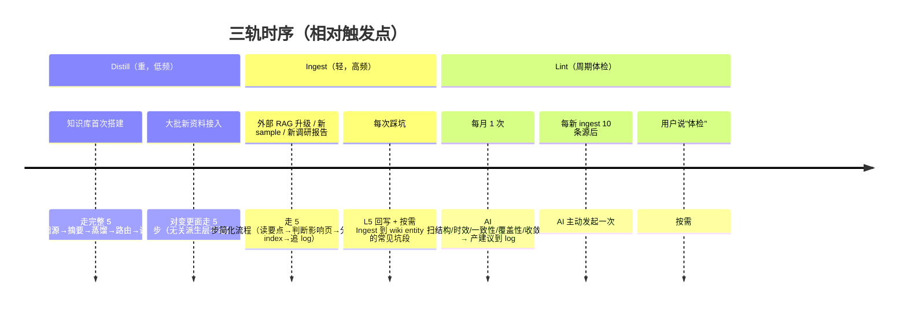

### 12.0.1 三轨闭环关系

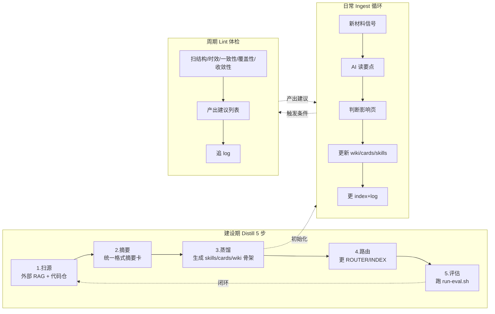

### 12.1 轨道 A：Distill（建设期批量蒸馏）

初次搭建知识库、或接入一大批新资料（例如项目从 CANN 8.5 升 9.0 beta2）时，走完整 5 步。**原"8 步"里的"清洗 / 切块 / 索引"三步已删**——本知识库不存原始资料也不建索引，这三步不适用。

| 步骤   | 动作                                                                | 产出物（放哪）                                                | 注意事项                                              |
| ---- | ----------------------------------------------------------------- | ------------------------------------------------------ | ------------------------------------------------- |
| 1. 扫源 | 批量跑外部 RAG 查询 + 用客户端原生代码搜索扫代码仓，按主题粗分类                           | 目标主题列表 + 候选 RAG query 集 + 候选代码路径集                      | 不下载文档、不读代码内容，只建"哪些主题要处理"                         |
| 2. 摘要 | 对每个主题用外部 RAG 查 + 代码检索取样，产出 20–40 行统一格式摘要卡                         | 临时工作文件（可存 `writeback/_distill-drafts/`）                | 摘要严格限长，不许整段透传                                     |
| 3. 蒸馏 | 从摘要卡提炼 L2 skills、L4 cards、L6 wiki 第一批 entity/concept 页骨架          | `skills/` `cards/` `wiki/`                             | **最耗人力也最决定效果**；wiki 初始页可以骨架化，让 Ingest 轨迭代丰富       |
| 4. 路由 | 把 L2/L4 新增项写进 `ROUTER.md` 和 `_INDEX.md`；wiki 新页写进 `wiki/index.md` | 更新 `router/ROUTER.md` + `wiki/index.md`                | 不写入路由等于白做                                         |
| 5. 评估 | 跑 `scripts/run-eval.sh`（评测 + wiki 体检）看 30 条样本通过率                  | `eval/` 下的评测报告                                         | 通过率 < 70% → 回到步骤 3 补 skills/cards；> 90% 才算建库成功    |

**Distill 的输入不是"原始资料"**，是：
- **外部 RAG**（`user-local-rag-9.0_a5` / `user-cann-rag`）暴露出的文档知识面
- **项目代码仓**（kernels/、docs/、其他目录）的可用示例
- 已有的 L5 writeback 积累（如果有）

**Distill 的输出全部是 markdown**，随 git 入仓。

### 12.2 轨道 B：Ingest（日常增量）

**触发**：以下任一信号来时跑一次——
- 外部文档 RAG 升级了（例如 `user-local-rag-9.0_a5` 从 9.0 beta2 升到 9.0 GA）
- 项目代码仓新增一整块（新算子族、新通信实现、新 sample）
- 用户提供一份新的调研报告 / 新踩坑笔记

走 5 步简化流程（比 Distill 轻）：

1. **读要点**：AI 读新材料（查 RAG 摘要 / 读新代码目录结构），提取关键事实、新概念、新约束。
2. **判断影响页**：对照 `wiki/index.md` 和 `cards/_INDEX.md`，找到受影响的 wiki entity/concept/compare/topic 页和 cards。
3. **分发更新**：
  - 新事实进对应 wiki entity 的"签名/约束"段，并在 Sources 段追加外部 RAG query 或代码路径；
  - 新概念进对应 concept 页或新建页；
  - 版本差异要专门标明；
  - 发现需要速查的 API/错误码 → 新建 L4 card；
  - 发现新方法论 → 新建或更新 L2 skill。
4. **更 index**：新页进 `wiki/index.md`。
5. **追 log**：`wiki/log.md` 追一条 `## [TS] ingest | <title>`。

**单次 Ingest 的工作量**：典型 10~30 分钟人 + AI 协作（一次中型信号影响 5–10 个 wiki 页）。比每次 query 重新检索 + 拼接便宜得多，且有累积。

### 12.3 轨道 C：Lint（周期体检）

Lint 是**周期性**体检（不是每次 query 的一部分）；它**只产出建议**，修复动作由 Ingest 轨或人工完成。Lint 发现的 5 类问题在这里定义，触发节奏表见 15.5。

| 类别 | 概念 | 典型信号 |
|----|----|----|
| 结构性 | wiki 结构级缺陷 | 孤立页（无入链）、死链、page_type 不规范、frontmatter 缺字段 |
| 时效性 | 内容过期信号 | `status=stale`、`last_updated` 超 3 个月、`sources[].query` 在外部 RAG 上复跑结果显著变化 |
| 一致性 | 跨页冲突 | 两个 wiki 页对同一事实给出不同结论（需要人裁决） |
| 覆盖性 | 派生层缺位 | L5 writeback 有 ≥3 条相似主题但 wiki 没有对应 entity / compare 页（晋升建议） |
| 收敛性 | 索引层失控 | `wiki/index.md` 某分类 > 30 页（建议拆子分类或建 topic 综述页入口） |

**Lint 的输出**是 `wiki/log.md` 里一条 `## [TS] lint | ...` 条目，内含建议列表。**AI 不擅自改 wiki 结构**——lint 只产出建议，修复动作要么下次 ingest 顺带做，要么由用户拍板。

### 12.4 判断资料归属的决策树

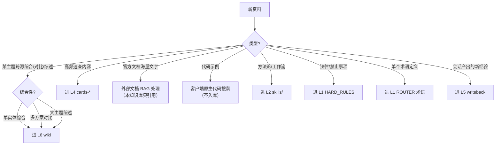


对照表（给人判断用）：


| 资料特征                | 归属                             | 动作                                                 |
| ------------------- | ------------------------------ | -------------------------------------------------- |
| 几百页 API 手册          | **L3a 外部文档 RAG**               | 本知识库不存也不索引；在 wiki / card / writeback 的 sources 字段用 `origin: mcp:<server>` + `query` 记录引用 |
| 一个完整 kernel 示例工程    | **L3b 客户端原生代码搜索 + L2 patterns** | 代码留在原仓里，用最低 `Grep` / `Glob` / `Read` 现场搜；若有 `SemanticSearch` 则作为增强；高价值骨架提炼成 patterns- skill |
| 高频 API（如 DataCopy） | L4 cards/api/ + L6 wiki/api/   | 速查进 card（<2K），完整综合进 wiki entity 页                  |
| 错误码表（161xxx / HCCL） | L4 cards/error-codes/          | 一码一条，含症状/根因/修复                                     |
| 一条经验"xxx 不能 yyy"    | L1 HARD_RULES                  | 在 HARD_RULES.md 新增一段                               |
| 一套调试流程              | L2 skill                       | 新建 `debug-*` 或 `workflow-*` skill                  |
| 一个术语表               | L1 ROUTER                      | 在 ROUTER.md 术语段增加一行                                |
| 一次具体 bug 的修复经过      | L5 writeback/bug-notes/        | 按模板写一页                                             |
| 一个项目内部的反复决策         | L5 writeback/decision-records/ | 记录"为什么这样选"                                         |
| 一个"怎么做 X"的方案        | L5 writeback/recipes/          | 简短可复用笔记                                            |
| 两种方案的 trade-off 比较  | L6 wiki/compare/               | 用户问过一次就沉淀，下次直接读                                    |
| 某编程模型/原理的统一叙述       | L6 wiki/concepts/              | 跨文档综合，带 Sources 段                                  |
| 某大主题的全景综述           | L6 wiki/topics/                | 入门 / 回顾用，上面是入口                                     |


### 12.5 Distill 第 3 步"蒸馏"细则

蒸馏是最被低估也最决定效果的一步。做四件事：

1. **蒸馏出 L4 卡片**：通过外部 RAG + 会话观察找出高频 API 和错误码，每个做一张 < 2K 的卡片。入选标准："过去一个月被 AI 查到 3 次以上的内容"。
2. **蒸馏出 L2 patterns**：按 10.4 节的方法，用客户端原生代码搜索扫代码仓提炼可复用模板。
3. **蒸馏出 L6 wiki entity/concept 页骨架**：对每个会被反复查到的实体 / 概念，写一页骨架（签名 / 约束 / Sources），日常 Ingest 逐步丰富。骨架化 ok，但必须建。
4. **从多个 L5 归纳出新 L2 skill 或晋升到 L6 wiki**：如果 writeback/bug-notes/ 里出现了 3 条相似的坑，要么升级成一个 `debug-*` skill，要么进 wiki 对应 entity 页的"常见陷阱"段。

### 12.6 回写（L5 writeback）细则

Distill 完成后，**日常会话中的 L5 回写遵循准入标准**——这是 L5 的本职工作，不属于 Distill 的某一步。

**回写模板**（`writeback/bug-notes/<date>-<short-name>.md`）：

```markdown
---
type: bug-note
date: 2026-04-18
env:
  cann: 9.0 beta2
  chip: Atlas 900 A3
  mode: ascend-c kernel-launch
tags: [precision, datacopy, alignment]
reliability: verified   # verified / tentative / unverified
sources:
  - origin: mcp:user-local-rag-9.0_a5
    query: "DataCopy alignment 32 bytes"
    reliability: high
  - origin: code:kernels/manual/a2a3/gemm_ar/xxx.cpp#L120-L150
    reliability: high
---

# 标题（一句话问题描述）

## 问题

具体现象：<报错信息 / 精度偏差 / 卡死等>

## 环境/版本

<如上 frontmatter 已标注，此处补充不方便塞 YAML 的细节>

## 根因

<分析找到的根本原因，一两段>

## 正确做法

<能直接复制的代码片段或步骤>

## 反例

<错误写法；说明为什么错>

## 参考来源

按 frontmatter `sources` 字段引用；如需额外说明，此处补充。
```

**回写准入标准**：只有满足以下任一条件时，才值得写入 L5：
- 根因不是表面现象，后续复用价值高；
- 以后高概率再次遇到；
- 官方文档或现有 cards/wiki 没有直接给出答案；
- 修复过程包含非直觉约束、易错顺序、隐藏前提；
- 需要保留"为什么这样选"的决策原因。

**不建议回写**：一次性 typo、纯当前分支临时状态、明显低价值环境噪声、没有复用价值的机械修复。


### 12.7 触发节奏建议（三轨对齐）


| 事件                              | 轨道              | 动作                                                                                           |
| ------------------------------- | --------------- | -------------------------------------------------------------------------------------------- |
| 首次搭建知识库                         | Distill（整轨）     | 扫源 → 摘要 → 蒸馏 → 路由 → 评估；典型 3–7 天 AI + 人协作                                                     |
| 外部 RAG 大版本升级（例如 CANN 9.1 上线）    | Distill（对变更面）   | 只蒸馏受影响主题，不动无关派生页；**不新建 rag/ 目录、不跑索引**                                                         |
| 单篇新文档信号 / 新 sample              | Ingest          | 走 5 步简化流程，更新相关 wiki 页 + log                                                                  |
| 每次踩坑                            | Ingest + L5 回写  | 至少回写一条 L5 bug-note；命中频次高则 Ingest 轨晋升到 L6 对应 entity 页                                         |
| 每周末                             | 人主动             | 扫描 writeback/，看能否归纳出新 skill、新 card、或晋升到 wiki                                                 |
| 每月                              | Lint            | wiki 体检，输出建议到 log                                                                            |
| 季度清理                            | 人主动             | review 哪些 skill 从未被触发、哪些 cards 未命中过、哪些 wiki 页长期 stale                                        |
| 半年                              | 人主动             | 重写 ROUTER 和 wiki/index 的分类策略                                                                 |


### 12.8 写入 CHANGELOG 的纪律

每次对 SSOT 的改动都写一行到 `meta/CHANGELOG.md`：

```
2026-04-18 | add skill: patterns-cube-mte-overlap | 从 kernels/manual/... 检索提炼
2026-04-17 | add card: cards/api/datacopy.md | 高频 API 蒸馏
2026-04-16 | writeback: bug-notes/2026-04-16-fp16-cast-precision.md | FP16 精度问题
2026-04-15 | update rule: no-read-large-files | threshold 100KB → 80KB
2026-03-20 | ingest: user-local-rag-9.0_a5 上游 +120 份 release note | 已更新 wiki/api/DataCopy、wiki/compare/cann-9.0-vs-8.5
```

---

## 13. Token 经济学验证

### 13.1 典型会话预算分解


| 阶段             | 消耗         | 说明                                    |
| -------------- | ---------- | ------------------------------------- |
| 会话启动（L1）       | 3–5K       | AGENTS.md + ROUTER.md + HARD_RULES.md |
| 任务路由（读索引）      | 0.5–2K     | skills/INDEX.md                       |
| 加载 1–2 个 skill | 5–15K      | 只读触发命中的正文                             |
| RAG 查询（如需要）    | 1–3K / 次   | 只返回 top-k 段落                          |
| **典型任务合计**     | **10–25K** | 200K 窗口占用 5–12%                       |


**典型会话 token 分布**（按中位数估算）：

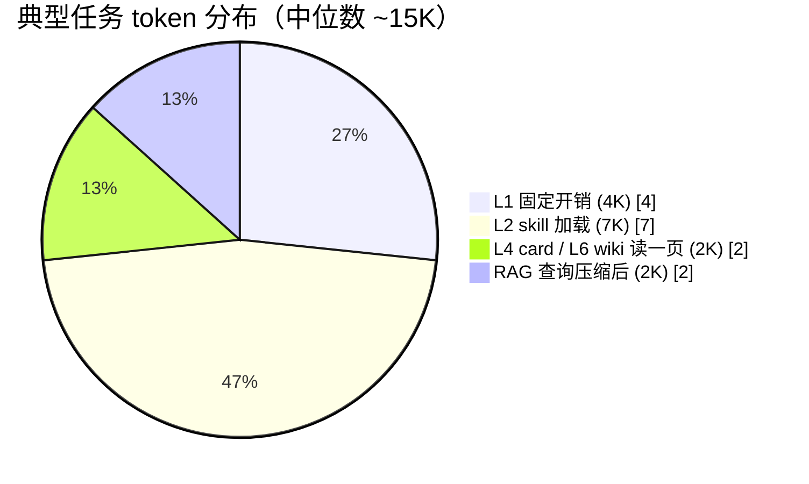

### 13.2 反模式对比


| 反模式                      | 额外消耗              | 危害                     |
| ------------------------ | ----------------- | ---------------------- |
| 把整份 API 手册灌入上下文          | ≥ 100K tokens     | 直接挤爆窗口，后续对话没空间         |
| 每次任务扫所有 skill            | 28 个 × 5K ≈ 140K  | 90% 浪费，AI 也会被噪声干扰      |
| 每次都 RAG 查 3 遍（三个 MCP 都试） | 3K × 3 = 9K "搜索税" | 延迟翻倍，命中率反而降低           |
| 把代码示例库整库读入               | ≥ 500K tokens     | 根本读不完，窗口先爆             |
| 每次都让 AI 从零猜该用什么方法        | 无形的试错成本           | 多轮无效对话，token 消耗难以量化但巨大 |


### 13.3 预算超标的典型信号

- 会话启动就超过 8K：L1 写得太厚，把方法论错放在 HARD_RULES
- 单任务超过 40K：可能是同时加载了 5+ 个 skill，或反复 RAG 查询。应定位"是不是 ROUTER 没命中该 skill"
- RAG 查询同一问题 > 3 次：提示 MCP 优先级规则不清晰，或 skill 缺失

发现超标立即 review ROUTER 和 INDEX，不要任其蔓延。

### 13.4 最坏情况刹车规则

token 预算表给的是**典型任务**，不是无限制承诺。为了防止真实执行时"先读一页 wiki、再读两个 skill、再跑几轮检索"导致预算失控，统一加以下刹车规则：

- **单任务最多加载 1 页 wiki + 2 个 skill**；超过仍证据不足，先向用户确认问题边界。
- **单任务外部文档 RAG 最多 2 次**；第二次仍未收敛，必须显式说明"现有证据不足"。
- **单任务代码证据包最多保留 3 个文件**；更多文件只留路径清单，不再全部展开。
- **同一事实若已有高可靠来源**，不为了"求全"继续补更多来源。
- **若进入 compare / 综述类深水区**，优先回写 wiki 再继续，而不是每轮都从 raw 重新拼接。

这些规则的目的不是降低质量，而是强制 AI 在预算内做收敛决策：先回答最关键部分，再决定是否值得继续下钻。


---

## 14. 落地步骤（6 步清单）

每步包含：动作 / 产出物 / 验收 / 预计时间 / 回滚。

### 步骤 1：搭项目知识根骨架

- **动作**：
  ```bash
  cd <project-root>
  mkdir -p .ai-knowledge/{router,skills,cards/{api,error-codes,checklists,tables},wiki/{api,chips,ops,concepts,compare,topics},writeback/{faq,bug-notes,recipes,decision-records,pitfalls},eval/{qa-benchmark,coding-tasks,debugging-cases},cache,meta,scripts}
  touch .ai-knowledge/router/{ROUTER.md,HARD_RULES.md,ANSWERING_POLICY.md,WIKI_SCHEMA.md}
  touch .ai-knowledge/{skills,cards,writeback,wiki}/_INDEX.md 2>/dev/null || true
  touch .ai-knowledge/wiki/{index.md,log.md}
  touch .ai-knowledge/meta/{VERSION.md,CHANGELOG.md,PROJECT_POLICY.md,README.md}
  echo "v0.5.0" > .ai-knowledge/meta/VERSION.md
  ```
- **产出物**：项目根下一份完整的 `.ai-knowledge/` 骨架 + 占位文件
- **验收**：`tree .ai-knowledge -L 2` 能看到第 6.3 节的骨架
- **预计时间**：0.5 小时
- **回滚**：`rm -rf .ai-knowledge`（此时还没任何实际内容）

### 步骤 2：迁入 skill

- **动作**：
  1. 找出本项目需要的所有 skill（包含之前散在 `~/.cursor/skills/*` 或老项目里的通用方法论 skill）。
  2. 直接 `cp -r` 到本项目的 `.ai-knowledge/skills/` 或 `.cursor/skills/`。**不保留任何指向项目外的软链或共享引用**。
  3. 每个 skill 的 `YAML frontmatter` 按第 8.2 节规范校一遍（name 全小写+短横线、description 带触发词）。
  4. 拿不准是否该进这个项目的，就先不要拷——要用时再拷，保持项目 skill 列表精简。
- **产出物**：本项目 `.ai-knowledge/skills/`（或 `.cursor/skills/`）下有本项目用得到的 skill，各自独立一份。
- **验收**：AI 在项目里能读到项目内 skill；**断开外部所有目录（包括用户级 `~/.cursor/skills/`）后项目仍能工作**。
- **预计时间**：0.5 天
- **回滚**：`git restore .ai-knowledge/skills/` 或 `rm -rf` 后重来。

### 步骤 3：写路由表和硬约束

- **动作**：按附录 A 模板填 `ROUTER.md`，按第 7.4 节风格填 `HARD_RULES.md`，参考附录 B 校核每个 skill 的 frontmatter。
- **产出物**：完整的 L1 三件套 + `_INDEX.md` 按附录更新。
- **验收**：在新开的 AI 会话里，给一个模糊 Ascend 任务，AI 应该能直接说出"我该去读 skill X"或"我该查 MCP Y"。
- **预计时间**：1–2 天
- **回滚**：git 回滚到上一次 commit

### 步骤 4：提炼 patterns- skill

- **动作**：按 10.4 节的 5 步流程由 **AI 驱动 + 人 review** 产出：AI 跑 `patterns-harvest-from-codebase/` skill 对示例库做结构扫描 → 按组取样产出摘要卡 → 跨摘要归并 → 生成 `[DRAFT]` 状态的 `patterns-*/SKILL.md` 草稿 → 人过一遍摘掉 draft 标签。
- **产出物**：`skills/patterns-*/SKILL.md` 若干（初版先要 3–5 个高频骨架，例如 double-buffer / tiling-2d-split / cube-mte-overlap）；`_INDEX.md` 新增对应行；ROUTER 更新。
- **验收**：给一个"写一个双缓冲 kernel"这类模糊需求，AI 能自动找到对应 patterns skill 并产出可编译骨架。
- **预计时间**：1–2 天
- **回滚**：删除对应 skill 目录 + 还原 INDEX、ROUTER

### 步骤 5：确认代码检索路径（不建 Code RAG）

- **动作**：
  1. 确认示例代码仓已 clone 到本项目可访问的路径（或项目自身就是代码仓）。
  2. 在 `router/ROUTER.md` 新增一段"代码检索规则"，说明：
     - 查符号 / 精确名 → 用 `Grep`（`rg`）
     - 查文件模式 / 目录结构 → 用 `Glob`
     - 查"做 X 的那段代码在哪" → 用 Cursor `SemanticSearch`
     - 只有精确路径明确时才用 `Read`（严禁大文件全读）
  3. 在 `skills/code-search-tactics/` 落地一份"战术决策表"（10.3 节）。
  4. 高频骨架（double-buffer / tiling-2d-split / cube-mte-overlap 等）通过 10.4 节的方法蒸馏成 `patterns-*` skill。
- **产出物**：`router/ROUTER.md` 代码检索段 + `skills/code-search-tactics/` + 必要的 patterns- skill。**不建任何 RAG 索引，不注册任何额外 MCP**。
- **验收**：AI 面对"查 catlass 里 GEMM 的 kernel 主体"这类问题时，能按战术表直接走 `SemanticSearch` / `Grep` 得到代码片段，不依赖任何额外基础设施。
- **预计时间**：0.5 天
- **回滚**：还原 ROUTER、删除对应 skill 目录。

### 步骤 6：接入一个新项目并做 git 托管

- **动作**：
  1. 在新项目根建 `.ai-knowledge/` 骨架（见步骤 1 的命令）。
  2. 写好 `AGENTS.md` / `CLAUDE.md` / `.cursor/rules/*.mdc`：第一次建库就现写；已经有老项目的，就 `cp` 过来再按新项目改。
  3. 按项目实际需要 `cp` 进来需要的 skill / card / wiki 页。
  4. 确认外部依赖的文档 RAG MCP（`user-local-rag-9.0_a5` / `user-cann-rag`）已在客户端挂载，并在 `AGENTS.md` 里写明依赖版本；不入仓任何 RAG 原始资料或索引（按 11.3 节约定，`.ai-knowledge/` 全量 git 版本化，无需 `.gitignore` 排除项）。
  5. `git add AGENTS.md CLAUDE.md .cursor/ .ai-knowledge/ && git commit -m "chore: bootstrap ascend knowledge"`。
- **产出物**：项目根下 AGENTS.md / CLAUDE.md / .cursor/rules/ 与 .ai-knowledge/ 都是项目内真实文件，已入 git。
- **验收**：在新项目里开一个 AI 会话，AI 正确识别项目的 Ascend 知识体系；**完全断开 `$HOME` 下的任何 Ascend 相关目录**后仍可正常路由。
- **预计时间**：0.5 天
- **回滚**：`git reset --hard` 回到接入前的提交。

---

## 15. 维护与演进

### 15.1 日常维护

- **每次踩坑**：当场决定写进 HARD_RULES 还是 skill；不要累积（累积 = 遗忘）
- **每次新套路**：立即写进 patterns- skill；否则下次还要重新摸索
- **每月 review**：看 CHANGELOG、看哪些 skill 触发次数为 0（说明可能废弃或触发词不准）

### 15.2 版本升级

- CANN 主版本升级 → 由外部 RAG 维护方负责挂新版 index；本知识库按 12.7 节"Distill（对变更面）"只更新受影响的 skills / cards / wiki 页，**不在 `.ai-knowledge/` 下新建 rag/ 目录**
- Skill 大改 → 新建 `skills/<name>@v2/` 独立目录，验证通过后把 `_INDEX.md` 入口切到 v2，旧版保留 3 个月供回溯
- HARD_RULES 重构 → git branch 操作，确认无误再 merge

### 15.3 清理规则

- skill 连续 3 个月未被触发 → review 是否触发词不准；若确实废弃，归档到 `skills/_archive/`
- 派生层（cards / wiki 页）> 6 个月无人查询 → 进入"可归档"清单；归档目录 `cards/_archive/` 或在 wiki frontmatter 标 `status: archived`，**不删**（第 6.5 节"只新增不改旧"原则）
- 单个 skill > 15K tokens → 拆分；过大的 skill 命中后会造成 token 浪费
- wiki 页面 `status=stale` 超过 3 个月未更新 → 进入"必复核"清单

### 15.4 度量指标（定性）


| 指标                                 | 健康              | 警戒                             |
| ---------------------------------- | --------------- | ------------------------------ |
| 会话启动 token                         | < 5K            | > 8K                           |
| 典型任务总 token                        | < 30K           | > 60K                          |
| RAG 查询次数/任务                        | < 3             | > 6                            |
| skill 加载数/任务                       | 1–2             | > 4                            |
| skill 总数                           | < 30 per 子域     | > 50 需拆分子目录                    |
| cards 命中率（命中 / 查询总数）               | > 40%           | < 20% 说明 cards 覆盖不足            |
| L5 回写条目 / 周                        | ≥ 3             | 0 说明没人在沉淀                      |
| wiki 页面数                           | 随知识库成熟持续增长（无上限） | 两个月 0 增长说明 query 没回写           |
| wiki query 命中率（wiki 命中 / query 总数） | > 30%           | < 10% 说明 wiki 覆盖面不足或 index 路由差 |


### 15.5 Lint 触发节奏

> Lint 的 5 类问题定义在 12.3 节，本节只给触发节奏和反模式。

**触发节奏（推荐）**：


| 触发  | 频率                      | 负责人                  |
| --- | ----------------------- | -------------------- |
| 定期  | 每月 1 次                  | AI 负责扫，人负责 review 建议 |
| 增量  | 每次新 ingest ≥ 10 条源后 1 次 | AI 主动发起              |
| 手动  | 用户说"体检"或"lint" 时        | 按需                   |


**反模式**：

- 把 lint 做成每次 query 都跑的前置步骤 → token 爆炸
- 让 AI lint 发现问题后自行大改结构 → 人失去控制，下次 review 要回看大量变更

### 15.6 评测与回归

> **没有评测，你不知道它是真的变强了，还是只是会检索了。**

评测集必须建，不然所有的优化都是拍脑袋。

#### 评测集三类


| 类别   | 目录                      | 形态                      | 评分方式                     |
| ---- | ----------------------- | ----------------------- | ------------------------ |
| 事实问答 | `eval/qa-benchmark/`    | Q + 标准答案 + 必须命中的 source | 答案字段匹配 + source 引用正确率    |
| 代码任务 | `eval/coding-tasks/`    | 需求描述 + 验收脚本             | 生成代码能否通过验收脚本(编译/运行/对齐标杆) |
| 调试任务 | `eval/debugging-cases/` | 报错 + 日志 + 已知根因          | AI 给的根因是否命中已知根因          |


#### 事实问答示例

```yaml
# eval/qa-benchmark/datacopy-alignment.yaml
id: qa-001
question: "CANN 9.0 下 DataCopy 对 src/dst 有什么对齐要求？"
expected_answer:
  must_contain: ["32 字节", "对齐"]
  must_cite: ["official", "CANN 9.0"]
category: api
chip: [Atlas 900 A3]
version: CANN 9.0 beta2
```

#### 代码任务示例

```yaml
# eval/coding-tasks/write-double-buffer-kernel.yaml
id: code-001
task: "写一个双缓冲 kernel，把 GM 上 1024 个 float16 搬到另一块 GM"
env:
  cann: 9.0 beta2
  chip: Atlas 900 A3
accept:
  - "能通过 <verify.sh> 编译"
  - "运行输出与参考一致 (rtol=1e-3)"
  - "Queue depth == 2"
```

#### 调试任务示例

```yaml
# eval/debugging-cases/hang-on-mc2-launch.yaml
id: debug-001
symptom: "MC2 启动后 30 秒无响应，然后超时"
logs: |
  [ERROR] ...
  [INFO] rank 0 waiting on notify ...
expected_root_cause_contains: ["rank 映射", "notify 顺序"]
expected_fix_refers_to_skill: ["comm-debug-troubleshooting"]
```

#### 跑评测与回归

```bash
# 每次知识库大改后跑一遍（特别是 ROUTER / cards / skills 改动后）
bash .ai-knowledge/scripts/run-eval.sh

# 两阶段：
# 1) wiki 结构体检（孤立页 / 过期时间戳 / 死链 / frontmatter 缺字段）
#    有致命问题直接中止；仅有建议则写入 wiki/log.md 继续跑下一步
# 2) 评测集回归（qa-benchmark / coding-tasks / debugging-cases）
#
# 输出：
# - wiki 体检报告（通过 / 建议项列表）
# - 总体通过率
# - 每类任务的通过率变化（对比上次）
# - 回归项列表（上次通过本次失败的）
```

#### 评测纪律

- **初始建 30 条测试** 足够：10 条事实问答 + 10 条代码任务 + 10 条调试任务
- **每次 SSOT 大改触发一次** 评测运行，通过率不能下降超过 5%
- **失败回归项必须人工分析**，要么修 skill 要么修评测本身（有时是标准答案过时）
- **评测集本身也要 CHANGELOG**，新版本要增测试

没有评测的知识库就是"自我感觉良好的知识库"，永远停留在"看起来有用"阶段。

---

## 16. 风险与预防


| 风险                            | 触发条件                                   | 预防措施                                                                      |
| ----------------------------- | -------------------------------------- | ------------------------------------------------------------------------- |
| 路由表写得太"活"，AI 看不懂              | ROUTER 用大段自然语言                         | 强制用 `- <触发词/场景> → skill: <name>` 或 `→ MCP: <server> query="<pattern>"` 句式 |
| skill 越来越多，INDEX 本身膨胀         | > 30 个 skill 平铺                        | INDEX 每 skill ≤ 2 行；超过 30 就按分类拆子目录                                        |
| RAG 命中不准，AI 还是瞎猜              | skill 不写明"遇到 X 问题用 `<query>` 查 MCP Y"  | 每个相关 skill 里给标准 query 模板                                                  |
| 多 AI 对 skill frontmatter 要求不一 | Cursor 认 `description`，某平台只认 `summary` | `description` 中英双语 + 必要时冗余字段                                              |
| SSOT 丢失                       | 只在本地，硬盘坏                               | git 托管 + 远端推送 + 定期备份                                                      |
| 新人不会用                         | 缺文档入口                                  | `meta/README.md` 解释"从哪里开始读"                                               |
| 知识过时                          | 上游文档升级没跟上                              | CHANGELOG + 季度 review；版本号锚定 CANN 版本                                       |


---

## 17. 附录 A：ROUTER.md 模板样例

> 直接照着填关键词即可；句式保持严格，便于 AI 解析。

```markdown
# Ascend Task Router

本文件把常见任务映射到 L2 skill / L4 card / L6 wiki / L3 MCP。AI 面对任务的第一步就读本文件。
句式：`- <触发词/场景> → skill: <name>` 或 `→ wiki: <path>` 或 `→ card: <path>` 或 `→ MCP: <server> query="<pattern>"`。

## 0. 查询优先级总则（必读）

面对用户查询，按以下顺序依次尝试，命中即止：

1. **L4 card**：API 签名、错误码、硬清单 —— 速查即答，不再追溯。
2. **L6 wiki**：主题综述、实体综合页、方案对比 —— 读 `wiki/index.md` 定位，命中直接读一页。
3. **L5 writeback**：历史经验、过往 bug —— 类似问题优先复用。
4. **L2 skill**：方法论、工作流 —— 需要按步骤操作时触发。
5. **L3 RAG**：仅当上面全部未命中、或用户明确要求溯源原文时回落。
6. 产出新的综述 / 对比 → 回写 L6 wiki；产出新的单次经验 → 回写 L5 writeback。

## 1. Kernel 开发

- 环境检查 / 设备查询 → skill: ascendc-env-check
- 新算子从零开发（需求分析→测试→文档） → skill: ascendc-kernel-develop-workflow
- Tiling 策略（多核切分 / UB 切分 / Buffer 规划） → skill: ascendc-tiling-design
- API 用法（DataCopy / Mul / Cast / Cast 陷阱） → skill: ascendc-api-best-practices
- 精度问题（rtol 不达标 / Cast 精度丢失 / FP16 偏差） → skill: ascendc-precision-debug
- 查某个具体 API 签名 → MCP: local-rag-900 query="<API name> signature parameters"
- 算子 UT/ST 测试用例 → skill: ascendc-st-design / ascendc-ut-develop

## 2. 通信与融合算子

- 通信选型（HCCL / HCOMM / SHMEM / MC2） → skill: comm-architecture-overview
- MatMul + AllReduce / ReduceScatter / AllGather → skill: comm-compute-fusion-develop
- MoE dispatch / combine 开发 → skill: comm-compute-fusion-develop
- 通信死锁 / HCCL 错误码 / mssanitizer → skill: comm-debug-troubleshooting
- 硬件传输层（RDMA / SDMA / MTE） → skill: comm-hw-transport

## 3. 代码模板（patterns-*）

- 写双缓冲 / ping-pong pipeline → skill: patterns-double-buffer
- 二维 tiling 切分 → skill: patterns-tiling-2d-split
- cube + mte 协同流水 → skill: patterns-cube-mte-overlap

## 4. 运行时问题

- aclnn 错误码 161xxx / 361xxx / 561xxx → skill: debug-runtime-error-codes
- plog 日志分析 → skill: debug-plog-analysis
- 卡死 / 挂起 / 超时 → skill: debug-runtime-error-codes

## 5. MCP 查询收敛规则

- 查 CANN 9.0 beta2 → 首选 local-rag-900，不够再查 cann-rag
- 查非 9.0 或跨产品线 → 直接 cann-rag
- 查第三方框架（PyTorch / vLLM 等） → context7
- 查示例代码库 → code-rag-<lib>（catlass / samples / ops-math 各自独立）
- 禁止同一问题连续查 > 3 个 MCP；超限则停下来问用户
- **wiki 命中 → 不跑 RAG**；wiki 未覆盖或 stale → 再查 RAG，且综述结果必须回写 wiki

## 6. Wiki 入口（优先于 RAG）

- 某个 API 的完整综合 → wiki: `wiki/api/<ApiName>.md`（例：`wiki/api/DataCopy.md`）
- 某个芯片/算子组件的综合 → wiki: `wiki/chips/<Chip>.md` / `wiki/ops/<OpName>.md`
- 某概念 / 编程模型的统一叙述 → wiki: `wiki/concepts/<concept>.md`
- 多方案对比 → wiki: `wiki/compare/<comparison>.md`（没有就回落 RAG + 回写新页）
- 大主题全景 → wiki: `wiki/topics/<topic>.md`
- 不知道去哪 → 先读 `wiki/index.md`

## 7. 术语表（防语义漂移）

- "UB" = Unified Buffer（不是 SRAM 的别名）
- "MTE" = Memory Transfer Engine
- "aicore" = AI Core，单独一个计算核
- "PTO" = 本项目特有的 Tile 编程抽象（非 CANN 官方术语）
- "融合算子" 在本体系中特指"计算+通信融合"；不指"多 elementwise 合并"
```

---

## 18. 附录 B：SKILL.md frontmatter 规范

### 18.1 最小字段集（跨平台通吃）

```yaml
---
name: <kebab-case-lowercase>
description: |
  触发：<中文触发场景，用分号分隔，3-6 条动宾短语>
  Trigger: <English trigger description, same semantics as above>
---
```

**硬性要求**：

- `name` 必须是小写连字符（kebab-case），不能有空格、大小写混合、下划线。
- `name` 必须与所在目录名完全一致（`skills/foo-bar/` → `name: foo-bar`）。
- `description` 必须中英双语。某些平台只扫描英文触发词，某些平台对中文更敏感，双语覆盖最稳。

### 18.2 可选字段

```yaml
---
name: xxx
description: ...
version: 0.2.0             # 可选，方便 CHANGELOG 对齐
related:                   # 可选，相关 skill
  - foo-bar
  - baz-qux
supersedes: old-skill-name # 可选，本 skill 取代了哪个旧 skill
---
```

### 18.3 正文结构建议

```markdown
# <Skill 显示名>

## 触发判断
何时读我，何时不必读我。

## 核心方法
3-8 条要点，或一段结构化流程。

## 可执行清单
AI 能直接执行的动作。命令、代码骨架、检查项。

## 反模式
常见错误与正确做法的对照。

## 相关 skill
- skill-a：xxx
- skill-b：xxx

## 更新记录
- 2026-04-18 | 初版
```

### 18.4 写作反例


| 反例                             | 问题                     |
| ------------------------------ | ---------------------- |
| `name: Patterns DoubleBuffer`  | 大写 + 空格，跨平台匹配会挂        |
| `description: 这个 skill 用于各种场景` | 触发词过泛，AI 无法判断          |
| 正文 > 15K tokens                | 一旦命中就挤占窗口；应拆分          |
| 只有方法论，没有可执行清单                  | AI 读完不知道下一步干什么         |
| 没写 "相关 skill"                  | AI 无法在跨场景任务里串联多个 skill |


---

---

## 版本与许可

- 文档版本：v0.5.0
- 最后更新：2026-04-18
- 修改者：按本手册第 12 章 Pipeline 维护，每次改动追加到 `meta/CHANGELOG.md`。
- 许可：本手册可自由复制、修改、再分发；引用请注明出处。
- v0.5.0 变更摘要：
  - 第 1 章新增查询时序图（1.2 节），让"一次查询发生了什么"一眼看到；
  - 第 6.5 节新增"Ingest 扇出图"，显式画出新源影响哪些派生层；
  - 第 9.7 节重构为"语义定义表"，流程细节全部交给第 12 章，消除重复；
  - 第 9.9 节新增"L5 晋升通道图"，画出 writeback → wiki/card/skill 的路径；
  - 第 12 章开头新增"三轨时序 timeline + 闭环图"两张图；
  - 第 12.3 节补全 Lint 5 类问题定义；15.5 节精简为触发节奏表；
  - 第 13.1 节新增 token 分布饼图；
  - 第 6.2 节正文去掉"9.0/10.5/10.6 等老章节号"的错位引用。
