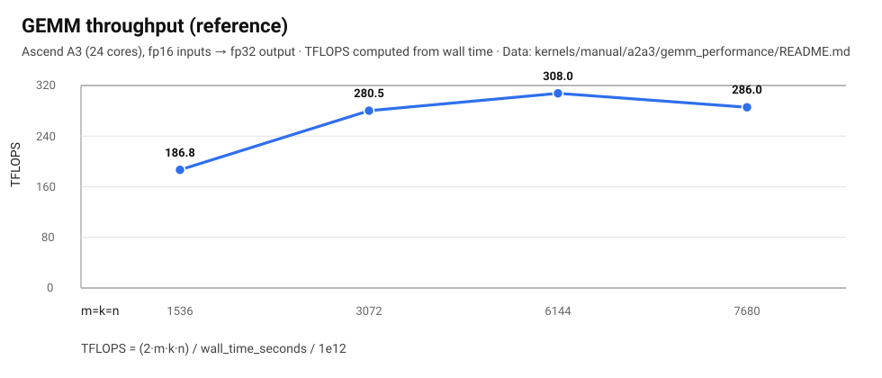
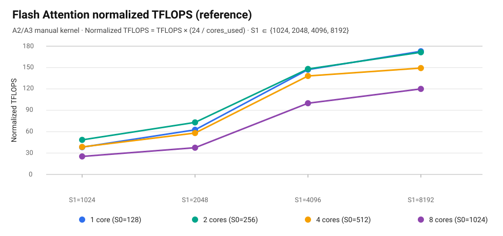

<p align="center">
  
</p>

# PTO Tile Library

Parallel Tile Operation (PTO) is a virtual instruction set architecture designed by Ascend CANN, focusing on tile-level operations. This repository offers high-performance, cross-platform tile operations across Ascend platforms. By porting to PTO instruction sequences, users can migrate Ascend hardware more easily.

## News

* **2025-12-27**: PTO Tile Library becomes publicly available.

## Overview

The PTO ISA (Instruction Set Architecture) is built on Ascend’s underlying hardware and software abstractions, providing over 90 standard tile-level operations.

Ascend hardware architectures have significantly evolved over generations, leading to major changes in the instruction sets. The PTO instruction set bridges these hardware differences by raising the abstraction level. We ensure that these PTO instructions work correctly across platforms while maintaining backward compatibility. However, this abstraction does not hide performance tuning opportunities. Users can still fine-tune performance by adjusting tile sizes, tile shapes, instruction order, etc. This provides sufficient control to fine-tune internal pipeline flows.

Our goal is to offer users a simplified, yet powerful way to optimize performance, enabling them to write high-performance code with PTO instructions.

Currently, PTO instructions are integrated into the following frameworks:

* [PyPTO](https://gitcode.com/cann/pypto/)
* [TileLang Ascend](https://github.com/tile-ai/tilelang-ascend/)
* More languages coming soon

## Target Users of this Repository

PTO Tile Lib is not aimed at beginner-level users. The intended audience includes:

* Backend developers implementing frameworks that directly interface with Ascend hardware.
* Cross-platform application developers.
* High-performance operator developers (manual operator implementations).

## Performance

This repository includes performance-oriented kernels with reference measurements and reproducible setups.For performance testing tools, please refer to the [msprof tool](https://www.hiascend.com/document/detail/zh/canncommercial/850/devaids/Profiling/atlasprofiling_16_0010.html).

### GEMM (A2/A3 reference)

- Kernel: `kernels/manual/a2a3/gemm_performance/`

Measured on Ascend A3 (24 cores) with fp16 inputs → fp32 output:

| Parameter | TMATMUL (Cube) Ratio | TEXTRACT Ratio | TLOAD Ratio | TSTORE Ratio | Execution time (ms) |
| --- | --- | --- | --- | --- | --- |
| `m=1536` `k=1536` `n=1536` | 54.5% | 42.2% | 72.2% | 7.7% | 0.0388 |
| `m=3072` `k=3072` `n=3072` | 79.0% | 62.0% | 90.9% | 5.8% | 0.2067 |
| `m=6144` `k=6144` `n=6144` | 86.7% | 68.1% | 95.2% | 3.1% | 1.5060 |
| `m=7680` `k=7680` `n=7680` | 80.6% | 63.0% | 98.4% | 2.4% | 3.1680 |

Detailed analysis and tuning notes: [High-Performance GEMM Operator Example](kernels/manual/a2a3/gemm_performance/README.md).



### Flash Attention (A2/A3 reference)

- Kernel: `kernels/manual/common/flash_atten/`

Detailed analysis and tuning notes: [Flash Attention Kernel Implementation](kernels/manual/common/flash_atten/README.md).

- S0: query sequence length (number of rows in Q/O)
- S1: key/value sequence length (number of rows in K/V)



## Coming Soon

The following features will be released in the future:

| Feature | Description | Scope |
| --- | --- | --- |
| PTO Auto Mode | BiSheng compiler support to automatically allocate tile buffers and insert synchronization. | Compiler / toolchain |
| PTO Tile Fusion | BiSheng compiler support to fuse tile operations automatically. | Compiler / toolchain |
| PTO-AS | Byte Code Support for PTO ISA. | Compiler / toolchain |
| **Convolution extension** | PTO ISA support for convolution kernels. | ISA Extension |
| **Collective communication extension** | PTO ISA support for collective communication. | ISA Extension |
| **System schedule extension** | PTO ISA support for SPMD/MPMD programming. | ISA Extension |


## How to Use PTO Tile Library

PTO instructions support two development modes:

- **Auto Mode** (recommended for beginners): No need to manually allocate buffers or manage pipelines; the compiler/runtime handles this automatically. Currently available in CPU simulation only.
- **Manual Mode**: Explicitly manage buffer addresses (`TASSIGN`) and pipeline synchronization (Events), used for performance tuning.

Recommended development path:

1. Develop the operator in Auto Mode and verify correctness in CPU simulation → see [Quickstart Guide](#quickstart-guide)
2. Port to Ascend hardware to verify correctness and collect performance data
3. Identify bottlenecks (CUBE Bound / MTE Bound / Vector Bound) and switch to Manual Mode for tuning

### 3.1 Enabling PTO

| Scenario | Framework | Description | Reference |
| --- | --- | --- | --- |
| CPU Simulation | None required | Cross-platform, no CANN/driver dependency, recommended first step | [Quickstart → CPU Simulator](#run-cpu-simulator-recommended-first-step) |
| AclNN Direct Call | CANN AclNN | Dispatch kernel directly via AclRT, without a training framework | [demos/baseline/add](demos/baseline/add/README.md) |
| PyTorch Training/Inference | torch_npu | Register as `torch.ops.npu.<op>` via `TORCH_LIBRARY`, callable from Python | [demos/baseline/add](demos/baseline/add/README.md), [demos/torch_jit/](demos/torch_jit/) |

#### AclNN Direct Call Example

```cpp
// host side: dispatch kernel via ACLRT_LAUNCH_KERNEL
#include "aclrtlaunch_add_custom.h"
void run(float* out, const float* x, const float* y, uint32_t len) {
    EXEC_KERNEL_CMD(add_custom, /*blockDim=*/20, x, y, out, len);
}
```

> Full end-to-end example (with CMakeLists and build scripts): [demos/baseline/add/README.md](demos/baseline/add/README.md)

#### PyTorch (torch_npu) Example

```cpp
// Declare operator schema
TORCH_LIBRARY_FRAGMENT(npu, m) {
    m.def("my_add(Tensor x, Tensor y) -> Tensor");
}
// Register implementation (NPU dispatch key is PrivateUse1)
TORCH_LIBRARY_IMPL(npu, PrivateUse1, m) {
    m.impl("my_add", TORCH_FN(run_add_custom));
}
```

```python
import torch, torch_npu
out = torch.ops.npu.my_add(x, y)  # call from Python
```

> Full example (with setup.py wheel packaging): [demos/baseline/add/README.md](demos/baseline/add/README.md)  
> JIT compilation example (no pre-built wheel needed): [demos/torch_jit/](demos/torch_jit/)

### 3.2 Overall Design

#### 3.2.1 Supported Data Types

The data type is specified via the C++ template parameter `DType`. Using templates is recommended to support multiple types:

```cpp
template <typename T>  // T can be float / half / int32_t / etc.
__global__ __aicore__ void MyKernel(__gm__ T* out, __gm__ const T* in) {
    using TileT = Tile<TileType::Vec, T, 16, 256>;
    // ...
}
```

Common data types and typical supported instructions:

| Data Type | Description | Typical Instructions |
| --- | --- | --- |
| `float` (FP32) | Single-precision float | Almost all vector/matrix instructions |
| `half` (FP16) | Half-precision float | Vector and matrix instructions |
| `int32_t` | 32-bit integer | Integer arithmetic, comparison, shift |
| `int8_t` / `uint8_t` | 8-bit integer | Quantization instructions (`TQUANT`, `TDEQUANT`, etc.) |
| `bfloat16` (BF16) | Brain float (requires GCC >= 14) | Select vector instructions |

> For per-instruction `DType` constraints, see the "Constraints" section of each instruction: [docs/isa/README.md](docs/isa/README.md)

#### 3.2.2 Host-Side Design

The host side is responsible for: allocating output tensors/workspace → setting kernel parameters → dispatching kernel execution.

```cpp
// 1. Allocate output
at::Tensor output = at::empty_like(input);

// 2. Set parallel parameters
uint32_t blockDim    = 20;              // number of cores (A2/A3 max 24, A5 max 20)
uint32_t totalLength = input.numel();

// 3. Dispatch
EXEC_KERNEL_CMD(my_kernel, blockDim, input, output, totalLength);
```

Key notes:
- `EXEC_KERNEL_CMD` / `ACLRT_LAUNCH_KERNEL`: auto-generated by the build system from kernel source; the host only passes GM pointers and shape parameters
- Multi-core parallelism uses SPMD mode; each core computes its data offset via `get_block_idx()`

> Full implementation reference: [demos/baseline/add/README.md](demos/baseline/add/README.md)  
> Operator fusion (reducing kernel launches and GM accesses): [kernels/custom/fused_add_relu_mul/README.md](kernels/custom/fused_add_relu_mul/README.md)

#### 3.2.3 Kernel-Side Design

The standard kernel skeleton: `GlobalTensor` (GM view) → `Tile` (on-chip buffer) → `TLOAD` → compute instructions → `TSTORE`.

**Auto Mode skeleton** (recommended for beginners; compiler manages buffers and sync):

```cpp
#include <pto/pto-inst.hpp>
using namespace pto;

template <typename T, int kRows, int kCols>
__global__ __aicore__ void MyKernel(__gm__ T* out, __gm__ const T* in) {
    GlobalTensor<T, /*...*/ > gin(in), gout(out);
    Tile<TileType::Vec, T, kRows, kCols> src, dst;

    TLOAD(src, gin);
    TADD(dst, src, src);   // example: element-wise add
    TSTORE(gout, dst);
}
```

**Manual Mode skeleton** (explicit address binding + Events, for performance tuning):

```cpp
Tile<TileType::Vec, T, kRows, kCols> src, dst;
TASSIGN(src, 0x0000);  // bind on-chip address explicitly
TASSIGN(dst, 0x4000);

Event<Op::TLOAD, Op::TADD> e_load;
e_load = TLOAD(src, gin);                       // async load
TSTORE(gout, dst, TADD(dst, src, src, e_load)); // wait for e_load, then compute
```

> Getting started tutorial (vector add / row-softmax / GEMM skeleton): [docs/coding/tutorial.md](docs/coding/tutorial.md)  
> Programming model (Auto vs Manual / SPMD vs MPMD): [docs/coding/ProgrammingModel.md](docs/coding/ProgrammingModel.md)  
> Tile abstraction and layout rules: [docs/coding/Tile.md](docs/coding/Tile.md)  
> Event and synchronization model: [docs/coding/Event.md](docs/coding/Event.md)

### 3.3 Supported Hardware

| Platform | Chip | Notes |
| --- | --- | --- |
| Ascend A2 | Ascend 910B | A2/A3 share `include/pto/npu/a2a3/` implementation |
| Ascend A3 | Ascend 910C | Same as above |
| Ascend A5 | Ascend 950 | `include/pto/npu/a5/`; larger L1, supports bigger Tiles |
| CPU Simulation | x86_64 / AArch64 | Cross-platform, for functional verification, no CANN required |

> Hardware differences in Tile size and data type support vary per instruction — see each instruction's constraints.  
> More details: [include/README.md](include/README.md)

### 3.4 Operator Constraints

Common constraints when using PTO Tile instructions:

- **Tile size alignment**: Tile width (`Cols`) must be a multiple of 16 (or 32), otherwise a compile-time error is raised
- **Valid region bounds**: `ValidRow <= Rows` and `ValidCol <= Cols`; src/dst valid regions must match at runtime
- **src/dst must not alias**: Some instructions (e.g. `TRECIP`) do not support src and dst pointing to the same on-chip buffer
- **No overlapping buffers in Manual Mode**: When using explicit `TASSIGN`, address ranges of different Tiles must not overlap
- **TileType must match**: Each instruction strictly requires specific `TileType` (Vec/Mat/Left/Right/Acc) for its operands; mixing types causes a compile error
- **Layout constraint**: Most vector instructions require RowMajor layout

> Per-instruction constraints: [docs/isa/README.md](docs/isa/README.md)  
> Common issues and debugging: [docs/coding/debug.md](docs/coding/debug.md)


## Platform Support

* Ascend A2 (Ascend 910B)
* Ascend A3 (Ascend 910C)
* Ascend A5 (Ascend 950)
* CPU (x86_64 / AArch64)

For more details please refer to [Released PTO ISA](include/README.md)

## Quickstart Guide

For detailed, OS-specific setup (Windows / Linux / macOS), see: [docs/getting-started.md](docs/getting-started.md).

### Build Documentation (MkDocs)

This repository includes comprehensive API documentation and ISA instruction references built with MkDocs (Material theme) under `docs/mkdocs/`. The documentation covers:

- Complete PTO ISA instruction reference
- API usage guidelines and examples
- Performance tuning guides
- Architecture and design documentation

**Option 1: Access Online Documentation (Recommended)**

For the latest documentation, visit the [Documentation Center](https://pto-isa.gitcode.com).

**Option 2: Build Documentation Locally**

Build locally if you need offline access, are working on documentation changes, or want to view unreleased features.

**Prerequisites:**
- Python >= 3.8
- pip (Python package manager)

**Method 1: Quick Start with MkDocs CLI**

1. Install MkDocs and dependencies:

```bash
python -m pip install -r docs/mkdocs/requirements.txt
```

2. Choose one of the following options:

**Option A: Serve documentation locally (for development/preview)**

```bash
python -m mkdocs serve -f docs/mkdocs/mkdocs.yml
```

The documentation will be available at `http://127.0.0.1:8000`. The server watches for file changes and automatically reloads. Press `Ctrl+C` to stop the server.

**Option B: Build static HTML site (for offline use/deployment)**

```bash
python -m mkdocs build -f docs/mkdocs/mkdocs.yml
```

Output will be in `docs/mkdocs/site/`. Open `docs/mkdocs/site/index.html` in your browser.

**Method 2: Build via CMake (Advanced)**

This method is useful for CI/CD pipelines or when integrating documentation builds into your development workflow.

1. Create a Python virtual environment (recommended):

```bash
python3 -m venv .venv-mkdocs
source .venv-mkdocs/bin/activate  # On Windows: .venv-mkdocs\Scripts\Activate.ps1
python -m pip install -r docs/mkdocs/requirements.txt
```

2. Configure and build with CMake:

```bash
cmake -S docs -B build/docs -DPython3_EXECUTABLE=$PWD/.venv-mkdocs/bin/python
cmake --build build/docs --target pto_docs
```

On Windows (PowerShell):

```powershell
cmake -S docs -B build/docs -DPython3_EXECUTABLE="$PWD\.venv-mkdocs\Scripts\python.exe"
cmake --build build/docs --target pto_docs
```

The built documentation will be in `build/docs/site/`.

### Run CPU Simulator (recommended first step)

CPU simulation is cross-platform and does not require Ascend drivers/CANN:

```bash
python3 tests/run_cpu.py --clean --verbose
```

Build & run the GEMM demo (optional):

```bash
python3 tests/run_cpu.py --demo gemm --verbose
```

Build & run the Flash Attention demo (optional):

```bash
python3 tests/run_cpu.py --demo flash_attn --verbose
```

### Running a Single ST Test Case

Running ST requires a working Ascend CANN environment and is typically Linux-only.

```bash
python3 tests/script/run_st.py -r [sim|npu] -v [a3|a5] -t [TEST_CASE] -g [GTEST_FILTER_CASE]
```

Note: the `a3` backend covers the A2/A3 family (`include/pto/npu/a2a3`).

Example:

```bash
python3 tests/script/run_st.py -r npu -v a3 -t tmatmul -g TMATMULTest.case1
python3 tests/script/run_st.py -r sim -v a5 -t tmatmul -g TMATMULTest.case1
```

### Running Recommended Test Suites

```bash
# Execute the following commands from the project root directory:
chmod +x ./tests/run_st.sh
./tests/run_st.sh a5 npu simple
./tests/run_st.sh a3 sim all
```

### Running CPU Simulation Tests

```bash
# Execute the following commands from the project root directory:
chmod +x ./tests/run_cpu_tests.sh
./tests/run_cpu_tests.sh

python3 tests/run_cpu.py --verbose
```

## Build / Run Instructions

### Configuring Environment Variables (Ascend CANN)

For example, if you use the CANN community package and install to the default path:

- Default path (installed as root)

    ```bash
    source /usr/local/Ascend/cann/bin/setenv.bash
    ```

- Default path (installed as a non-root user)
    ```bash
    source $HOME/Ascend/cann/bin/setenv.bash
    ```

If you install to `install-path`, use:

```bash
source ${install-path}/cann/bin/setenv.bash
```

### One-click Build and Run

* Run Full ST Tests:

  ```bash
  chmod +x build.sh
  ./build.sh --run_all --a3 --sim
  ```
* Run Simplified ST Tests:

  ```bash
  chmod +x build.sh
  ./build.sh --run_simple --a5 --npu
  ```
* Packaging:

  ```bash
  chmod +x build.sh
  ./build.sh --pkg
  ```

## Documentation

* ISA Guide and Instruction Navigation: [docs/README.md](docs/README.md)
* Agent Quick Context (repo map + run commands): [docs/agent.md](docs/agent.md)
* ISA Instruction Documentation Index: [docs/isa/README.md](docs/isa/README.md)
* Developer Coding Documentation Index: [docs/coding/README.md](docs/coding/README.md)
* Getting Started Guide (recommended to run on CPU before moving to NPU): [docs/getting-started.md](docs/getting-started.md)
* Security and Disclosure Process: [SECURITY.md](SECURITY.md)
* Directory-level Reading (Code Organization):

  * Build and Packaging (CMake): [cmake/README.md](cmake/README.md)
  * External Header Files and APIs: [include/README.md](include/README.md), [include/pto/README.md](include/pto/README.md)
  * NPU Implementation (Split by SoC): [include/pto/npu/README.md](include/pto/npu/README.md), [include/pto/npu/a2a3/README.md](include/pto/npu/a2a3/README.md), [include/pto/npu/a5/README.md](include/pto/npu/a5/README.md)
  * Kernel/Custom Operators: [kernels/README.md](kernels/README.md), [kernels/custom/README.md](kernels/custom/README.md)
  * Testing and Use Cases: [tests/README.md](tests/README.md), [tests/script/README.md](tests/script/README.md)
  * Packaging Scripts: [scripts/README.md](scripts/README.md), [scripts/package/README.md](scripts/package/README.md)

## Repository Structure

* `include/`: PTO C++ header files (see [include/README.md](include/README.md))
* `kernels/`: Custom operators and kernel implementations (see [kernels/README.md](kernels/README.md))
* `docs/`: ISA instructions, API guidelines, and examples (see [docs/README.md](docs/README.md))
* `tests/`: ST/CPU test scripts and use cases (see [tests/README.md](tests/README.md))
* `scripts/`: Packaging and release scripts (see [scripts/README.md](scripts/README.md))
* `build.sh`, `tests/run_st.sh`: Build, package, and example run entry points

## License

This project is licensed under the CANN Open Software License Agreement Version 2.0. See the `LICENSE` file for details.
