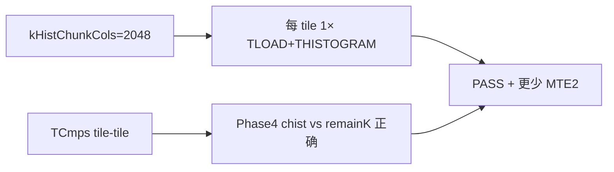

# 案例：A5 TopK 直方图 tiling 扩到 2048

本文记录把 **Phase1/3 `THISTOGRAM` 的列向 tiling** 从 **256** 提到 **2048** 的完整经验：动机、参数分工、一次隐蔽的正确性 bug、仿真排障手段、性能收益与回归清单。实现见 [`kernels/manual/a5/topk/`](../../../kernels/manual/a5/topk/)（`draft.cpp`）。

---

## 1. 问题背景

| 项目 | 值 |
|------|-----|
| 平台 | Ascend A5（仿真 `Ascend950PR_9599`） |
| 算法 | 2 字节 key 的 Radix-Select TopK |
| 规模 | N=8192，TopK=512 |
| GM 分块 | `kTileCols = 2048` → 4 个 GM tile |
| 校验 | host 比较 `keys[out[i]]` 多重集合（不要求输出下标有序） |

与 [`topk_ub`](../../../kernels/manual/a5/topk_ub/) 的区别：本工程 **按 GM tile 分块读入**；`topk_ub` 为整段 key 在 UB 上的对照实现。

---

## 2. 三类 tiling 参数（不要混为一谈）

`draft.cpp` 里同时存在 **三个独立的列宽常量**，职责不同：

| 常量 | 当前值 | 作用阶段 | 含义 |
|------|--------|----------|------|
| `kTileCols` | **2048** | 外层 GM 循环 | 每个 GM tile 的列宽（8192÷4） |
| `kHistChunkCols` | **2048**（默认） | Phase1、Phase3 | 每次 `TLOAD` + `THISTOGRAM` 处理的列数 |
| `kChunkCols` | **256** | Phase5 | `TGATHER` / `TCONCAT_IMPL` 的列切片 |

### 2.1 为何直方图可以一次 2048，gather 仍用 256？

- **直方图**：`THISTOGRAM` 在 UB 上累加 256 个 bin，对 **输入列宽** 的约束相对宽松；把 `kHistChunkCols` 提到与 GM tile 同宽，可把「每 tile 8 次 hist 切片」降为 **1 次**，显著减少 `TLOAD` 与 VF 启动次数。
- **Gather / concat**：Phase5 的 `TGATHER`、六参 `TCONCAT_IMPL` 与 UB 上 `idx*Out`/`idx*Acc` 布局强相关，**仍按 256 列切片** 更稳（与历史调优、mask 宽度一致）。**不要**为了「统一 tiling」把 Phase5 也强行改成 2048，除非单独验证 UB 与 VF 模板。

### 2.2 从 256 提到 2048 时改了什么？

**仅** Phase1/3 内层循环步长：

```cpp
// Phase1/3：sub 步长由 kHistChunkCols 决定
for (int sub = 0; sub < valid; sub += kHistChunkCols) {
    int subValid = (sub + kHistChunkCols <= valid) ? kHistChunkCols : (valid - sub);
    inTile.SetValidCol(subValid);
    // TLOAD → THISTOGRAM → TADD(chist, ...)
}
```

当 `valid == kTileCols == 2048` 且 `kHistChunkCols == 2048` 时，内层循环 **只跑 1 次**（`num_hist_slices_per_pass = 4` 时仍为每 GM tile 1 次直方图）。

---

## 3. 正确性：表面像 tiling，根因是 `TCMPS` 标量路径

### 3.1 现象（`kHistChunkCols=2048` 失败时）

- 仿真 **FAIL**；`kHistChunkCols=256` **PASS**。
- Phase4 后观测：`lsbWinnerBin=16`，`packedThr=0xF010`（错误）。
- 修复后：`lsbWinnerBin=90 (0x5a)`，`packedThr=0xF05a`，与 golden 一致。

### 3.2 误导性线索（已排除）

| 假设 | 结论 |
|------|------|
| `remainK` 在 UB 被踩 | `0x25000` 在 Phase2 后正确为 **12 (0x0C)**，直到 Phase4 `TOR` 才写成 packed 阈值 |
| Phase5 前缺 `pipe_barrier` | 加 `PIPE_ALL` **不能**修复旧 bug |
| 2048 宽 `THISTOGRAM` 本身非法 | rebase 后 2048 直方图 **PASS**；并补充 THISTOGRAM ST `1×2048` |

### 3.3 真正根因：Phase4 `TCMPS` 比较对象错误

旧版 `include/pto/npu/a5/TCmps.hpp` 在 tile-tile 场景仍用 **标量** 读 `src1`：

```cpp
// 错误模式（示意）：只取 src1 第一个元素
T src1Value = *src1;
```

VF  lowering 后，Phase4 的 `TCMPS GT`（`chist` vs `remainK`）实际变成 **`chist` 与 index tile 比较**，winner bin 与 packed 阈值全错。这与 hist 列宽 256/2048 **无直接关系**——只是 2048 路径更容易暴露错误结果。

**修复（上游已合入）**：`TCmpsTileB32` 等对 `src1` 使用整 tile 加载，例如：

```cpp
vlds(src1Reg, src1, 0, BRC_B32);
// 每行 repeat 内 CmpCall(src0Reg*, src1Reg, mode, ...)
```

**经验**：扩 tiling 前，先 `git fetch` + rebase `origin/master`，确认 `TCmps.hpp` 为 **tile-tile** 实现；本地 stash 若覆盖该文件，应 **保留上游** 而非自己的 fence/调试补丁。

### 3.4 依赖关系小结



二者 **都满足** 时，2048 hist tiling 才同时正确且更快。

---

## 4. 排障手段（仿真 dump + 脚本）

### 4.1 环境变量（A5 仿真）

在 `run.sh` 或手动运行前设置（路径以实际 build 为准）：

- `CAMODEL_LOG_PATH`：指定 dump 输出目录
- 关注 `core0.veccore0.ub.{rd,wr}_log.dump`、`rvec_pv.dump`

### 4.2 分阶段核对清单

| 阶段 | 关注点 | 辅助脚本（`topk/scripts/`） |
|------|--------|------------------------------|
| Phase1 | MSB `chist` 累加 | `check_phase1_chist_msb.py` |
| Phase3 | LSB hist 输入 / MSB winner | `check_phase3_histogram_input.py`, `check_phase3_msb_winner.py` |
| Phase4 | `remainK`、packed `TOR` | `check_phase4_packed_tor.py`, `compare_phase4_ub_pv.py` |
| Golden | 理论 winner / GT\|EQ 计数 | `radix_topk_golden_stats.py` |

### 4.3 归档对比

为便于评审，可保留 **PASS 256** 与 **FAIL 2048（修 TCmps 前）** 的 dump 目录（例如 `build_dump_pass256/`、`build_dump_fail2048/`），与当前 `build/` 对比 `lsbWinnerBin`、`packedThr` 与 UB 地址 `0x25000`。

### 4.4 推荐调试顺序

1. 单 seed `gen_data.py` + `./topk` → `RESULT`
2. 失败时先 Phase4（`TCMPS`/`TOR`），再 Phase3 hist，最后 Phase5 gather
3. 怀疑指令语义时查 `docs/isa/TCMPS.md` 与 **仓库头文件** 是否一致（`CMakeLists.txt` 已 `BEFORE` 本仓库 `include/`）

---

## 5. 性能：2048 hist vs 256 hist 切片（8K，seed `1241200609`）

归档见 `kernels/manual/a5/topk/perf/`：

| 指标 | `kHistChunkCols=2048`（当前） | hist256gm 归档 |
|------|------------------------------:|---------------:|
| kernel ticks | **52,207** | 87,221 |
| MTE2 busy | 36,277 | ~66k |
| rvec busy | 27,565 | ~34.5k |
| msprof 墙钟（veccore0） | **~28.7 µs** | （见 `*_hist256gm.json`） |

Phase5 VF 占比仍最高（~86% rvec）；收益主要来自 **更少 hist 切片与 MTE2**。解析脚本：

```bash
python3 scripts/parse_phase_perf.py --build-dir build --seed 1241200609 \
  --hist-chunk-cols 2048 --opprof-dir build/OPPROF_<id> \
  -o perf/phase_perf_8k_seed1241200609.json
```

---

## 6. 测试与回归

### 6.1 手工 TopK（8K）

```bash
cd kernels/manual/a5/topk
source $ASCEND_HOME_PATH/set_env.sh
export LD_LIBRARY_PATH=$ASCEND_HOME_PATH/tools/simulator/Ascend950PR_9599/lib:...
cd build && make -j16 && cd ..
for s in 1241200609 2203936584 191132090; do
  python3 scripts/gen_data.py --seed $s && cd build && ./topk | grep RESULT; cd ..
done
python3 scripts/gen_data.py --const 0x1234 && cd build && ./topk | grep RESULT
```

单次仿真约 **3–5 min**（4×2048 GM tile）。

### 6.2 THISTOGRAM ST（2048 宽）

`tests/npu/a5/src/st/testcase/thistogram/` 中补充了 **`1×2048`** 等用例，用于在 ST 层隔离直方图指令，与 TopK 端到端互补。

### 6.3 头文件优先级

`kernels/manual/a5/topk/CMakeLists.txt` 使用 **`BEFORE` 本仓库 `include/`**，避免链接到 CANN 安装树里的旧 `TCmps.hpp`。

---

## 7. 经验清单（可抄到其它算子）

1. **先分清** GM tile、hist 子块、gather 子块三个 tiling 旋钮，避免「一刀切 2048」。
2. **扩 hist tiling** 前确认 **`TCMPS`/`TCMP` 等控制流指令** 的 tile-tile 语义与 ISA 文档一致；标量 `*src1` 在 VF 下会静默错。
3. **FAIL 且仅大 tile 触发** 时，优先查 **比较/选择类指令** 与 UB 上标量槽位，不要先怀疑 `pipe_barrier`。
4. **用分 phase 脚本 + dump** 把错误钉在 Phase4 之前还是之后，减少全量 trace 阅读。
5. **性能**：hist 与 GM tile 同宽时优先看 **MTE2 busy** 与 **hist 切片次数**；compute-bound 的 Phase5 可能几乎不变。
6. **rebase 后** 再跑 3 seed + `--const`；归档 `perf/*_hist256gm.*` 便于 PR 说明「为何更快」。
7. **ST + manual** 双层覆盖：ST 验证单指令宽度；manual 验证流水线与 UB 布局。

---

## 8. 相关链接

- 工程 README：[`kernels/manual/a5/topk/README_zh.md`](../../../kernels/manual/a5/topk/README_zh.md)
- UB 对照实现：[`kernels/manual/a5/topk_ub/README_zh.md`](../../../kernels/manual/a5/topk_ub/README_zh.md)
- `TCMPS` ISA：[`docs/isa/TCMPS.md`](../../isa/TCMPS.md)
- 性能优化总览：[`docs/coding/opt_zh.md`](../opt_zh.md)
- 调试断言索引：[`docs/coding/debug_zh.md`](../debug_zh.md)
