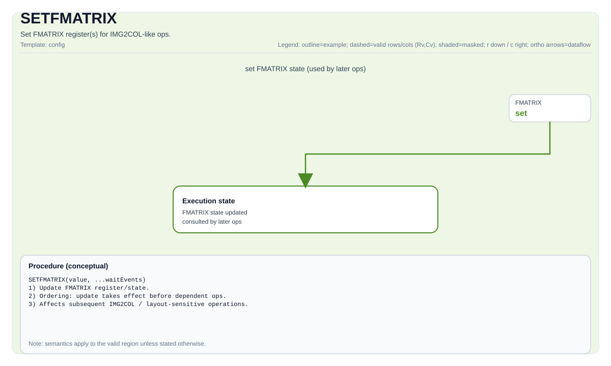

# SETFMATRIX

## Tile Operation Diagram



## Introduction

Program the FMATRIX register(s) used by IMG2COL-like operations from a `ConvTile`'s fmap dimensions and padding list (target/implementation-defined).

## See also

- IMG2COL instruction: `docs/isa/TIMG2COL.md`.

## C++ Intrinsic

Declared in `include/pto/common/pto_instr.hpp`:

```cpp
template <typename ConvTileData, SetFmatrixMode FmatrixMode = SetFmatrixMode::FMATRIX_A_MANUAL, typename... WaitEvents>
PTO_INST RecordEvent SETFMATRIX(ConvTileData &src, WaitEvents&... events);
```

## Math Interpretation

This instruction produces no direct tensor arithmetic. It packs the ConvTile's fmap width/height and padding list into the **FMATRIX hardware register** consumed by subsequent `TIMG2COL`-like operations. Register layout (implementation-defined): the low 16 bits hold `fmapW`, the next 16 bits hold `fmapH`, and from bit 32 onward each 8 bits hold one padding value (four total, taken from `src.GetPadListArray()[0..3]`).

It takes effect only when `FmatrixMode` is `FMATRIX_A_MANUAL` / `FMATRIX_B_MANUAL` (calling `set_fmatrix` / `set_fmatrix_b` respectively); under `FMATRIX_A_AUTO` / `FMATRIX_B_AUTO` it is a no-op.

## Constraints

- This instruction is backend-specific and available only for backends that expose an FMATRIX register.
- `src` must be a ConvTile type that provides `GetFmapW()` / `GetFmapH()` / `GetPadListArray()`.
- The register is written only when `FmatrixMode` is `FMATRIX_A_MANUAL` / `FMATRIX_B_MANUAL`; `FMATRIX_A_AUTO` / `FMATRIX_B_AUTO` are no-ops.
- Set FMATRIX before dependent `TIMG2COL` operations in the same execution stream.

## Examples

```cpp
#include <pto/pto-inst.hpp>

using namespace pto;

void example_setfmatrix() {
  // ConvTile<Loc, Element, BufferSize, Layout, ConvTileShape<...>>
  using CfgTile = ConvTile<TileType::Mat, half, 128, Layout::NC1HWC0,
                           ConvTileShape<1, 1, 16, 16, 16>>;
  CfgTile cfg;

  SETFMATRIX(cfg);                                            // default FmatrixMode = FMATRIX_A_MANUAL
  SETFMATRIX<CfgTile, SetFmatrixMode::FMATRIX_B_MANUAL>(cfg); // explicit B-side
}
```
