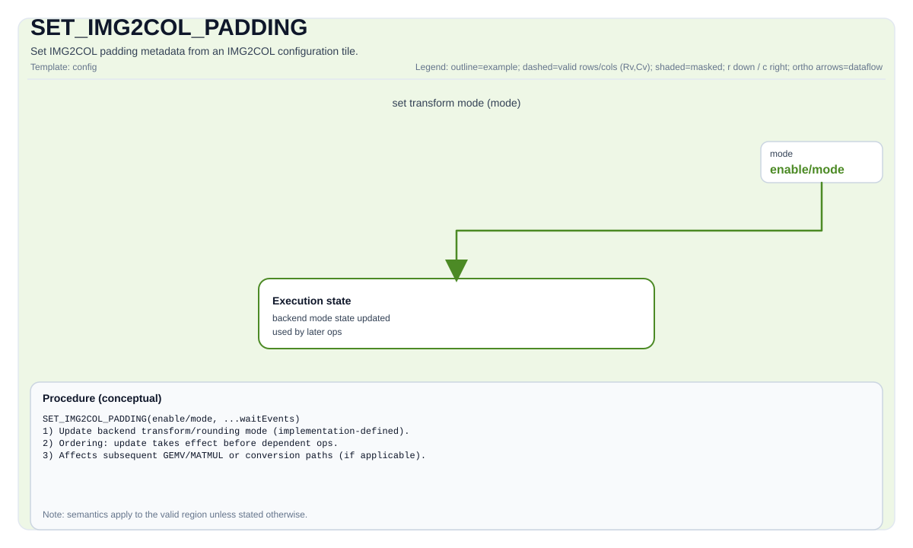

# SET_IMG2COL_PADDING

## 指令示意图



## 简介

从 IMG2COL 配置 Tile 设置 IMG2COL 填充元数据（实现定义）。

## 数学语义

该指令不直接产生张量算术结果。它会更新后续数据搬运类操作使用的 IMG2COL 填充控制状态。

## C++ 内建接口

声明于 `include/pto/common/pto_instr.hpp`：

```cpp
template <typename ConvTileData, SetFmatrixMode FmatrixMode = SetFmatrixMode::FMATRIX_A_MANUAL, typename... WaitEvents>
PTO_INST RecordEvent SET_IMG2COL_PADDING(ConvTileData &src, WaitEvents &... events);
```

`FmatrixMode` 带默认值 `FMATRIX_A_MANUAL`，可省略该模板参数；需要时显式指定（如 `SetFmatrixMode::FMATRIX_B_MANUAL`）。

## 约束

- 该指令属于后端相关能力，仅在支持 IMG2COL 配置状态的后端可用。
- `src` 必须是目标后端接受的 IMG2COL 配置 Tile 类型。
- 该指令更新的填充相关字段属于实现定义行为。
- 在同一执行流中，应先设置该状态，再执行依赖的 `TIMG2COL` 指令。

## 示例

```cpp
#include <pto/pto-inst.hpp>

using namespace pto;

void example_set_img2col_padding() {
  // ConvTile<Loc, Element, BufferSize, Layout, ConvTileShape<...>>
  using CfgTile = ConvTile<TileType::Mat, half, 128, Layout::NC1HWC0,
                           ConvTileShape<1, 1, 16, 16, 16>>;
  CfgTile cfg;

  SET_IMG2COL_PADDING(cfg); // 默认 FmatrixMode = FMATRIX_A_MANUAL
}
```
