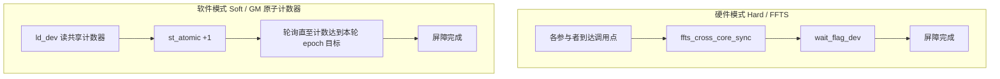

# SYNCALL

## 指令示意图

> 仓库未提供 `SYNCALL.svg`。`SYNCALL` 是**跨核控制面**原语，不描述单Tile上的数据变换，语义为「全体参与者在同一点汇合后再前进」。




## 简介

`SYNCALL` 是跨核同步屏障。两个模板参数各自独立：

- `SyncCoreType` 选参与者集合：**AIVOnly**（默认）、**AICOnly**、**Mix**（AIC+AIV）。
- `SyncAllMode` 选实现路径：**Hard**（FFTS硬件旗标，无workspace重载）、**Soft**（GM共享原子计数器，带workspace重载）。

## 数学语义

不适用逐元素算术语义，表达的是 **barrier 到达** 关系：属于当前参与者集合的每个core都执行过该 `SYNCALL` 之后，任一core方可继续。Hard与Soft的语义完全相同，仅实现路径不同。

## C++内建接口

公共头 `<pto/pto-inst.hpp>`，声明位于 `include/pto/common/pto_instr.hpp`：

```cpp
// 硬件模式（所有 CoreType 通用）
template <SyncCoreType CoreType = SyncCoreType::AIVOnly>
PTO_INST void SYNCALL();

// 软件模式 — GM 共享原子计数器
template <SyncAllMode Mode, SyncCoreType CoreType = SyncCoreType::AIVOnly, typename GlobalData,
          std::enable_if_t<is_global_data_v<GlobalData>, int> = 0>
PTO_INST void SYNCALL(GlobalData &gmWorkspace, int32_t usedCores = 0);
```


## 参数

- `gmWorkspace`：Soft模式使用的一块GM缓冲，类型为 `GlobalTensor<int32_t, pto::Shape<>, pto::Stride<>>`。指令只用它的**首个int32**作为全体参与者共享的到达计数器，因此分配一条cache line即可，且**首次使用前必须清零**。
- `usedCores`：参与同步的核数。
  - 为0时由指令自动推算：AIV-only 与 AIC-only 取本次launch的核数；MIX 取全部AIC核与其配对AIV核之和。
  - 显式指定时**可小于launch核数**，即只让部分核参与同步；此时未参与的核**不得**调用 `SYNCALL`。

`Mode` 为 `Hard` 时忽略 `gmWorkspace` 与 `usedCores`，行为等同无参 `SYNCALL()`。

## 约束


### 编译与启动

`SYNCALL` 能否生效取决于kernel的编译arch与启动方式，违反下列约束的典型表现是hang而非报错。完整可运行示例见ST用例 `[tests/npu/a2a3/src/st/testcase/syncall/](../../tests/npu/a2a3/src/st/testcase/syncall/)` 与 `[tests/npu/a5/src/st/testcase/syncall/](../../tests/npu/a5/src/st/testcase/syncall/)`。

- **Hard与Soft不可共用同一** `.so`（AIV-only / AIC-only场景下soft会污染hard的FFTS配置导致hang）。MIX 1:2的hard与soft同走自动拆分，可同 `.so`。
- **A2/A3 的 Hard AIC-only 必须用** `dav-c220` **MIX 编译**：纯 `dav-c220-cube` 建立不起AIC-only硬同步所需的FFTS上下文，须由AIC执行 `SYNCALL<AICOnly>()`、AIV留空stub。A5 用纯 `dav-c310-cube` 即可。
- **MIX 1:1 只能cube / vec双路编译**：自动拆分的物理比例恒为1:2。Soft靠双流chevron + GM计数器同步；Hard需单一MIX FFTS上下文，只能走register ELF，A5因取不到FFTS基址而无此路径。
- MIX场景的 `aicBlocks` / 参与者数应作为标量参数从Host传入，AIC/AIV两侧读同一份，以适配不同芯片的cube数。
- **绕开自动拆分手工编译kernel时，须手写kernel meta**，否则runtime按错误的核型调度、硬同步拿不到FFTS上下文而hang。meta是写入 `.ascend.meta.<入口符号名>` 段的一条记录，声明该kernel的核型与AIC:AIV配比，宏定义见 `include/pto/common/kernel_meta.hpp`：`PTO_SYNCALL_AIV_KERNEL_META` / `PTO_SYNCALL_AIC_KERNEL_META` / `PTO_SYNCALL_MIX_AIC_KERNEL_META(kernelName, aicRatio, aivRatio)`，宏参须与 `__global__` 入口符号完全一致。仅A2/A3的三种场景需要：Hard AIV-only、Soft AIC-only、register-ELF的MIX 1:1 Hard（AIC与AIV两侧都用MIX宏、配比填1:1，写法见 `syncall_mix_1_1_kernel.cpp`）。chevron自动拆分与单arch编译的meta由Bisheng生成，A5全部场景均无需手写。


### 使用

- Soft模式要求所有参与的核以**相同顺序、相同次数**进入同一组barrier；epoch由单调计数推导，次数或顺序不一致会错配或死锁。
- `SYNCALL` 只保证barrier**到达**，业务数据的顺序与可见性均由调用方保证：它不参与PTO的Event自动依赖编排（不接受 `WaitEvents`，也不返回 `RecordEvent`），不会等待本核前序数据指令（如 `TSTORE`）完成；hard与soft也都**不刷业务数据的cache**，跨核读写GM需自行 `dcci` / `dsb`。
- auto构建路径（`__PTO_AUTO__`）下 `SYNCALL` 为no-op，真实同步只在manual kernel中发生。


## 示例


### 硬件模式

```cpp
#include <pto/pto-inst.hpp>

using namespace pto;

void example_hard_aiv() { SYNCALL(); }                        // 全AIV核
void example_hard_aic() { SYNCALL<SyncCoreType::AICOnly>(); } // 全AIC核
void example_hard_mix() { SYNCALL<SyncCoreType::Mix>(); }     // AIC+AIV
```

编译与启动方式见「约束 / 编译与启动」，A2/A3 部分场景还需按「Kernel Meta宏」声明meta。

### 软件模式

```cpp
#include <pto/pto-inst.hpp>

using namespace pto;

// AIV-only：usedCores=0 自动取 get_block_num()
void example_soft_aiv(__gm__ int32_t *gmPtr) {
  GlobalTensor<int32_t, pto::Shape<>, pto::Stride<>> gmWs(gmPtr);
  SYNCALL<SyncAllMode::Soft, SyncCoreType::AIVOnly>(gmWs, 0);
}

// MIX：AIC与AIV参与者到达同一计数器
void example_soft_mix(__gm__ int32_t *gmPtr) {
  GlobalTensor<int32_t, pto::Shape<>, pto::Stride<>> gmWs(gmPtr);
  SYNCALL<SyncAllMode::Soft, SyncCoreType::Mix>(gmWs, 0);
}

// 部分核参与：launch 全部核，仅前 syncBlocks 个核同步，其余核不得调用 SYNCALL
void example_soft_partial(__gm__ int32_t *gmPtr, int32_t syncBlocks) {
  if (static_cast<int32_t>(get_block_idx()) >= syncBlocks) {
    return;
  }
  GlobalTensor<int32_t, pto::Shape<>, pto::Stride<>> gmWs(gmPtr);
  SYNCALL<SyncAllMode::Soft, SyncCoreType::AIVOnly>(gmWs, syncBlocks);
}
```

