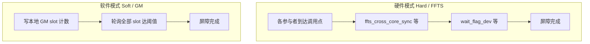

# SYNCALL

## 指令示意图

> 仓库当前未提供 `SYNCALL.svg`（与多数向量算子不同）。`SYNCALL` 为**跨核控制面**原语，不描述单 Tile 上的逐元素数据变换；语义上可理解为「所有选定参与者在同一点汇合后再前进」。

以下示意区分硬件（FFTS）与软件（GM 轮询）两条路径（概念图，非规范绑定）：



## 简介

`SYNCALL` 是跨核同步屏障，支持 A2/A3 和 A5 NPU 后端。通过模板参数 `SyncCoreType` 选择核类型模式：

- **AIV-only**（默认）：`SYNCALL()` 同步所有 AIV 核。
- **AIC-only**：`SYNCALL<SyncCoreType::AICOnly>()` 同步所有 AIC 核（A2/A3 支持硬件和软件模式；A5 仅支持硬件模式）。
- **MIX（AIC+AIV）**：`SYNCALL<SyncCoreType::Mix>()` 同步 AIC 和 AIV 混合核。

通过 `SyncAllMode`（在带 workspace 的重载中显式给出）选择 **硬件模式（FFTS）** 或 **软件模式（GM 轮询）**。无 workspace 的重载对应硬件路径。

## 数学语义

不适用逐元素算术语义。`SYNCALL` 表达的是 **barrier（屏障）到达** 关系：

- 在某一动态程序点上，凡属于当前 `SyncCoreType` 所划定参与者集合的 core，均须执行到该 `SYNCALL` 调用之后，任一参与者方可越过该点继续执行后续代码。
- 硬件模式：由 FFTS 旗标与设备侧 `wait_flag_dev` 等原语保证跨核可见顺序。
- 软件模式：由 GM 中各参与者独占 slot 的单调计数与 `dcci`/`dsb` 等一致性原语，在轮询中判定「全员已到达当前代数」。

该语义**不**对 barrier 之后的 GM 或其它 buffer 内容作额外保证；若需与数据可见性组合，仍须由调用方显式同步或遵循既有数据面约定。

## C++ 内建接口

声明于 `include/pto/common/pto_instr.hpp`。软件模式接口使用类型安全的 `GlobalTensor` 和 `Tile` 参数（通过 SFINAE 约束）：

```cpp
// 硬件模式（所有 CoreType 通用）
template <SyncCoreType CoreType = SyncCoreType::AIVOnly>
PTO_INST void SYNCALL();

// 软件模式 — AIV-only（GlobalTensor + Vec Tile）
template <SyncAllMode Mode, SyncCoreType CoreType = SyncCoreType::AIVOnly,
          typename GlobalData, typename TileData,
          std::enable_if_t<is_global_data_v<GlobalData> &&
                           is_tile_data_v<TileData> && TileData::Loc == TileType::Vec, int> = 0>
PTO_INST void SYNCALL(GlobalData &gmWorkspace, TileData &ubWorkspace, int32_t usedCores = 0);

// 软件模式 — AIC-only（GlobalTensor + Mat Tile）
template <SyncAllMode Mode, SyncCoreType CoreType = SyncCoreType::AICOnly,
          typename GlobalData, typename TileData,
          std::enable_if_t<is_global_data_v<GlobalData> &&
                           is_tile_data_v<TileData> && TileData::Loc == TileType::Mat, int> = 0>
PTO_INST void SYNCALL(GlobalData &gmWorkspace, TileData &l1Workspace, int32_t usedCores = 0);

// 软件模式 — MIX（GlobalTensor + Vec Tile + Mat Tile）
template <SyncAllMode Mode, SyncCoreType CoreType = SyncCoreType::Mix,
          typename GlobalData, typename UbTileData, typename L1TileData,
          std::enable_if_t<is_global_data_v<GlobalData> &&
                           is_tile_data_v<UbTileData> && UbTileData::Loc == TileType::Vec &&
                           is_tile_data_v<L1TileData> && L1TileData::Loc == TileType::Mat, int> = 0>
PTO_INST void SYNCALL(GlobalData &gmWorkspace, UbTileData &ubWorkspace, L1TileData &l1Workspace,
                       int32_t usedCores = 0);
```

## 参数

- `gmWorkspace`: `GlobalTensor<int32_t, pto::Shape<>, pto::Stride<>>`（在 Ascend C 与 `using namespace pto` 并存时，建议写全 `pto::`，避免与编译器内置头中的 `Stride` 枚举同名冲突）。软件模式使用的 GM workspace，调用前需要初始化为 0。每个参与 core 占用 8 个 `int32_t`（按 cache line 隔离同步计数）。
- `ubWorkspace`: `Tile<TileType::Vec, int32_t, 1, SYNCALL_SOFT_SLOT_INT32>`。AIV-only 和 MIX 软件模式使用的 UB scratch，容量至少为 `usedCores * 8 * sizeof(int32_t)`。
- `l1Workspace`: `Tile<TileType::Mat, int32_t, 1, SYNCALL_SOFT_SLOT_INT32>`。AIC-only 和 MIX 软件模式使用的 L1（cbuf）scratch，用于 `create_cbuf_matrix` 填充同步值后经 DMA 搬移到 GM。
- `usedCores`: 参与软件 barrier 的 core 数。为 0 时自动推算——AIV-only 使用 `get_block_num()`，AIC-only 使用 `get_block_num()`，MIX 使用 `SYNCALL_GET_MIX_PARTICIPANT_COUNT()`（即 `AIC blocks × (1 + AIV ratio)`）。

## Kernel Meta 宏

MIX 模式 kernel 需要在 ELF 中嵌入 `.ascend.meta` 信息，供 runtime 正确调度 AIC/AIV 子 kernel。宏定义于 `include/pto/common/kernel_meta.hpp`：

```cpp
// AIV 侧 kernel（标记为 MIX_AIV_MAIN，ratio 固定 0:1）
PTO_SYNCALL_AIV_KERNEL_META(kernelName);

// AIC 侧 kernel（标记为 MIX_AIC_MAIN，指定 AIC:AIV 比例）
PTO_SYNCALL_MIX_AIC_KERNEL_META(kernelName, aicRatio, aivRatio);
```

使用示例（1:2 混合模式）：

```cpp
PTO_SYNCALL_MIX_AIC_KERNEL_META(MyKernel_mix_aic, 1, 2);  // AIC kernel ELF
PTO_SYNCALL_AIV_KERNEL_META(MyKernel_mix_aiv);             // AIV kernel ELF
```

> 历史别名 `PTO_SYNCALL_AIV_KERNEL_META` / `PTO_SYNCALL_MIX_AIC_KERNEL_META` 仍可使用，等价于上述宏。

> **dav-c220 自动拆分**：使用 `--cce-aicore-arch=dav-c220` 编译时，Bisheng 会自动生成 AIC/AIV 子 kernel 及对应 `.ascend.meta`，物理比例为 **1:2**（每个 AIC block 配 2 个 AIV subblock）。此时**无需**手写 `PTO_SYNCALL_MIX_AIC_KERNEL_META`，也**不能**通过 meta 把比例改成 1:1（见下文「MIX 1:1」）。

## 编译与调度指南（A2/A3）

本节以 ST 用例 [`tests/npu/a2a3/src/st/testcase/syncall_mix_chevron/`](../../tests/npu/a2a3/src/st/testcase/syncall_mix_chevron/) 为准，说明不同 `SyncCoreType` / 模式 / AIC:AIV 比例下应采用的**编译 arch**、**Meta** 与 **Host 启动**方式。历史用例 [`syncall/`](../../tests/npu/a2a3/src/st/testcase/syncall/) 仍保留 register-ELF 全路径实现，逻辑等价；新开发优先参考 chevron 目录的分场景写法。

### 场景速查表

| 场景 | 同步模式 | 参与者数（910B4） | 编译 `--cce-aicore-arch` | Kernel Meta | Host 启动 | 参考源文件 |
|------|---------|-------------------|--------------------------|-------------|-----------|-----------|
| AIV-only | Hard | 40 AIV | `dav-c220-vec` | `PTO_SYNCALL_AIV_KERNEL_META` | chevron `<<<40>>>` | `syncall_aiv_hard_kernel.cpp` |
| AIV-only | Soft | 40 AIV | `dav-c220-vec` | 无 | chevron `<<<40>>>` | `syncall_aiv_soft_kernel.cpp` |
| AIC-only | Hard | 20 AIC | **`dav-c220`**（MIX 自动拆分，AIV 空 stub） | 由 Bisheng 自动生成 | chevron `<<<20>>>` | `syncall_aic_hard_kernel.cpp` |
| AIC-only | Soft | 20 AIC | `dav-c220-cube` | 无 | chevron `<<<20>>>` | `syncall_aic_soft_kernel.cpp` |
| MIX 1:2 | Hard / Soft | 60（20 AIC + 40 AIV） | **`dav-c220`**（`pto_mix_st`） | 由 Bisheng 自动生成 | chevron `<<<20>>>` | `syncall_mix_chevron_kernel.cpp` |
| MIX 1:1 | Soft | 40（20 AIC + 20 AIV） | cube + vec 各编一份 `.o`，链成单个 `.so` | 可选（soft 不依赖 FFTS 上下文） | **双流** chevron：AIC `<<<20>>>` + AIV `<<<20>>>` 各一 stream | `syncall_mix11_soft_kernel.cpp` |
| MIX 1:1 | Hard | 40（20 AIC + 20 AIV） | cube + vec 各编一份 `.o` | **`PTO_SYNCALL_MIX_AIC_KERNEL_META(..., 1, 1)`** | **register ELF** + `rtKernelLaunchWithHandleV2` | `syncall_mix11_hard_kernel.cpp` |

### 各路径说明

#### 1. Chevron 单 arch 编译（AIV-only / AIC-only soft）

- 编译：单个源文件 + 对应 arch（`dav-c220-vec` 或 `dav-c220-cube`），产出独立 `.so`。
- 启动：`kernel<<<blockDim, nullptr, stream>>>(...)`，blockDim 等于参与 barrier 的 core 数。
- Hard AIV-only 须在 kernel 上声明 `PTO_SYNCALL_AIV_KERNEL_META`，使 runtime 按 `KERNEL_TYPE_MIX_AIV_1_0` 调度。

#### 2. Chevron MIX 自动拆分（MIX 1:2、Hard AIC-only）

- 编译：`--cce-aicore-arch=dav-c220`，Bisheng 将同一源文件拆成 AIC/AIV 两份 device 代码并嵌入 meta；CMake 可用 `pto_mix_st(<target>)` 封装。
- 启动：只需一次 chevron，`<<<AIC block 数>>>`（910B4 为 20）；runtime 按 1:2 拉起 20 AIC + 40 AIV。
- **Hard AIC-only 特例**：纯 `dav-c220-cube` 无法建立 AIC-only 硬同步所需的 FFTS 上下文，会 hang。须改为 `dav-c220` MIX 编译：AIC 侧执行 `SYNCALL<AICOnly>()`，AIV 侧为空 stub，借助 MIX launch 提供 FFTS 环境。

#### 3. 双 arch 双 stream（MIX 1:1 Soft）

- 原因：ccec/bisheng 路径下 `GetTaskRation()` 恒为 **2**，`dav-c220` 自动拆分物理固定 **1:2**，无法通过 meta 覆盖为 1:1。
- 编译：同一源文件分别以 `dav-c220-cube`（`-DSYNCALL_MIX_BUILD_AIC`）和 `dav-c220-vec`（`-DSYNCALL_MIX_BUILD_AIV`）各编一份 `.o`，链接为一个 `.so`。
- 启动：AIC 与 AIV kernel 分别在两个 `aclrtStream` 上 chevron `<<<20>>>`；soft 同步走 GM 轮询，**不依赖**统一 MIX FFTS 上下文，因此双流可行。

#### 4. Register ELF（MIX 1:1 Hard）

- 原因：Hard MIX 同步需要**单一** MIX FFTS 上下文，双流 Hard 不可用；而 chevron 自动拆分在 ccec 下做不到真 1:1（实测输出全 0）。CANN 内置算子的 `KERNEL_TYPE_MIX_AIC_1_1` 仅在 **opc** 编译路径下 `GetTaskRation()==1`；ccec 路径同为 2。
- 编译：
  1. cube / vec 各编一份带 `PTO_SYNCALL_MIX_AIC_KERNEL_META(name, 1, 1)` 的 `.o`；
  2. 再以 `-DSYNCALL_MIX_REGISTER_BUILD` 各编 register 专用 `.o`；
  3. 用 `make_mix_register_elf.py` 提取嵌套 device ELF，合成紧凑 registration ELF。
- 启动：`rtRegisterAllKernel` + `rtKernelLaunchWithHandleV2(handle, tilingKey, 20, ...)`，由 runtime 在统一 MIX 上下文中调度 20 AIC + 20 AIV。

## 模式支持矩阵

### A2/A3

| 核类型 | 硬件模式 | 软件模式 |
|--------|---------|---------|
| AIV-only | 支持 | 支持 |
| AIC-only | 支持 | 支持 |
| MIX | 支持 | 支持 |

### A5

| 核类型 | 硬件模式 | 软件模式 |
|--------|---------|---------|
| AIV-only | 支持 | 支持 |
| AIC-only | 支持 | 不支持 |
| MIX | 不支持 | 支持 |

## 约束

- 当前实现覆盖 A2/A3 和 A5 后端。
- 软件模式支持 AIV-only、AIC-only 和 AIC+AIV 混合 kernel。
  - AIC-only 模式（仅 A2/A3）：AIC 核通过 `copy_cbuf_to_gm`（L1→GM DMA）直接写入和读取 GM slot 完成同步。
  - A2/A3 混合模式：AIC 核通过 `copy_cbuf_to_gm`（L1→GM DMA）直接写入 GM slot，AIV 核通过 UB workspace 写入。
  - A5 混合模式：A5 AIC（`dav-c310-cube`）不支持 `copy_cbuf_to_gm` 等直接写 GM 的 DMA 指令，改为通过 `intra_block` 信号委托同 block 的 AIV subblock 0 代为执行 UB→GM 写入。
- A5 AIC-only 硬件模式已支持：AIC 通过 `ffts_cross_core_sync` + `wait_flag_dev` 实现跨核同步，不需要 `set_ffts_base_addr`。
- A5 AIC-only 软件模式不支持：A5 AIC（`dav-c310-cube`）缺少 `copy_cbuf_to_gm` 等独立写 GM 的 DMA 路径，无法实现 GM 轮询同步。
- A5 硬件 MIX 模式不可用：运行时接口 `rtGetC2cCtrlAddr` 在 A5（`CHIP_DAVID`）平台返回 `RT_ERROR_FEATURE_NOT_SUPPORT`（207000），无法获取 FFTS 基地址。
- 软件模式要求所有参与 core 以相同顺序进入同一组 barrier；每个参与 core 在 `gmWorkspace` 中占用 8 个 `int32_t`，用于按 cache line 隔离同步计数。
- 软件模式只提供 barrier 到达语义。若 barrier 前后还需要观察其他 GM 数据，调用方仍需保证对应数据的 cache 可见性。
- 软件模式轮询循环内置退避策略（超过阈值后插入 `pipe_barrier`）和超时保护（默认 1,000,000 次迭代上限），超时后 kernel 侧 break 退出，CPU 模拟器构建下触发断言。
- 硬件 AIV-only `SYNCALL()` 需要 kernel ELF 中带 `.ascend.meta.<kernel>_mix_aiv` metadata，使 runtime 按 `KERNEL_TYPE_MIX_AIV_1_0` 调度。
- AIC-only kernel 需要在函数体开头调用 `__builtin_cce_kernel_type_set(1)`（对应 `KERNEL_TYPE_AIC_ONLY`），使运行时正确调度到 AIC 核。
- `SYNCALL` 不返回 `RecordEvent`，也不作为 `Event<SrcOp, DstOp>` 的依赖操作使用。
- 在 auto 模式下与现有同步指令保持一致，不直接发射硬件同步。

## 示例

### 自动（Auto）

在 **auto** 构建路径下，`SYNCALL` 与既有同步策略一致，**不直接发射**跨核硬件同步；用于占位或与 host/编译器协同的图级语义。典型算子开发仍以显式 **manual** kernel 中的 `SYNCALL` 为准。

```cpp
#include <pto/pto-inst.hpp>

using namespace pto;

// auto 模式下 SYNCALL 为 no-op（与 TSYNC 等在 auto 下的处理一致）
void example_auto_noop() {
  SYNCALL();  // 不触发 FFTS
}
```

### 手动（Manual）— 硬件模式

```cpp
#include <pto/pto-inst.hpp>

using namespace pto;

// AIV-only：全 AIV 核 FFTS 屏障（需正确 kernel meta / ELF）
void example_hard_aiv() {
  SYNCALL();
}

// AIC-only：仅编译到 AIC（__DAV_CUBE__）单元时可用；A5 上已验证硬模式路径
void example_hard_aic() {
  SYNCALL<SyncCoreType::AICOnly>();
}

// MIX：AIC 与 AIV 配对 ELF，见上文「Kernel Meta 宏」一节
void example_hard_mix() {
  SYNCALL<SyncCoreType::Mix>();
}
```

### 手动（Manual）— 软件模式

软件模式需传入 **已清零** 的 GM workspace 与合法容量的 UB/L1 Tile。`Mode` 须为 `SyncAllMode::Soft`（`Hard` 时忽略 workspace，行为同无参 `SYNCALL_IMPL`）。

```cpp
#include <pto/pto-inst.hpp>

using namespace pto;

void example_soft_aiv(__gm__ int32_t *gmPtr) {
  GlobalTensor<int32_t, pto::Shape<>, pto::Stride<>> gmWs(gmPtr);
  Tile<TileType::Vec, int32_t, 1, SYNCALL_SOFT_SLOT_INT32> ub;
  SYNCALL<SyncAllMode::Soft, SyncCoreType::AIVOnly>(gmWs, ub, 0);
}
```

MIX 软件模式需同时提供 UB 与 L1（Mat）Tile；A5 AIC 侧通过代理路径写 GM，详见「约束」一节。
