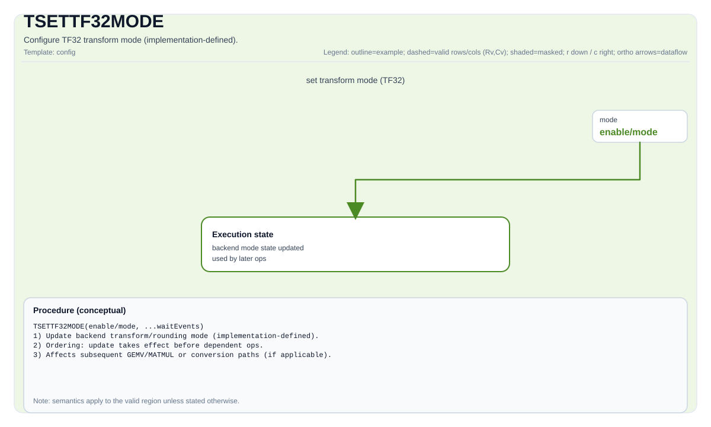

# TSETTF32MODE


## Tile Operation Diagram



## Introduction

Sets the TF32 conversion mode (implementation-defined) to configure precision mode for FP32 operands before TMatmul operations. Different precision modes are implemented on different hardware platforms:

- A2/A3 platforms: HF32 mode (e8m11, 8 exponent bits, 11 mantissa bits, 1 sign bit)

- A5 platforms: TF32 mode (e8m10, 8 exponent bits, 10 mantissa bits, 1 sign bit)

## Math Interpretation

No direct tensor arithmetic is produced by this instruction. It updates target mode state used by subsequent instructions.

## Assembly Syntax

PTO-AS form: see [docs/grammar/PTO-AS.md](../grammar/PTO-AS.md).

Schematic form:

```text
SetMadTF32Mode {mode = ...}
```

### IR Level 1（SSA）

```text
pto.SetMadTF32Mode {mode = ...}
```

### IR Level 2（DPS）

```text
pto.SetMadTF32Mode ins({mode = ...}) outs()
```
## C++ Intrinsic

Declared in  `include/pto/common/pto_tile.hpp`：

```cpp
PTO_INTERNAL void SetMadTF32Mode(RoundMode tf32TransMode = RoundMode::CAST_ROUND)
```

## Constraints

- Available only when the corresponding backend capability macro is enabled.
- Exact mode values and hardware behavior are target-defined.
- This instruction has control-state side effects and should be ordered appropriately relative to dependent compute instructions.

## Examples

```cpp
#include <pto/pto-inst.hpp>
using namespace pto;

void example_enable_tf32() {
  using LeftTile = TileLeft<U, M, K, M, K>;
  LeftTile aTile;
  aTile.SetMadTF32Mode(RoundMode::CAST_ROUND);
}
```

## ASM Form Examples

### Auto Mode

```text
# Auto mode: compiler/runtime-managed placement and scheduling.
pto.SetMadTF32Mode {mode = ...}
```

### Manual Mode

```text
# Manual mode: bind resources explicitly before issuing the instruction.
# Optional for tile operands:
# pto.tassign %arg0, @tile(0x1000)
# pto.tassign %arg1, @tile(0x2000)
pto.tile.SetMadTF32Mode {mode = ...}
```

### PTO Assembly Form

```text
pto.SetMadTF32Mode {mode = ...}
# IR Level 2 (DPS)
pto.SetMadTF32Mode ins({mode = ...}) outs()
```

