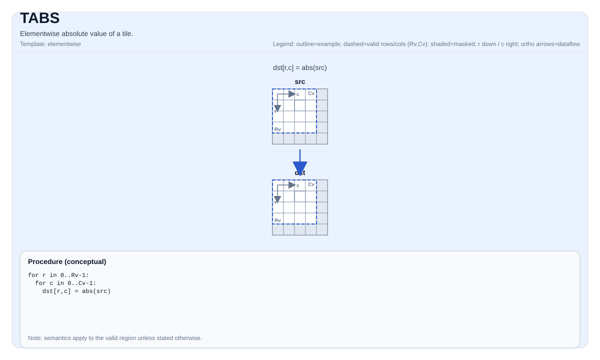

# TABS

## 指令示意图



## 简介

Tile 的逐元素绝对値。

## 数学语义

对每个元素 `(i, j)` 在有效区域内：

$$ \mathrm{dst}_{i,j} = \left|\mathrm{src}_{i,j}\right| $$

## C++ 内建接口

声明于 `include/pto/common/pto_instr.hpp`：

```cpp
template <typename TileDataDst, typename TileDataSrc, typename... WaitEvents>
PTO_INST RecordEvent TABS(TileDataDst &dst, TileDataSrc &src, WaitEvents &... events);
```

## 约束

- **实现检查 (CPU sim)**:
    - `TileData::DType` 必须是以下之一：`int32_t`、`int`、`int16_t`、`half`、`float`。
    - 实现在 `dst.GetValidRow()` / `dst.GetValidCol()` 上迭代。
- **实现检查 (Costmodel)**:
    - `TileData::DType` 必须是以下之一：`int32_t`、`int16_t`、`int8_t`、`uint8_t`、`half`、`float`。
- **实现检查 (NPU)**:
    - A3 `TileData::DType` 必须是以下之一：`float` 或 `half`。
    - A5 `TileData::DType` 必须是以下之一：`int32_t`、`int16_t`、`int8_t`、`half`、`float`。
    - Tile 位置必须是向量（`TileData::Loc == TileType::Vec`）。
    - 静态有效边界：`TileData::ValidRow <= TileData::Rows` 且 `TileData::ValidCol <= TileData::Cols`。
    - 运行时：`src.GetValidRow() == dst.GetValidRow()` 且 `src.GetValidCol() == dst.GetValidCol()`。
    - Tile 布局必须是行主序（`TileData::isRowMajor`）。
- **有效区域**:
    - 该操作使用 `dst.GetValidRow()` / `dst.GetValidCol()` 作为迭代域。

## 示例

### 自动（Auto）

```cpp
#include <pto/pto-inst.hpp>

using namespace pto;

void example_auto() {
  using TileT = Tile<TileType::Vec, float, 16, 16>;
  TileT src, dst;
  TABS(dst, src);
}
```

### 手动（Manual）

```cpp
#include <pto/pto-inst.hpp>

using namespace pto;

void example_manual() {
  using TileT = Tile<TileType::Vec, float, 16, 16>;
  TileT src, dst;
  TASSIGN(src, 0x1000);
  TASSIGN(dst, 0x2000);
  TABS(dst, src);
}
```

