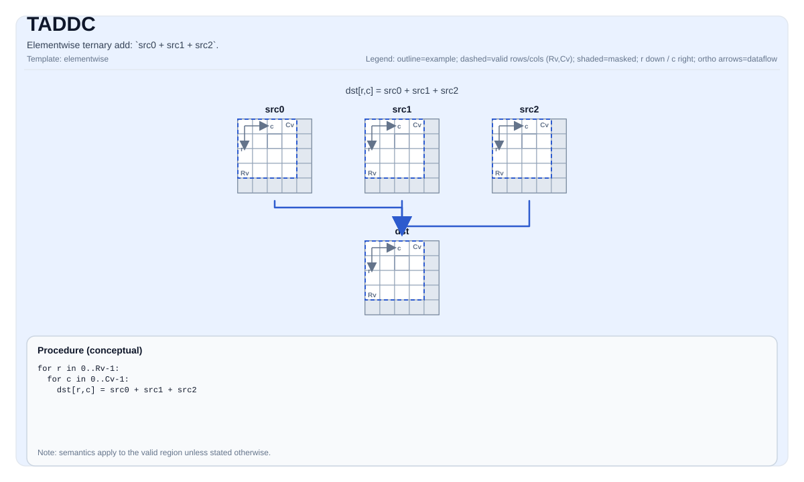

# TADDC

## 指令示意图



## 简介

三元逐元素加法：`src0 + src1 + src2`。

## 数学语义

对每个元素 `(i, j)` 在有效区域内：

$$ \mathrm{dst}_{i,j} = \mathrm{src0}_{i,j} + \mathrm{src1}_{i,j} + \mathrm{src2}_{i,j} $$

## C++ 内建接口

声明于 `include/pto/common/pto_instr.hpp`：

```cpp
template <typename TileData, typename... WaitEvents>
PTO_INST RecordEvent TADDC(TileData &dst, TileData &src0, TileData &src1, TileData &src2, WaitEvents &... events);
```

## 约束

- 该操作在 `dst.GetValidRow()` / `dst.GetValidCol()` 上迭代。

## 示例

```cpp
#include <pto/pto-inst.hpp>

using namespace pto;

void example() {
  using TileT = Tile<TileType::Vec, float, 16, 16>;
  TileT a, b, c, out;
  TADDC(out, a, b, c);
}
```
