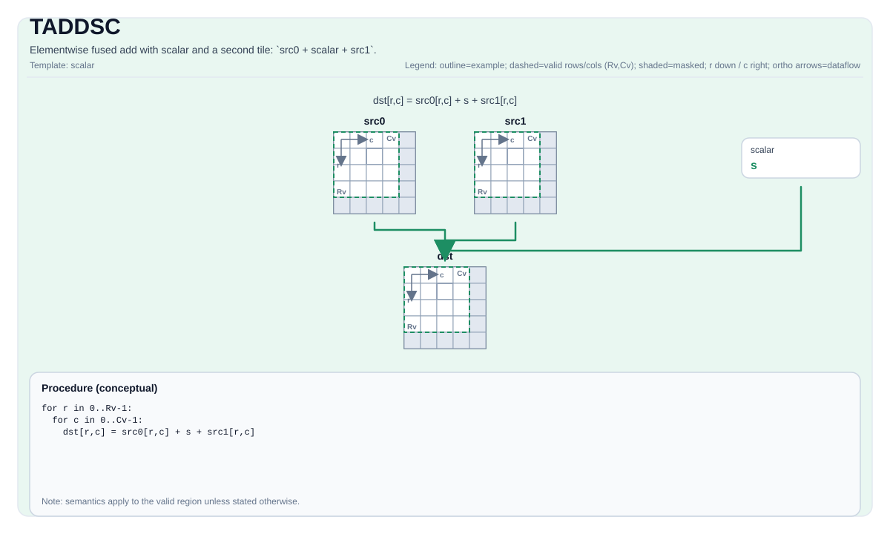

# TADDSC

## Tile Operation Diagram



## Introduction

Elementwise fused add with scalar and a second tile: `src0 + scalar + src1`.

## Math Interpretation

For each element `(i, j)` in the valid region:

$$ \mathrm{dst}_{i,j} = \mathrm{src0}_{i,j} + \mathrm{scalar} + \mathrm{src1}_{i,j} $$

## C++ Intrinsic

Declared in `include/pto/common/pto_instr.hpp`:

```cpp
template <typename TileData, typename... WaitEvents>
PTO_INST RecordEvent TADDSC(TileData& dst, TileData& src0, typename TileData::DType scalar, TileData& src1,
                            WaitEvents&... events);
```

## Constraints

- **Implementation checks (A2A3)**:
    - `TileData::DType` must be one of: `int32_t`, `int16_t`, `half`, `float`.
    - Tile layout must be row-major (`TileData::isRowMajor`).
- **Implementation checks (A5)**:
    - `TileData::DType` must be one of: `int32_t`, `int16_t`, `half`, `float`.
    - Tile layout must be row-major (`TileData::isRowMajor`).
- **Common constraints**:
    - Tile location must be vector (`TileData::Loc == TileType::Vec`).
    - Static valid bounds: `TileData::ValidRow <= TileData::Rows` and `TileData::ValidCol <= TileData::Cols`.
    - Runtime: `dst`, `src0` and `src1` must have the same valid row/col.
    - Scalar type must match the Tile data type.
- **Valid region**:
    - The op uses `dst.GetValidRow()` / `dst.GetValidCol()` as the iteration domain.

## Examples

```cpp
#include <pto/pto-inst.hpp>

using namespace pto;

void example() {
  using TileT = Tile<TileType::Vec, float, 16, 16>;
  TileT a, b, out;
  TADDSC(out, a, 2.0f, b);
}
```
