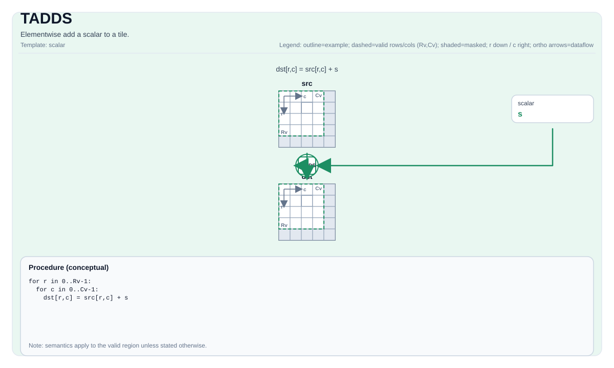

# TADDS

## 指令示意图



## 简介

Tile与标量的逐元素加法。

## 数学语义

对每个元素 `(i, j)` 在有效区域内：

$$ \mathrm{dst}_{i,j} = \mathrm{src}_{i,j} + \mathrm{scalar} $$

## C++内建接口

声明于 `include/pto/common/pto_instr.hpp`：
> 公共包含头为 `<pto/pto-inst.hpp>`，内部声明位于 `pto/common/pto_instr.hpp`。

```cpp
template <typename TileDataDst, typename TileDataSrc, typename... WaitEvents>
PTO_INST RecordEvent TADDS(TileDataDst &dst, TileDataSrc &src0, typename TileDataSrc::DType scalar, WaitEvents &... events);
```

## 约束

- **实现检查 （Atlas A2/A3 训练系列产品/Atlas A2/A3 推理系列产品）**:
    - `TileData::DType` 必须是以下之一： `int32_t`， `int`， `int16_t`， `half`， `float16_t`， `float`， `float32_t`。
    - Tile位置必须是向量（`TileData::Loc == TileType::Vec`）。
    - 静态有效边界： `TileData::ValidRow <= TileData::Rows`且`TileData::ValidCol <= TileData::Cols`。
    - 运行时： `src0.GetValidRow() == dst.GetValidRow()`且`src0.GetValidCol() == dst.GetValidCol()`。
    - Tile布局必须是行主序（`TileData::isRowMajor`）。
- **实现检查 (Ascend 950PR/Ascend 950DT)**:
    - `TileData::DType` 必须是以下之一： `uint8_t`， `int8_t`， `uint16_t`， `int16_t`， `uint32_t`， `int32_t`， `int64_t`， `uint64_t`， `half`， `float`， `bfloat16_t`。
    - Tile位置必须是向量（`TileData::Loc == TileType::Vec`）。
    - 静态有效边界： `TileData::ValidRow <= TileData::Rows`且`TileData::ValidCol <= TileData::Cols`。
    - 运行时： `src0.GetValidRow() == dst.GetValidRow()` 且 `src0.GetValidCol() == dst.GetValidCol()`。
    - Tile布局必须是行主序（`TileData::isRowMajor`）。
- **有效区域**:
    - 该操作使用 `dst.GetValidRow()` / `dst.GetValidCol()` 作为迭代域。

## 示例

### 自动（Auto）

```cpp
#include <pto/pto-inst.hpp>

using namespace pto;

void example_auto() {
  using TileT = Tile<TileType::Vec, float, 16, 16>;
  TileT src, dst;
  TADDS(dst, src, 1.0f);
}
```

### 手动（Manual）

```cpp
#include <pto/pto-inst.hpp>

using namespace pto;

void example_manual() {
  using TileT = Tile<TileType::Vec, float, 16, 16>;
  TileT src, dst;
  TASSIGN(src, 0x1000);
  TASSIGN(dst, 0x2000);
  TADDS(dst, src, 1.0f);
}
```
