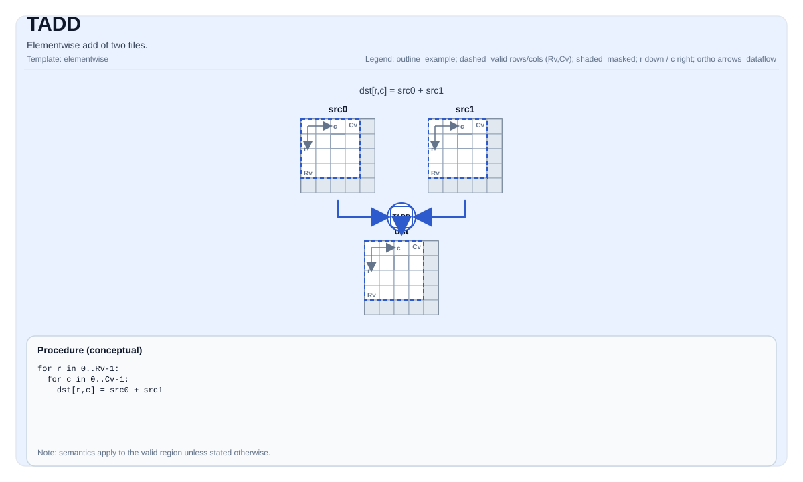

# TADD

## 指令示意图



## 简介

两个Tile的逐元素加法。

## 数学语义

对每个元素 `(i, j)` 在有效区域内：

$$ \mathrm{dst}_{i,j} = \mathrm{src0}_{i,j} + \mathrm{src1}_{i,j} $$

## C++内建接口

声明于 `include/pto/common/pto_instr.hpp`：
> 公共包含头为 `<pto/pto-inst.hpp>`，内部声明位于 `pto/common/pto_instr.hpp`。

```cpp
template <typename TileDataDst, typename TileDataSrc0, typename TileDataSrc1, typename... WaitEvents>
PTO_INST RecordEvent TADD(TileDataDst &dst, TileDataSrc0 &src0, TileDataSrc1 &src1, WaitEvents &... events);
```

## 约束

- **实现检查 （Atlas A2/A3 训练系列产品/Atlas A2/A3 推理系列产品）**:
    - `dst`、`src0` 和 `src1` 的数据类型必须相同，且必须是以下之一：`int32_t`、`int16_t`、`half`、`float`。
    - `dst`、`src0` 和 `src1` 的 Tile 布局都必须是行主序（`TileData::isRowMajor`）。
- **实现检查 (Ascend 950PR/Ascend 950DT)**:
    - `dst`、`src0` 和 `src1` 的数据类型必须相同，且必须是以下之一：`int32_t`、`uint32_t`、`int64_t`、`uint64_t`、`float`、`int16_t`、`uint16_t`、`half`、`bfloat16_t`、`uint8_t`、`int8_t`。
    - `dst`、`src0` 和 `src1` 的 Tile 布局都必须是行主序（`TileData::isRowMajor`）。
- **实现检查（CPU_SIM）**：
    - 三个操作数的数据类型必须相同。CPU_SIM 不额外限制为行主序；行主序、列主序及其他受支持的 Tile 布局分别使用对应操作数自身的偏移计算。
- **有效区域**:
    - 该操作使用 `dst.GetValidRow()` / `dst.GetValidCol()` 作为迭代域。
    - `dst`、`src0` 和 `src1` 可以使用不同的 C++ Tile 类型，包括不同的静态或动态 `ValidRow`/`ValidCol` 模板参数；前提是三者元素类型相同。
    - A2A3、A5 和 CPU_SIM 都要求 `src0`、`src1` 和 `dst` 的运行时有效行列数完全相同，不匹配时触发断言失败。CPU_SIM 会根据每个操作数自身的 Tile 布局和物理形状分别计算地址。

## 示例

### 自动（Auto）

```cpp
#include <pto/pto-inst.hpp>

using namespace pto;

void example_auto() {
  using TileT = Tile<TileType::Vec, float, 16, 16>;
  TileT src0, src1, dst;
  TADD(dst, src0, src1);
}
```

### 自动（混用静态和动态有效形状）

```cpp
#include <pto/pto-inst.hpp>

using namespace pto;

void example_mixed_valid_shape() {
  using DynamicTile = Tile<TileType::Vec, int32_t, 16, 16, BLayout::RowMajor, -1, -1>;
  using StaticTile = Tile<TileType::Vec, int32_t, 16, 16, BLayout::RowMajor, 16, 16>;
  DynamicTile dst(16, 16), src1(16, 16);
  StaticTile src0;
  TADD(dst, src0, src1);
}
```

### 手动（Manual）

```cpp
#include <pto/pto-inst.hpp>

using namespace pto;

void example_manual() {
  using TileT = Tile<TileType::Vec, float, 16, 16>;
  TileT src0, src1, dst;
  TASSIGN(src0, 0x1000);
  TASSIGN(src1, 0x2000);
  TASSIGN(dst,  0x3000);
  TADD(dst, src0, src1);
}
```
