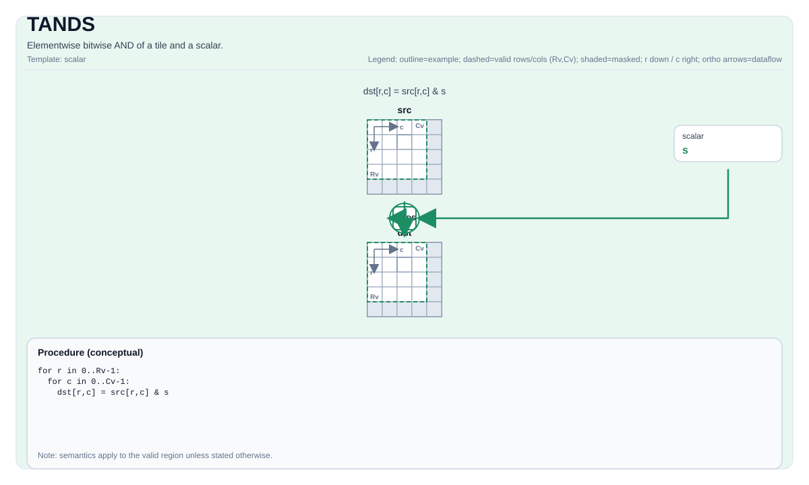

# TANDS

## 指令示意图



## 简介

Tile 与标量的逐元素按位与。

## 数学语义

对每个元素 `(i, j)` 在有效区域内：

$$ \mathrm{dst}_{i,j} = \mathrm{src}_{i,j} \;\&\; \mathrm{scalar} $$

## C++ 内建接口

声明于 `include/pto/common/pto_instr.hpp`：

```cpp
template <typename TileDataDst, typename TileDataSrc, typename... WaitEvents>
PTO_INST RecordEvent TANDS(TileDataDst &dst, TileDataSrc &src, typename TileDataDst::DType scalar, WaitEvents &... events);
```

## 约束

- **实现检查 (A2A3)**:
    - 适用于整数元素类型。
    - `dst` 和 `src` 必须使用相同的元素类型。
    - `dst` 和 `src` 必须是向量 Tile。
    - 运行时：`src.GetValidRow() == dst.GetValidRow()` 且 `src.GetValidCol() == dst.GetValidCol()`。
    - 在手动模式下，不支持将源 Tile 和目标 Tile 设置为相同的内存。
- **实现检查 (A5)**:
    - 适用于 `TANDS` 支持的整数元素类型。
    - `dst` 和 `src` 必须使用相同的元素类型。
    - `dst` 和 `src` 必须使用行主序布局。
    - 运行时：`src.GetValidRow() == dst.GetValidRow()` 且 `src.GetValidCol() == dst.GetValidCol()`。
- **有效区域**:
    - 该操作使用 `dst.GetValidRow()` / `dst.GetValidCol()` 作为迭代域。

## 示例

```cpp
#include <pto/pto-inst.hpp>

using namespace pto;

void example() {
  using TileDst = Tile<TileType::Vec, uint16_t, 16, 16>;
  using TileSrc = Tile<TileType::Vec, uint16_t, 16, 16>;
  TileDst dst;
  TileSrc src;
  TANDS(dst, src, 0xffu);
}
```


