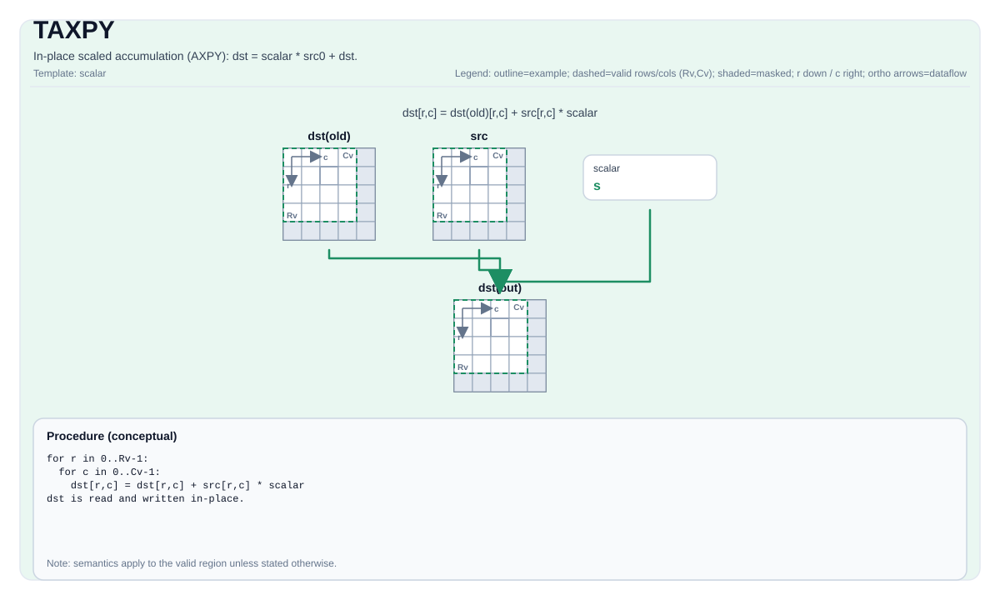

# TAXPY

## 指令示意图



## 简介

标量缩放的逐元素 AXPY：以标量 `scalar` 缩放 `src0` 后累加到 `dst`（原地）。支持同精度以及混合精度（`dst` 为 `float`、`src0` 为 `half`）。

## 数学语义

对有效区域内每个元素 `(i, j)`：

$$ \mathrm{dst}_{i,j} = \mathrm{scalar} \cdot \mathrm{src0}_{i,j} + \mathrm{dst}_{i,j} $$

## C++ 内建接口

声明于 `include/pto/common/pto_instr.hpp`：

```cpp
template <typename TileDataDst, typename TileDataSrc, typename... WaitEvents>
PTO_INST RecordEvent TAXPY(TileDataDst &dst, TileDataSrc &src0, typename TileDataSrc::DType scalar,
                           WaitEvents &... events);
```

## 约束

- `dst` 的数据类型必须为 `half` 或 `float`。
- `dst` 与 `src0` 数据类型一致；或混合精度情形——`dst` 为 `float` 且 `src0` 为 `half`。
- `dst` 的 `TileType` 必须为 `Vec`。
- `src0` 与 `dst` 的有效行数、有效列数必须相同。

## 示例

### 自动（Auto）

```cpp
#include <pto/pto-inst.hpp>

using namespace pto;

void example_auto(__gm__ float* in) {
  using TileT = Tile<TileType::Vec, float, 16, 16>;
  TileT src, dst;
  // ... 此前已用 TLOAD 载入 src 与 dst ...
  TAXPY(dst, src, 2.0f);  // dst = 2.0 * src + dst
}
```

### 手动（Manual）

```cpp
#include <pto/pto-inst.hpp>

using namespace pto;

void example_manual() {
  using TileT = Tile<TileType::Vec, half, 16, 16>;
  TileT src, dst;
  TASSIGN<0x0000>(src);
  TASSIGN<0x0400>(dst);
  TAXPY(dst, src, static_cast<half>(2.0));
}
```
