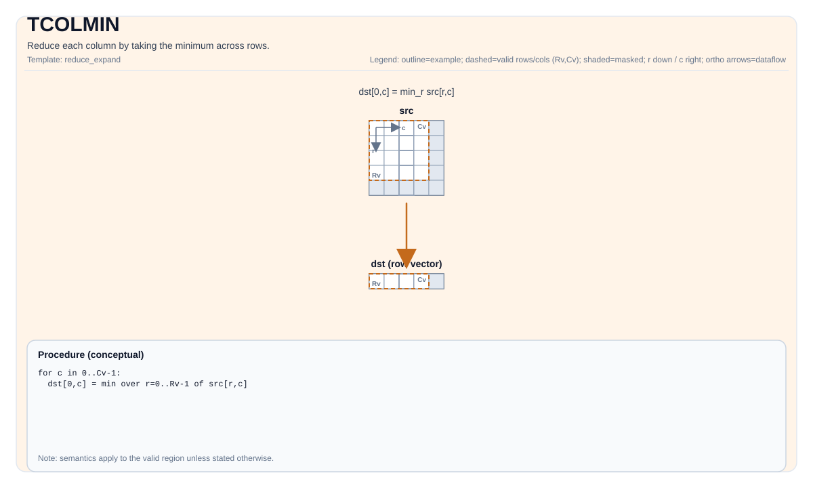

# TCOLARGMIN

## 指令示意图



## 简介

获取每列最大值对应行索引。

## 数学语义

设 `R = src.GetValidRow()`，`C = src.GetValidCol()`。对 `0 <= j < C`：

$$ \mathrm{dst}_{0,j} = \operatorname{argmin}_{0 \le i < R} \mathrm{src}_{i,j} $$

即，对于每一列，输出该列中最大值所在的行索引。

## 汇编语法

PTO-AS 形式：参见 [PTO-AS 规范](../assembly/PTO-AS_zh.md)。

同步形式：

```text
%dst = tcolargmin %src : !pto.tile<...> -> !pto.tile<...>
```

Lowering 可能会引入内部临时 Tile；C++ 内建接口需要显式提供 `tmp` 操作数。

### AS Level 1（SSA）

```text
%dst = pto.tcolargmin %src, %tmp : (!pto.tile<...>, !pto.tile<...>) -> !pto.tile<...>
```

### AS Level 2（DPS）

```text
pto.tcolargmin ins(%src, %tmp : !pto.tile_buf<...>, !pto.tile_buf<...>) outs(%dst : !pto.tile_buf<...>)
```

## C++ 内建接口

声明于 `include/pto/common/pto_instr.hpp`：

```cpp
template <typename TileDataOut, typename TileDataIn, typename TileDataTmp, typename... WaitEvents>
PTO_INST RecordEvent TCOLARGMIN(TileDataOut &dst, TileDataIn &src, TileDataTmp &tmp, WaitEvents &... events);
```

## 约束

实现检查 (NPU):

- Tile 位置：`dst` 和 `src` 必须是 `TileType::Vec`。
- Tile 布局：所有 Tile 必须是 ND 分形（`isRowMajor` 且 `SLayout::NoneBox`）。
- 源数据类型：A2A3:`half`、`float`、`uint16_t`、`uint32_t`, A5:`half`、`float`、`uint16_t`、`uint32_t`、`s8`、`u8`、`s16`、`s32`。
- 目标数据类型：`uint32_t` 或 `int32_t`。
- 数据类型一致性：`src.DType == tmp.DType`。
- 运行期有效区域检查：
    - `src.GetValidCol() == dst.GetValidCol()`。
    - `dst.GetValidRow() == 1`。
    - `src.GetValidRow() != 0` 且 `src.GetValidCol() != 0`。
- A2A3：
  - `src.ValidCol` 必须为 1 或 -1（表示运行时确定）。

## 示例

### 自动（Auto）

```cpp
#include <pto/pto-inst.hpp>

using namespace pto;

void example_auto() {
  using SrcT = Tile<TileType::Vec, float, 16, 16>;
  using DstT = Tile<TileType::Vec, uint32_t, 1, 16>;
  using TmpT = Tile<TileType::Vec, float, 16, 16>;
  SrcT src;
  DstT dst;
  TmpT tmp;
  TCOLARGMIN(dst, src, tmp);
}
```

### 手动（Manual）

```cpp
#include <pto/pto-inst.hpp>

using namespace pto;

void example_manual() {
  using SrcT = Tile<TileType::Vec, float, 16, 16>;
  using DstT = Tile<TileType::Vec, uint32_t, 1, 16>;
  using TmpT = Tile<TileType::Vec, float, 16, 16>;
  SrcT src;
  DstT dst;
  TmpT tmp;
  TASSIGN(src, 0x1000);
  TASSIGN(dst, 0x2000);
  TASSIGN(tmp, 0x3000);
  TCOLARGMIN(dst, src, tmp);
}
```

## 汇编示例（ASM）

### 自动模式

```text
# 自动模式：由编译器/运行时负责资源放置与调度。
%dst = pto.tcolargmin %src, %tmp : (!pto.tile<...>, !pto.tile<...>) -> !pto.tile<...>
```

### 手动模式

```text
# 手动模式：先显式绑定资源，再发射指令。
# 可选（当该指令包含 tile 操作数时）：
# pto.tassign %arg0, @tile(0x1000)
# pto.tassign %arg1, @tile(0x2000)
# pto.tassign %arg2, @tile(0x3000)
%dst = pto.tcolargmin %src, %tmp : (!pto.tile<...>, !pto.tile<...>) -> !pto.tile<...>
```

### PTO 汇编形式

```text
%dst = tcolargmin %src : !pto.tile<...> -> !pto.tile<...>
# AS Level 2 (DPS)
pto.tcolargmin ins(%src, %tmp : !pto.tile_buf<...>, !pto.tile_buf<...>) outs(%dst : !pto.tile_buf<...>)
```

## 相关指令

- [TCOLMIN](TCOLMIN_zh.md) - 通过取行间最大值来归约每一列。
- [TCOLMIN](TCOLMIN_zh.md) - 通过取行间最小值来归约每一列。
- [TCOLARGMIN](TCOLARGMIN_zh.md) - 获取每列最小值对应行索引。
- [TROWARGMIN](TROWARGMIN_zh.md) - 获取每行最大值对应列索引。