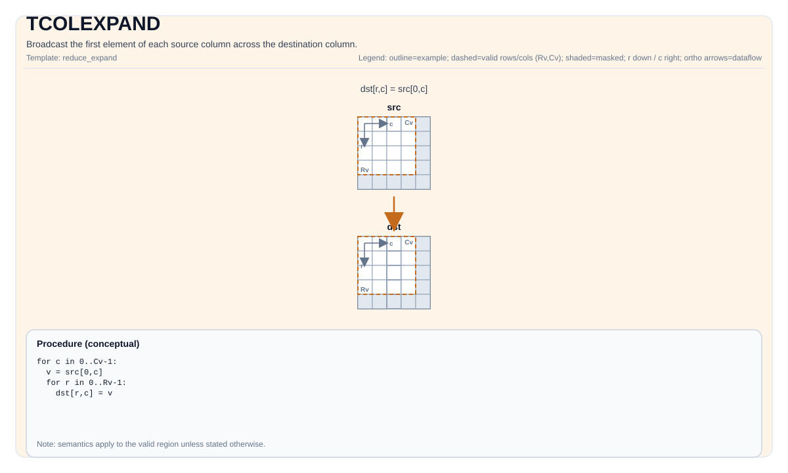

# TCOLEXPAND


## Tile Operation Diagram



## Introduction

Broadcast the first element of each source column across the destination column.

## Math Interpretation

Let `R = dst.GetValidRow()` and `C = dst.GetValidCol()`. For `0 <= i < R` and `0 <= j < C`:

$$ \mathrm{dst}_{i,j} = \mathrm{src}_{0,j} $$

## Assembly Syntax

Synchronous form:

```text
%dst = tcolexpand %src : !pto.tile<...> -> !pto.tile<...>
```

### AS Level 1 (SSA)

```text
%dst = pto.tcolexpand %src : !pto.tile<...> -> !pto.tile<...>
```

### AS Level 2 (DPS)

```text
pto.tcolexpand ins(%src : !pto.tile_buf<...>) outs(%dst : !pto.tile_buf<...>)
```
## C++ Intrinsic

Declared in `include/pto/common/pto_instr.hpp`:

```cpp
template <typename TileDataDst, typename TileDataSrc, typename... WaitEvents>
PTO_INST RecordEvent TCOLEXPAND(TileDataDst &dst, TileDataSrc &src, WaitEvents &... events);
```

## Constraints

- Tile Type: `dst` and `src` must be `TileType::Vec`.
- Tile layout: both `src` and `dst` must use ND layout (row-major, non-fractal: `isRowMajor` and `SLayout::NoneBox`).
- Data type: element size must be 1, 2, or 4 bytes; `dst` and `src` must use the same element type.
- Runtime checks:
    - A2A3: returns early if any of `dst.GetValidRow()`, `dst.GetValidCol()`, `src.GetValidRow()`, `src.GetValidCol()` is zero.
    - A5: asserts `srcValidRow != 0 && srcValidCol != 0`.
    - Both backends assert `src.GetValidCol() == dst.GetValidCol()`.

## Examples

```cpp
#include <pto/pto-inst.hpp>

using namespace pto;

void example() {
  using TileT = Tile<TileType::Vec, float, 16, 16>;
  TileT src, dst;
  TCOLEXPAND(dst, src);
}
```

## ASM Form Examples

### Auto Mode

```text
# Auto mode: compiler/runtime-managed placement and scheduling.
%dst = pto.tcolexpand %src : !pto.tile<...> -> !pto.tile<...>
```

### Manual Mode

```text
# Manual mode: resources must be bound explicitly before issuing the instruction.
# Optional for tile operands:
# pto.tassign %arg0, @tile(0x1000)
# pto.tassign %arg1, @tile(0x2000)
%dst = pto.tcolexpand %src : !pto.tile<...> -> !pto.tile<...>
```

### PTO Assembly Form

```text
%dst = tcolexpand %src : !pto.tile<...> -> !pto.tile<...>
# AS Level 2 (DPS)
pto.tcolexpand ins(%src : !pto.tile_buf<...>) outs(%dst : !pto.tile_buf<...>)
```

