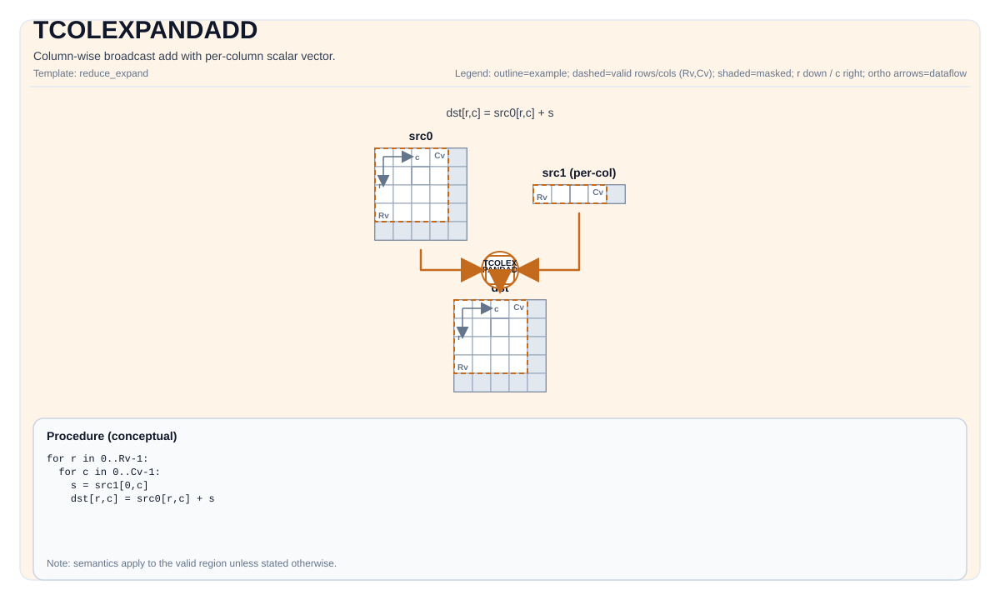

# TCOLEXPANDADD


## Tile Operation Diagram



## Introduction

Column-wise broadcast add: add each element of `src0` by a per-column scalar vector `src1`.

## Math Interpretation

Let `R = dst.GetValidRow()` and `C = dst.GetValidCol()`. Let `s_j` be the per-column scalar taken from `src1` (one value per column).

For `0 <= i < R` and `0 <= j < C`:

$$
\mathrm{dst}_{i,j} = \mathrm{src0}_{i,j} + s_j
$$

## C++ Intrinsic

Declared in `include/pto/common/pto_instr.hpp`:

```cpp
template <typename TileDataDst, typename TileDataSrc0, typename TileDataSrc1, typename... WaitEvents>
PTO_INST RecordEvent TCOLEXPANDADD(TileDataDst &dst, TileDataSrc0 &src0, TileDataSrc1 &src1, WaitEvents &... events);
```

## Constraints

- `TileDataDst::DType`, `TileDataSrc1::DType` must be one of: `half`, `float`, `int16`, `int32` for A2, A3 and A5, `uint16`, `uint32`, `bfloat16_t`, `int8`, `uint8`, `int64`, `uint64` for A5.
- Tile shape/layout constraint (compile-time): `TileDataDst::isRowMajor`.
- `src1` is expected to provide **one scalar per column** (i.e., its valid shape must cover `C` values).
- Exact layout/fractal constraints are target-specific; see backend headers under `include/pto/npu/*/TColExpand*.hpp`.

### 64-bit element types (A5)

`int64` / `uint64` are supported on A5 only. A5 has no native 64-bit vector ALU, so the instruction is emulated on pairs of 32-bit registers that hold the low and the high word of every element; the per-column operand is read with the same de-interleaved layout as the full-sized operand.

Results are exact 64-bit two's-complement values. Tile alignment follows the usual rule for 64-bit elements: a RowMajor tile needs `Cols % 4 == 0`.

## Examples

See related examples in `docs/isa/` and `docs/coding/tutorials/`.
