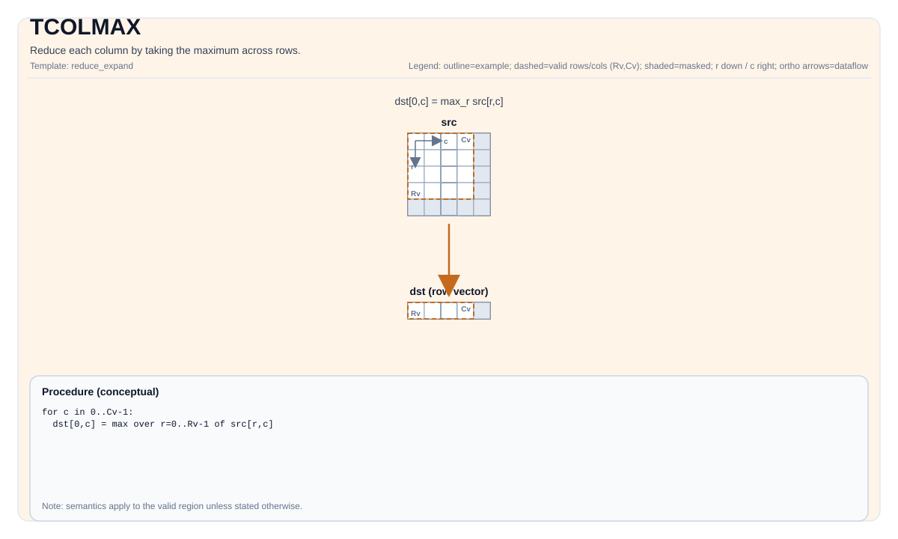

# TCOLMAX


## Tile Operation Diagram



## Introduction

Reduce each column by taking the maximum across rows.

## Math Interpretation

Let `R = src.GetValidRow()` and `C = src.GetValidCol()`. For `0 <= j < C`:

$$ \mathrm{dst}_{0,j} = \max_{0 \le i < R} \mathrm{src}_{i,j} $$

## C++ Intrinsic

Declared in `include/pto/common/pto_instr.hpp`:

```cpp
template <typename TileDataOut, typename TileDataIn, typename... WaitEvents>
PTO_INST RecordEvent TCOLMAX(TileDataOut &dst, TileDataIn &src, WaitEvents &... events);
```

## Constraints

### General constraints / checks

- `dst` and `src` must be `TileType::Vec`.
- `dst` and `src` must use standard ND layout: row-major and non-fractal (`BLayout::RowMajor`, `SLayout::NoneBox`).
- `dst` and `src` must use the same element type.
- Runtime checks:
    - `src.GetValidCol() == dst.GetValidCol()`
- If `src.GetValidRow() == 0` or `src.GetValidCol() == 0`, the implementation returns early.

### A2A3 implementation checks

- Supported element types: `half`, `float`, `int16_t`, `int32_t`.

### A5 implementation checks

- Supported element types: `half`, `float`, `int8_t`, `uint8_t`, `int16_t`, `uint16_t`, `int32_t`, `uint32_t`, `int64_t`, `uint64_t`, `bfloat16_t`.

- For `int64_t` / `uint64_t`: use output valid shape `[1, src.GetValidCol()]`. Physical `Cols` is a multiple of 4; valid columns need not be aligned. Only valid results in row 0 are written; other physical padding is preserved.

## Examples

### Auto

```cpp
#include <pto/pto-inst.hpp>

using namespace pto;

void example_auto() {
  using SrcT = Tile<TileType::Vec, float, 16, 16>;
  using DstT = Tile<TileType::Vec, float, 1, 16>;
  SrcT src;
  DstT dst;
  TCOLMAX(dst, src);
}
```

### Manual

```cpp
#include <pto/pto-inst.hpp>

using namespace pto;

void example_manual() {
  using SrcT = Tile<TileType::Vec, float, 16, 16>;
  using DstT = Tile<TileType::Vec, float, 1, 16>;
  SrcT src;
  DstT dst;
  TASSIGN(src, 0x1000);
  TASSIGN(dst, 0x2000);
  TCOLMAX(dst, src);
}
```
