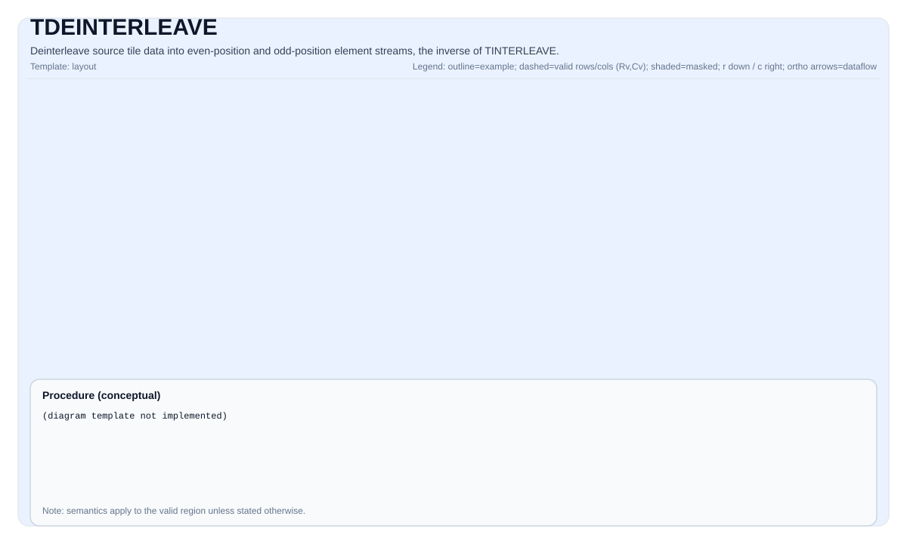

# TDEINTERLEAVE


## Tile Operation Diagram




## Introduction

De-interleave source tiles into two destination tiles (`dst0` and `dst1`). The operation reverses interleaving: `dst0` receives elements at even positions of the combined interleaved stream, and `dst1` receives elements at odd positions.

`TDeInterleave` has two overload forms:

- **Two-source form** (`dst1, dst0, src1, src0`): Given two source tiles that hold the first and second halves of an interleaved stream, de-interleave into the original even and odd element streams.
- **Single-source form** (`dst1, dst0, src`): Given one source tile containing the full interleaved data, de-interleave into even-position and odd-position element streams. Each destination row holds `src.GetValidCol() / 2` valid elements.

`TDeInterleave` is the inverse of `TInterleave`.

## Math Interpretation

### Two-source form

Given two source tiles `src0` (first half) and `src1` (second half) of an interleaved stream, reconstruct the full stream and de-interleave:

$$ \mathrm{combined}_{j} = \begin{cases} \mathrm{src0}_{i, j} & \text{if } 0 \le j < \mathrm{validCols} \\ \mathrm{src1}_{i, j - \mathrm{validCols}} & \text{if } \mathrm{validCols} \le j < 2 \times \mathrm{validCols} \end{cases} $$

$$ \mathrm{dst0}_{i, k} = \mathrm{combined}_{2k}, \quad 0 \le k < \mathrm{validCols} $$
$$ \mathrm{dst1}_{i, k} = \mathrm{combined}_{2k+1}, \quad 0 \le k < \mathrm{validCols} $$

Where `validRows = dst0.GetValidRow()` and `validCols = dst0.GetValidCol()`.

### Single-source form

Given one source tile `src` containing the interleaved data per row:

$$ \mathrm{dst0}_{i, k} = \mathrm{src}_{i, 2k}, \quad 0 \le k < \mathrm{halfValidCols} $$
$$ \mathrm{dst1}_{i, k} = \mathrm{src}_{i, 2k+1}, \quad 0 \le k < \mathrm{halfValidCols} $$

Where `halfValidCols = src.GetValidCol() / 2`.

> **Note**: For the single-source form, the source tile width must be at least `2 × ElementsPerRepeat` (where `ElementsPerRepeat = 256 / sizeof(T)`) so that two adjacent register-sized chunks can be loaded from the same row without crossing row boundaries.

## C++ Intrinsic

Declared in `include/pto/common/pto_instr.hpp`:

```cpp
// Two-source form
template <typename TileDataDst, typename TileDataSrc, typename... WaitEvents>
PTO_INST RecordEvent TDEINTERLEAVE(TileDataDst &dst1, TileDataDst &dst0, TileDataSrc &src1, TileDataSrc &src0,
                                   WaitEvents &...events);

// Single-source form
template <typename TileDataDst, typename TileDataSrc, typename... WaitEvents>
PTO_INST RecordEvent TDEINTERLEAVE(TileDataDst &dst1, TileDataDst &dst0, TileDataSrc &src,
                                   WaitEvents &...events);
```

> **Note**: The parameter order is `(dst1, dst0, src1, src0)` for the two-source form. `dst0` receives even-position elements of the interleaved stream, `dst1` receives odd-position elements.

## Constraints

- **Implementation checks (A5)**:
    - `TileData::DType` must be one of: `int32_t`, `uint32_t`, `float`, `int16_t`, `uint16_t`, `half`, `bfloat16_t`, `uint8_t`, `int8_t`.
    - Tile layout must be row-major (`TileData::isRowMajor`).
    - All tiles must have the same `DType`.
    - Two-source form: `src0`, `src1`, `dst0`, `dst1` must all have the same valid shape, and their `validCols` must be even.
    - Single-source form: `src`, `dst0`, `dst1` must all have the same valid shape; `src`'s `validCols` must be even.
    - The `validCols` of `dst0`/`dst1` tile must be half the `validCols` of `src` tile.
- **Valid region**:
    - Two-source form: The op uses `dst0.GetValidRow()` / `dst0.GetValidCol()` as the iteration domain. `dst0/dst1` each hold `validCols` elements per row.
    - Single-source form: `dst0/dst1` each hold `src.GetValidCol() / 2` valid elements per row. Elements beyond `halfValidCols` in each row are **unspecified**.

## Examples

### Auto — Two-source form

```cpp
#include <pto/pto-inst.hpp>

using namespace pto;

void example_auto_two_src() {
    using TileT = Tile<TileType::Vec, float, 16, 128>;
    TileT src0(16, 128), src1(16, 128);
    TileT dst0(16, 128), dst1(16, 128);

    TDEINTERLEAVE(dst1, dst0, src1, src0);
}
```

### Auto — Single-source form

```cpp
#include <pto/pto-inst.hpp>

using namespace pto;

void example_auto_single_src() {
    using TileT = Tile<TileType::Vec, float, 16, 128>;
    TileT src(16, 128);
    TileT dst0(16, 128), dst1(16, 128);

    TDEINTERLEAVE(dst1, dst0, src);
}
```

### Manual — Two-source form

```cpp
#include <pto/pto-inst.hpp>

using namespace pto;

void example_manual_two_src() {
    using TileT = Tile<TileType::Vec, half, 16, 256, BLayout::RowMajor, 16, 256>;
    TileT src0, src1, dst0, dst1;

    TASSIGN(src0, 0x1000);
    TASSIGN(src1, 0x2000);
    TASSIGN(dst0, 0x3000);
    TASSIGN(dst1, 0x4000);

    TDEINTERLEAVE(dst1, dst0, src1, src0);
}
```

### Manual — Single-source form

```cpp
#include <pto/pto-inst.hpp>

using namespace pto;

void example_manual_single_src() {
    using TileT = Tile<TileType::Vec, half, 16, 256, BLayout::RowMajor, 16, 256>;
    TileT src, dst0, dst1;

    TASSIGN(src,  0x1000);
    TASSIGN(dst0, 0x2000);
    TASSIGN(dst1, 0x3000);

    TDEINTERLEAVE(dst1, dst0, src);
}
```

## Related Instructions

- [TInterleave](TINTERLEAVE.md) - Interleave two tiles into an alternating even/odd stream (inverse of TDeInterleave).
