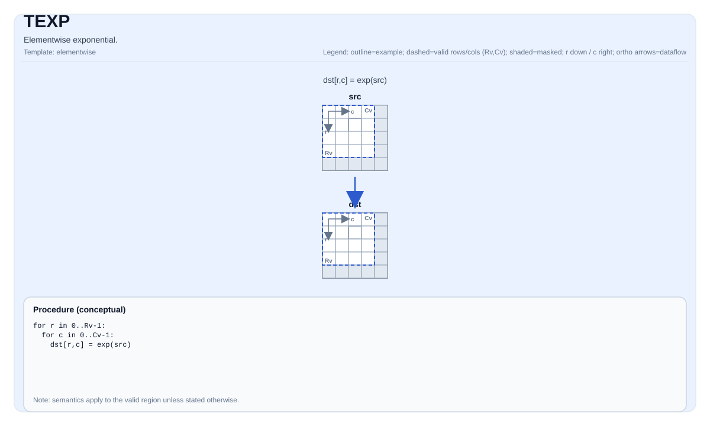

# TEXP

## 指令示意图



## 简介

逐元素指数运算。

## 数学语义

对每个元素 `(i, j)` 在有效区域内：

$$ \mathrm{dst}_{i,j} = \exp(\mathrm{src}_{i,j}) $$

## C++内建接口

声明于 `include/pto/common/pto_instr.hpp`：
> 公共包含头为 `<pto/pto-inst.hpp>`，内部声明位于 `pto/common/pto_instr.hpp`。

```cpp
template <auto PrecisionType = ExpAlgorithm::DEFAULT, typename TileDataDst, typename TileDataSrc,
          typename... WaitEvents>
PTO_INST RecordEvent TEXP(TileDataDst &dst, TileDataSrc &src, WaitEvents &... events);
```

`PrecisionType`可指定以下值：

* `ExpAlgorithm::DEFAULT`：普通算法，速度快但精度较低。
* `ExpAlgorithm::HIGH_PRECISION`：高精度算法，速度较慢。

## 约束

- **实现检查 (NPU)**:
    - `TileData::DType` 必须是以下之一：`float` 或 `half`。
    - Tile位置必须是向量（`TileData::Loc == TileType::Vec`）;
    - 静态有效边界：`TileData::ValidRow <= TileData::Rows` 且 `TileData::ValidCol <= TileData::Cols`。
    - 运行时：`src.GetValidRow() == dst.GetValidRow()` 且 `src.GetValidCol() == dst.GetValidCol()`。
    - Tile布局必须是行主序（`TileData::isRowMajor`）。
- **有效区域**:
    - 该操作使用 `dst.GetValidRow()` / `dst.GetValidCol()` 作为迭代域。
- **高精度算法**
    - 仅在Ascend 950PR/Ascend 950DT上有效，`PrecisionType`选项在Atlas A3 训练系列产品/Atlas A3 推理系列产品上将被忽略。

## 示例

### 自动（Auto）

```cpp
#include <pto/pto-inst.hpp>

using namespace pto;

void example_auto() {
  using TileT = Tile<TileType::Vec, float, 16, 16>;
  TileT src, dst;
  TEXP(dst, src);
  TEXP<ExpAlgorithm::HIGH_PRECISION>(dst, src);  // A5 Only
}
```

### 手动（Manual）

```cpp
#include <pto/pto-inst.hpp>

using namespace pto;

void example_manual() {
  using TileT = Tile<TileType::Vec, float, 16, 16>;
  TileT src, dst;
  TASSIGN(src, 0x1000);
  TASSIGN(dst, 0x2000);
  TEXP(dst, src);
}
```
