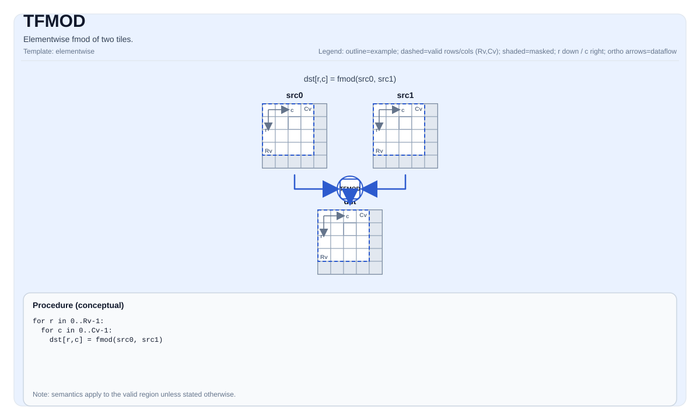

# TFMOD


## Tile Operation Diagram



## Introduction

Elementwise floor of two tiles.

## Math Interpretation

For each element `(i, j)` in the valid region:

$$\mathrm{dst}_{i,j} = \mathrm{fmod}(\mathrm{src0}_{i,j}, \mathrm{src1}_{i,j})$$

## C++ Intrinsic

Declared in `include/pto/common/pto_instr.hpp`:

```cpp
template <auto PrecisionType = FmodAlgorithm::DEFAULT, typename TileDataDst, typename TileDataSrc0,
          typename TileDataSrc1, typename... WaitEvents>
PTO_INST RecordEvent TFMOD(TileDataDst &dst, TileDataSrc0 &src0, TileDataSrc1 &src1, WaitEvents &... events);
```

`PrecisionType` has the following values available:

* `FmodAlgorithm::DEFAULT`: Normal algorithm, faster but with lower precision.
* `FmodAlgorithm::HIGH_PRECISION`: High precision algorithm, but slower.

## Constraints

- The op iterates over `dst.GetValidRow()` / `dst.GetValidCol()`.
- Division-by-zero behavior is target-defined; the CPU simulator asserts in debug builds.

## Examples

```cpp
#include <pto/pto-inst.hpp>

using namespace pto;

void example() {
  using TileT = Tile<TileType::Vec, int32_t, 16, 16>;
  TileT out, a, b;
  TFMOD(out, a, b);
}
```

