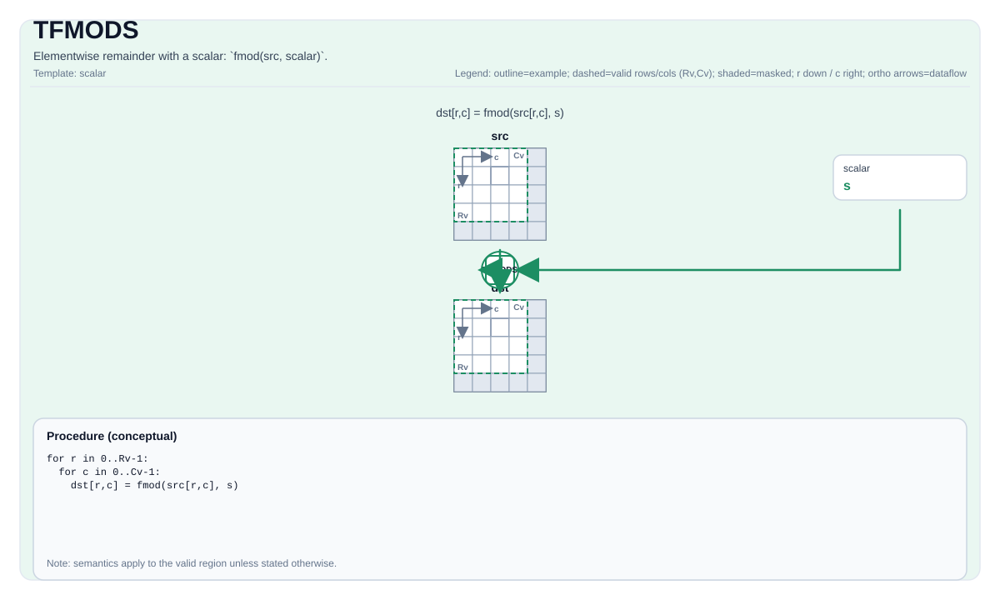

# TFMODS

## Tile Operation Diagram



## Introduction

Elementwise floor with a scalar: `fmod(src, scalar)`.

## Math Interpretation

For each element `(i, j)` in the valid region:

$$\mathrm{dst}_{i,j} = \mathrm{fmod}(\mathrm{src}_{i,j}, \mathrm{scalar})$$

## C++ Intrinsic

Declared in `include/pto/common/pto_instr.hpp`:

```cpp
template <auto PrecisionType = FmodSAlgorithm::DEFAULT, typename TileDataDst, typename TileDataSrc,
          typename... WaitEvents>
PTO_INST RecordEvent TFMODS(TileDataDst &dst, TileDataSrc &src, typename TileDataSrc::DType scalar,
                            WaitEvents &...events);
```

`PrecisionType` has the following values available:

* `FmodSAlgorithm::DEFAULT`: Normal algorithm, faster but with lower precision.
* `FmodSAlgorithm::HIGH_PRECISION`: High precision algorithm, but slower, only support `float` type.

## Constraints

- **Implementation checks (A2A3)**:
    - `dst` and `src` must use the same element type.
    - Supported element types are `float` and `float32_t`.
    - `dst` and `src` must be vector tiles.
    - `dst` and `src` must be row-major.
    - Runtime: `dst.GetValidRow() == src.GetValidRow() > 0` and `dst.GetValidCol() == src.GetValidCol() > 0`.
- **Implementation checks (A5)**:
    - `dst` and `src` must use the same element type.
    - Supported element types are 2-byte or 4-byte types supported by the target implementation (including `half` and `float`).
    - `dst` and `src` must be vector tiles.
    - Static valid bounds must satisfy `ValidRow <= Rows` and `ValidCol <= Cols` for both tiles.
    - Runtime: `dst.GetValidRow() == src.GetValidRow()` and `dst.GetValidCol() == src.GetValidCol()`.
- **Division-by-zero**:
    - Behavior is target-defined; the CPU simulator asserts in debug builds.
- **Valid region**:
    - The op uses `dst.GetValidRow()` / `dst.GetValidCol()` as the iteration domain.
- **High Precision Algorithm**
    - Only available on A5, `PrecisionType` option is ignored on A3.

## Examples

```cpp
#include <pto/pto-inst.hpp>

using namespace pto;

void example() {
  using TileT = Tile<TileType::Vec, float, 16, 16>;
  TileT x, out;
  TFMODS(out, x, 3.0f);
}
```
