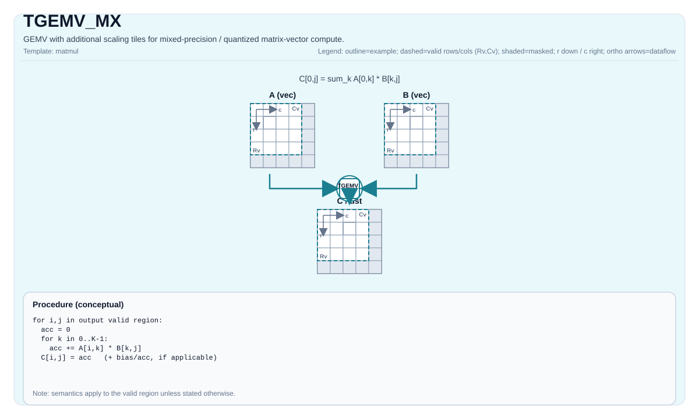

# TGEMV_MX

## 指令示意图



## 简介

带缩放Tile的GEMV变体，支持混合精度/量化矩阵向量计算。

此指令当前仅在 Ascend 950PR/Ascend 950DT 和 Ascend 960 上实现（见 `include/pto/npu/a5/TMatmul.hpp`
和 `include/pto/npu/a6/TMatmul.hpp`）。

## 数学语义

概念上（基础GEMV路径）：

$$
\mathrm{C}_{0,j} = \sum_{k=0}^{K-1} \mathrm{A}_{0,k} \cdot \mathrm{B}_{k,j}
$$

对于 `TGEMV_MX`，缩放tile参与实现定义的混合精度重建/缩放。架构约定是输出对应于目标定义的mx GEMV语义。

## C++内建接口

声明于 `include/pto/common/pto_instr.hpp`：
> 公共包含头为 `<pto/pto-inst.hpp>`，内部声明位于 `pto/common/pto_instr.hpp`。

```cpp
template <typename TileRes, typename TileLeft, typename TileLeftScale, typename TileRight, typename TileRightScale,
          typename... WaitEvents>
PTO_INST RecordEvent TGEMV_MX(TileRes &cMatrix, TileLeft &aMatrix, TileLeftScale &aScaleMatrix, TileRight &bMatrix, TileRightScale &bScaleMatrix, WaitEvents &... events);

template <AccPhase Phase, typename TileRes, typename TileLeft, typename TileLeftScale, typename TileRight,
          typename TileRightScale, typename... WaitEvents>
PTO_INST RecordEvent TGEMV_MX(TileRes &cMatrix, TileLeft &aMatrix, TileLeftScale &aScaleMatrix, TileRight &bMatrix, TileRightScale &bScaleMatrix, WaitEvents &... events);

template <typename TileRes, typename TileLeft, typename TileLeftScale, typename TileRight, typename TileRightScale,
          typename... WaitEvents>
PTO_INST RecordEvent TGEMV_MX(TileRes &cOutMatrix, TileRes &cInMatrix, TileLeft &aMatrix, TileLeftScale &aScaleMatrix, TileRight &bMatrix, TileRightScale &bScaleMatrix, WaitEvents &... events);

template <AccPhase Phase, typename TileRes, typename TileLeft, typename TileLeftScale, typename TileRight,
          typename TileRightScale, typename... WaitEvents>
PTO_INST RecordEvent TGEMV_MX(TileRes &cOutMatrix, TileRes &cInMatrix, TileLeft &aMatrix, TileLeftScale &aScaleMatrix, TileRight &bMatrix, TileRightScale &bScaleMatrix, WaitEvents &... events);

template <typename TileRes, typename TileLeft, typename TileLeftScale, typename TileRight, typename TileRightScale,
          typename TileBias, typename... WaitEvents>
PTO_INST RecordEvent TGEMV_MX(TileRes &cMatrix, TileLeft &aMatrix, TileLeftScale &aScaleMatrix, TileRight &bMatrix, TileRightScale &bScaleMatrix, TileBias &biasData, WaitEvents &... events);

template <AccPhase Phase, typename TileRes, typename TileLeft, typename TileLeftScale, typename TileRight,
          typename TileRightScale, typename TileBias, typename... WaitEvents>
PTO_INST RecordEvent TGEMV_MX(TileRes &cMatrix, TileLeft &aMatrix, TileLeftScale &aScaleMatrix, TileRight &bMatrix, TileRightScale &bScaleMatrix, TileBias &biasData, WaitEvents &... events);
```

附加重载支持累加/偏置变体和 `AccPhase` 选择。

## 约束

- 使用后端特定的mx合法性检查，用于数据类型、tile位置、分形/布局组合以及缩放格式。
- 缩放tile兼容性和累加器提升由目标后端的实现定义。
- 为了可移植性，请根据目标实现约束验证确切的 `(A, B, scaleA, scaleB, C)` 类型元组和tile布局。
- 在Ascend 950PR/Ascend 950DT上，支持的 `(C, A, B)` 三元组（`C` 始终为 `float`；缩放tile为 `float8_e8m0_t`）：FP8 `(float, float8_e4m3_t, float8_e4m3_t)`、`(float, float8_e4m3_t, float8_e5m2_t)`、`(float, float8_e5m2_t, float8_e4m3_t)`、`(float, float8_e5m2_t, float8_e5m2_t)`；FP4 `(float, float4_e1m2x2_t, float4_e1m2x2_t)`、`(float, float4_e1m2x2_t, float4_e2m1x2_t)`、`(float, float4_e2m1x2_t, float4_e2m1x2_t)`、`(float, float4_e2m1x2_t, float4_e1m2x2_t)`。

## 示例

实际使用模式请参见：

- `docs/isa/TMATMUL_MX.md`
- `docs/isa/TGEMV.md`
