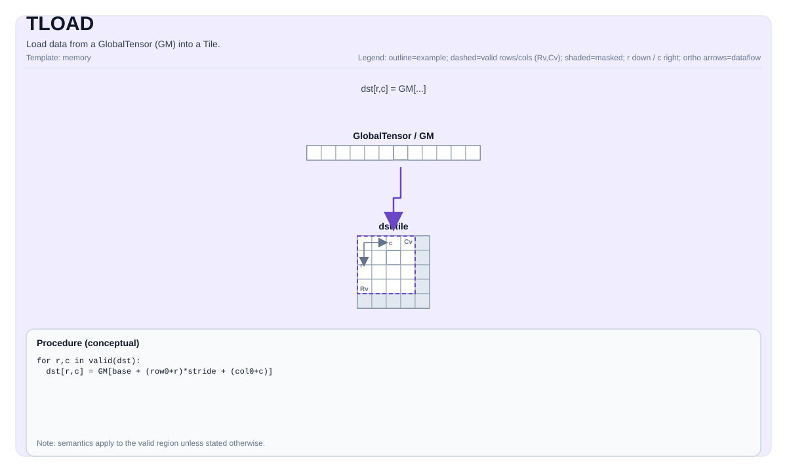

# TLOAD


## 指令示意图



## 简介

从GlobalTensor (GM) 加载数据到Tile。

## 数学语义

符号表示取决于 `GlobalTensor` 的形状/步长和 `Tile` 的布局。概念上（二维视图，带基础偏移量 `r_0` 和 `c_0`）：

$$ \mathrm{dst}_{i,j} = \mathrm{src}_{r_0 + i,\; c_0 + j} $$

## 汇编语法

同步形式：

```text
%t0 = tload %sv[%c0, %c0] : (!pto.memref<...>, index, index) -> !pto.tile<...>
```

### AS Level 1（SSA）

```text
%dst = pto.tload %mem : !pto.partition_tensor_view<MxNxdtype> ->
!pto.tile<loc, dtype, rows, cols, blayout, slayout, fractal, pad>
```

### AS Level 2（DPS）

```text
pto.tload ins(%mem : !pto.partition_tensor_view<MxNxdtype>) outs(%dst : !pto.tile_buf<...>)
```

## C++内建接口

声明于 `include/pto/common/pto_instr.hpp`：
> 公共包含头为 `<pto/pto-inst.hpp>`，内部声明位于 `pto/common/pto_instr.hpp`。

```cpp
template <typename TileData, typename GlobalData, typename... WaitEvents>
PTO_INST RecordEvent TLOAD(TileData &dst, GlobalData &src, WaitEvents &... events);

template <TLoadL2Hint l2Control, typename TileData, typename GlobalData, typename... WaitEvents>
PTO_INST RecordEvent TLOAD(TileData &dst, GlobalData &src, WaitEvents &... events);
```

原有 `TLOAD(dst, src)` 与 `TLOAD<TileT, GTensor>(dst, src)` 仍可用。`TLoadL2Hint` 为首模板的形式为额外重载（`l2Control` 无默认值）。

## L2 cache hint

可选首模板参数重载（原有 `TLOAD(dst, src)` 不变）：

```cpp
TLOAD<TLoadL2Hint::NotAllocKeep>(dst, src);
```

支持的 `TLoadL2Hint`：

| 枚举 | 值 | A2/A3 | A5 |
| --- | --- | --- | --- |
| NormalFirstVictim | 0 | 默认分配（无效果） | 支持 |
| NormalLastVictim | 1 | 默认分配（无效果） | 支持 |
| NormalPersistent | 2 | 默认分配（无效果） | 支持 |
| NotAllocKeep | 4 | 非分配（GM 地址加上运行时 `l2Cacheoffset`） | 支持 |
| NotAllocClean | 5 | 非分配（同 Keep） | 支持 |
| NotAllocDrop | 6 | 非分配（同 Keep） | 支持 |

A2/A3 上实际只有 **两种行为**：

1. **默认分配** — `NormalFirstVictim` (0)、`NormalLastVictim` (1)、`NormalPersistent` (2)：在 A2/A3 上为无效果（对 VLU / first/last/persist 等不同提示无影响）。它们不是有意义的独立模式，均走默认分配路径。
2. **非分配** — `NotAllocKeep` (4)、`NotAllocClean` (5)、`NotAllocDrop` (6)：生效，通过 GM 地址加上运行时 `l2Cacheoffset`（A2/A3 上 Keep/Clean/Drop 行为相同）。

A5 上表内取值均透传给 DMA。CPU / costmodel 接受该模板并忽略。

## 约束

- **实现检查 （Atlas A2/A3 训练系列产品/Atlas A2/A3 推理系列产品）**:
    - `TileData::DType` 必须是以下之一：`int8_t`、`uint8_t`、`int16_t`、`uint16_t`、`int32_t`、`uint32_t`、`int64_t`、`uint64_t`、`half`、`bfloat16_t`、`float`。
    - 目标tile位置必须是 `TileType::Vec` 或 `TileType::Mat`。
    - `sizeof(TileData::DType) == sizeof(GlobalData::DType)`。
    - 运行时：所有 `src.GetShape(dim)` 值和 `dst.GetValidRow()/GetValidCol()` 必须 `> 0`。
    - `TileType::Vec` 加载仅支持匹配的布局：ND->ND、DN->DN、NZ->NZ。
    - `TileType::Mat` 加载支持：ND->ND、DN->DN、NZ->NZ，以及ND->NZ和DN->ZN。
    - 对于ND->NZ：`GlobalData::staticShape[0..1] == 1` 且 `TileData::SFractalSize == 512`。
    - 对于DN->ZN：`GlobalData::staticShape[0..2] == 1` 且 `TileData::SFractalSize == 512`。
    - ND->NZ 也支持 `GlobalData::staticShape[2] != 1`。此时 `Shape2` 是单条指令搬运的 ND 小矩阵个数
      （指令自带的 `ndNum` 操作数），每个小矩阵形状为 `[Shape3, Shape4]`，多个小矩阵沿 tile 行方向堆叠，
      因此 `dst.GetValidRow() == Shape2 * Shape3`。该平台的 `srcNdMatrixStride` 与 `dstNzMatrixStride`
      是 16 位的元素数，因此除 `Shape2 * Shape3 <= TileData::Rows` 和 `1 <= Shape2 <= 65535` 外，
      还要求 `Stride2 <= 65535` 且 `Shape3 * (32 / sizeof(DType)) <= 65535`。
    - 对于 `int64_t/uint64_t`，仅支持ND->ND或DN->DN。
    - Vec tile（UB路径）：`1 <= TileData::Rows <= 4095`。
    - Mat tile（L1路径）：`1 <= TileData::Rows <= 16384`。
- **实现检查 (Ascend 950PR/Ascend 950DT)**:
    - `sizeof(TileData::DType)` 必须是 `1`、`2`、`4` 或 `8` 字节，且必须匹配 `sizeof(GlobalData::DType)`。
    - 对于 `int64_t/uint64_t`，`TileData::PadVal` 必须是 `PadValue::Null` 或 `PadValue::Zero`。
    - `TileType::Vec` 加载需要以下布局对之一：
    - ND使用行主序 + `SLayout::NoneBox`（ND->ND），
    - DN使用列主序 + `SLayout::NoneBox`（DN->DN），
    - NZ使用 `SLayout::RowMajor`（NZ->NZ）。
    - 对于使用编译时已知形状的行主序ND->ND，`TileData::ValidCol` 必须等于 `GlobalData::staticShape[4]`，且 `TileData::ValidRow` 必须等于 `GlobalData::staticShape[0..3]` 的乘积。
    - `TileType::Mat` 加载还受到 `TLoadCubeCheck` 的约束（例如，仅特定的ND/DN/NZ转换和L1大小限制）。
    - 对于 `TileType::Mat` 的 ND->NZ 和 DN->NZ：`TileData::SFractalSize == 512`、`sizeof(TileData::DType) != 8`，
      且 `GlobalData::staticShape[0] == 1 && GlobalData::staticShape[1] == 1`。
    - ND->NZ 额外支持 `GlobalData::staticShape[2] != 1`（包括动态 Shape2）。`Shape2` 表示源中可用的
      ND 小矩阵个数，每个小矩阵形状为 `[Shape3, Shape4]`，多个小矩阵沿 tile 行方向堆叠。
      运行时：`1 <= Shape2 <= 65535`、`1 <= Shape3 <= 16384`，且
      `1 <= dst.GetValidRow() <= min(TileData::Rows, Shape2 * Shape3)`。数据类型不能是 fp4。
    - DN->NZ 要求 `GlobalData::staticShape[2] == 1`。
    - DN->ZN 也支持 `GlobalData::staticShape[2] != 1`（包括动态 Shape2）。每个 DN 矩阵形状为
      `[Shape3, Shape4]`，`Shape2` 个矩阵沿 ZN tile 的列方向合并。要求
      `GlobalData::staticShape[0..1] == 1`、512 字节的 ZN 分形、b8/b16/b32（不支持 fp4/hif4），
      且 `TileData::Cols <= 65535`。运行时：`1 <= Shape2 <= 65535`、`1 <= Shape4 <= 16384`、
      `1 <= dst.GetValidCol() <= min(TileData::Cols, Shape2 * Shape4)`，以及
      `1 <= dst.GetValidRow() <= min(TileData::Rows, Shape3)`。
    - `TileType::Mat` 加载还处理mx格式的加载，包括 `MX_A_ZZ/MX_A_ND/MX_A_DN` 到ZZ（用于scalarA）和 `MX_B_NN/MX_B_ND/MX_B_DN` 到NN（用于scalarB）。
    - 对于 `MX_A_ZZ/MX_B_NN`：`(GlobalData::staticShape[3] == 16 || GlobalData::staticShape[3] == -1)` 且 `(GlobalData::staticShape[4] == 2 || GlobalData::staticShape[4] == -1)`。
    - 对于 `MX_A_ND/MX_A_DN/MX_B_ND/MX_B_DN`：`(GlobalData::staticShape[0] == 1 || GlobalData::staticShape[0] == -1)` 且 `(GlobalData::staticShape[1] == 1 || GlobalData::staticShape[1] == -1)` 且 `(GlobalData::staticShape[4] == 2 || GlobalData::staticShape[4] == -1)`。
    - 对于scaleA，`dst.GetValidCol() % 2 == 0`。
    - 对于scaleB，`dst.GetValidRow() % 2 == 0`。

- **有效区域**:
    - 实现使用 `dst.GetValidRow()` / `dst.GetValidCol()` 作为传输大小。
    - 在A2/A3上，同布局且按块对齐的 `TileType::Mat` 加载仅写入有效区域。ND到NZ、DN到ZN加载（以及单行/单列Mat特殊路径）还会将最后一个不完整C0块的尾部填零。其他数据保持不变，包括共享同一底层存储的其他tile视图所对应的数据。
    - 在A5上，同布局 `TileType::Mat` 的ND/DN加载仅按 `PadVal` 填充最后一个不完整32B块；ND/DN到分形布局的加载将最后一个不完整C0块的尾部填零。完整32B间隔块以及未参与传输的行或列保持不变。
    - 在A5上，`GlobalData::staticShape[2] != 1` 的 ND->NZ 加载合并后的前 `dst.GetValidRow()` 行。
      先用一条指令搬运 `dst.GetValidRow() / Shape3` 个完整矩阵，若 `dst.GetValidRow() % Shape3` 非零，
      再单独搬运这些尾行；没有完整矩阵时只搬运尾块。两次搬运均保持整个 tile 的 NZ 列块步长。
      Shape2 为动态维度且运行时取值为 1 时也适用。例如 `Shape3 = 3`、`dst.GetValidRow() = 17` 时，
      搬运 5 个完整矩阵和第 6 个矩阵的前 2 行，此时要求 `Shape2 >= 6`。
    - A5 的多 ND DN->ZN 沿列应用相同规则：先搬运 `dst.GetValidCol() / Shape4` 个完整矩阵，
      再搬运下一个矩阵的前 `dst.GetValidCol() % Shape4` 列。两次搬运均以 `TileData::Cols`
      作为 ND2NZ DMA 的 C0 块步长，单位为 32 字节。ZN `[D, M]` 与 NZ `[M, D]` 的字节布局相同，
      无需额外转置。仅对有效行末尾不足一个 C0 块的部分填零；未参与搬运的列以及有效行之外的
      完整 C0 块保留原值。
    - 在A2/A3和A5上，`PadVal` 非空时，`TileType::Vec` 的ND/DN加载仅填充每个burst传输后不足32B的尾部；完整32B间隔块以及未参与传输的行或列保持不变。NZ加载和`PadValue::Null`不增加填充。

## 示例

### A5 多矩阵 DN 到 ZN 加载

在 Cube kernel 中，下面的代码加载合并后的前 17 列，即 5 个完整的 3 列矩阵和第 6 个矩阵的前 2 列。
GM 物理存储为 `[8, 9, 64]`，DN 描述符选择其中的 `[8, 3, 35]`，并交换每个矩阵的逻辑轴顺序。
以下步长均以元素为单位。

```cpp
using SrcShape = pto::Shape<1, 1, 8, 35, 3>;
using SrcStride = pto::Stride<4608, 4608, 576, 1, 64>;
using SrcGlobal = pto::GlobalTensor<int16_t, SrcShape, SrcStride, pto::Layout::DN>;
using MatTile = pto::Tile<pto::TileType::Mat, int16_t, 64, 32, pto::BLayout::RowMajor,
                          35, 17, pto::SLayout::ColMajor, 512>;
SrcGlobal src(in); // in 指向 GM 中第一个源矩阵
MatTile dst;
pto::TASSIGN(dst, 0); // 使用可用的 L1 地址
pto::TLOAD(dst, src);
```

对于 `0 <= r < 35`、`0 <= c < 17`，结果为
`dst[r, c] = in[(c / 3) * 576 + (c % 3) * 64 + r]`。
当 Shape2 的运行时值可以变化（包括取值为 1）时，使用动态 Shape2（`-1`）。编译期 Shape2 为 1
会选择现有的单矩阵路径，此时源形状应描述本次搬运的范围。

### 自动（Auto）

```cpp
#include <pto/pto-inst.hpp>

using namespace pto;

template <typename T>
void example_auto(__gm__ T* in) {
  using TileT = Tile<TileType::Vec, T, 16, 16>;
  using GShape = Shape<1, 1, 1, 16, 16>;
  using GStride = BaseShape2D<T, 16, 16, Layout::ND>;
  using GTensor = GlobalTensor<T, GShape, GStride, Layout::ND>;

  GTensor gin(in);
  TileT t;
  TLOAD(t, gin);
}
```

### 手动（Manual）

```cpp
#include <pto/pto-inst.hpp>

using namespace pto;

template <typename T>
void example_manual(__gm__ T* in) {
  using TileT = Tile<TileType::Vec, T, 16, 16>;
  using GShape = Shape<1, 1, 1, 16, 16>;
  using GStride = BaseShape2D<T, 16, 16, Layout::ND>;
  using GTensor = GlobalTensor<T, GShape, GStride, Layout::ND>;

  GTensor gin(in);
  TileT t;
  TASSIGN(t, 0x1000);
  TLOAD(t, gin);
}
```

## 汇编示例（ASM）

### 自动模式

```text
# 自动模式：由编译器/运行时负责资源放置与调度。
%dst = pto.tload %mem : !pto.partition_tensor_view<MxNxdtype> ->
```

### 手动模式

```text
# 手动模式：先显式绑定资源，再发射指令。
# 可选（当该指令包含 tile 操作数时）：
# pto.tassign %arg0, @tile(0x1000)
# pto.tassign %arg1, @tile(0x2000)
%dst = pto.tload %mem : !pto.partition_tensor_view<MxNxdtype> ->
```

### PTO汇编形式

```text
%t0 = tload %sv[%c0, %c0] : (!pto.memref<...>, index, index) -> !pto.tile<...>
# AS Level 2 (DPS)
pto.tload ins(%mem : !pto.partition_tensor_view<MxNxdtype>) outs(%dst : !pto.tile_buf<...>)
```
