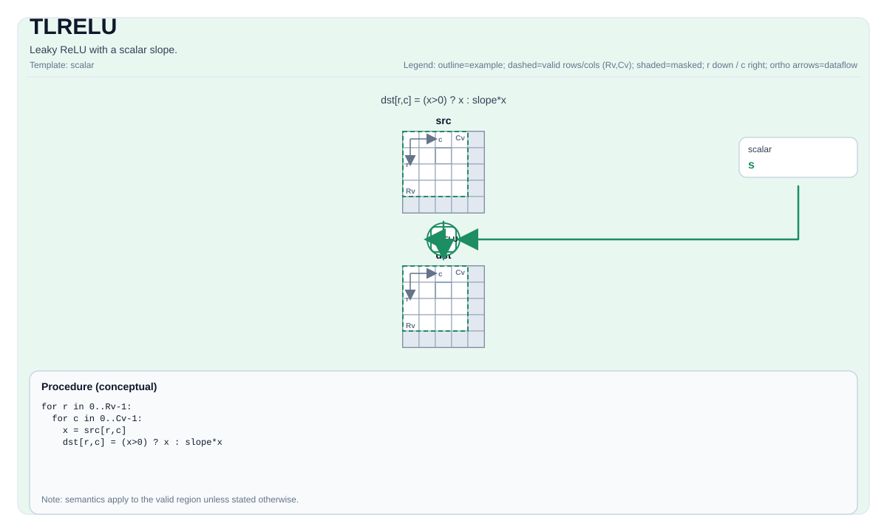

# TLRELU


## Tile Operation Diagram



## Introduction

Leaky ReLU with a scalar slope.

## Math Interpretation

For each element `(i, j)` in the valid region:

$$ \mathrm{dst}_{i,j} = (\mathrm{src}_{i,j} > 0) ? \mathrm{src}_{i,j} : (\mathrm{src}_{i,j} \cdot \mathrm{slope}) $$

## C++ Intrinsic

Declared in `include/pto/common/pto_instr.hpp`:

```cpp
template <typename TileDataDst, typename TileDataSrc, typename... WaitEvents>
PTO_INST RecordEvent TLRELU(TileDataDst& dst, TileDataSrc& src, typename TileDataSrc::DType scalar, WaitEvents&... events);
```

## Constraints

- **Implementation checks (A2A3)**:
    - `TileData::DType` must be one of: `half`, `float16_t`, `float`, `float32_t` (floating-point types only).
    - Tile layout must be row-major (`TileData::isRowMajor`).
- **Implementation checks (A5)**:
    - `TileData::DType` must be one of: `half`, `float` (floating-point types only).
    - Tile layout must be row-major (`TileData::isRowMajor`).
- **Common constraints**:
    - Tile location must be vector (`TileData::Loc == TileType::Vec`).
    - Static valid bounds: `TileData::ValidRow <= TileData::Rows` and `TileData::ValidCol <= TileData::Cols`.
    - Runtime: `dst` and `src` must have the same valid row/col.
    - Slope scalar type must match the Tile data type.
- **Valid region**:
    - The op uses `dst.GetValidRow()` / `dst.GetValidCol()` as the iteration domain.

## Examples

```cpp
#include <pto/pto-inst.hpp>

using namespace pto;

void example() {
  using TileT = Tile<TileType::Vec, float, 16, 16>;
  TileT x, out;
  TLRELU(out, x, 0.1f);
}
```

