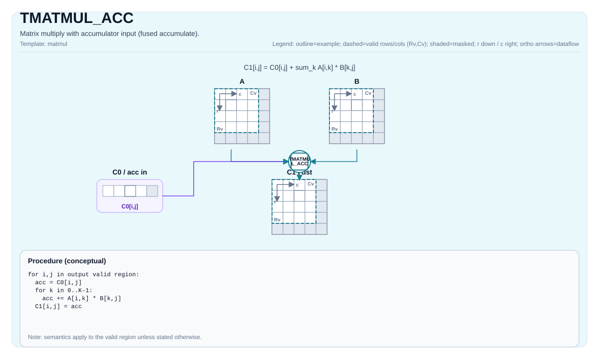

# TMATMUL_ACC

## 指令示意图



## 简介

带累加器输入的矩阵乘法（融合累加）。

## 数学语义

设：

- `M = aMatrix.GetValidRow()`
- `K = aMatrix.GetValidCol()`
- `N = bMatrix.GetValidCol()`

对于 `0 <= i < M` 和 `0 <= j < N`：

$$ \mathrm{C1}_{i,j} = \mathrm{C0}_{i,j} + \sum_{k=0}^{K-1} \mathrm{A}_{i,k} \cdot \mathrm{B}_{k,j} $$

`C0` 是融合乘加序列的初始累加值，并非先从零独立计算点积、再在末尾加上 `C0`；跨 K tile 累加时，两种顺序可能产生不同的浮点舍入结果。

## C++内建接口

声明于 `include/pto/common/pto_instr.hpp`：
> 公共包含头为 `<pto/pto-inst.hpp>`，内部声明位于 `pto/common/pto_instr.hpp`。

```cpp
template <typename TileRes, typename TileLeft, typename TileRight, typename... WaitEvents>
PTO_INST RecordEvent TMATMUL_ACC(TileRes &cOutMatrix, TileRes &cInMatrix, TileLeft &aMatrix, TileRight &bMatrix, WaitEvents &... events);

template <AccPhase Phase, typename TileRes, typename TileLeft, typename TileRight, typename... WaitEvents>
PTO_INST RecordEvent TMATMUL_ACC(TileRes &cOutMatrix, TileRes &cInMatrix, TileLeft &aMatrix, TileRight &bMatrix, WaitEvents &... events);

template <AccPhase Phase = AccPhase::Unspecified, typename TileRes, typename TileLeft, typename TileRight,
          typename... WaitEvents>
PTO_INST RecordEvent TMATMUL_ACC(TileRes &cMatrix, TileLeft &aMatrix, TileRight &bMatrix, WaitEvents &... events); // 注：该重载将 cMatrix 同时作为累加器输入与输出（原地），读取其现有值作为 C0，写回 C1 = C0 + A·B；既不清零也不覆盖
```

## 约束

- 所有来自 `TMATMUL` 的约束都适用于 `(cOutMatrix, aMatrix, bMatrix)` 三元组。
- **实现说明 (Atlas A2/A3 训练系列产品/Atlas A2/A3 推理系列产品/Ascend 950PR/Ascend 950DT)**:
    - `TMATMUL_ACC_IMPL` 使用 `aMatrix.GetValidRow()`、`aMatrix.GetValidCol()` 和 `bMatrix.GetValidCol()` 作为 `m/k/n`。
    - `cInMatrix` 在当前实现中不通过显式断言进行验证（目标定义的行为）。

- **实现检查（CPU_SIM，FP8/HIF8）**：输入类型组合、A5 模拟模式要求及数值精度限制与
  [TMATMUL](TMATMUL_zh.md) 相同。

## 示例

### 自动（Auto）

```cpp
#include <pto/pto-inst.hpp>

using namespace pto;

void example_auto() {
  using A = TileLeft<half, 16, 16>;
  using B = TileRight<half, 16, 16>;
  using C = TileAcc<float, 16, 16>;
  A a;
  B b;
  C c0, c1;
  TMATMUL_ACC(c1, c0, a, b);
}
```

### 手动（Manual）

```cpp
#include <pto/pto-inst.hpp>

using namespace pto;

void example_manual() {
  using A = TileLeft<half, 16, 16>;
  using B = TileRight<half, 16, 16>;
  using C = TileAcc<float, 16, 16>;
  A a;
  B b;
  C c0, c1;
  TASSIGN(a, 0x1000);
  TASSIGN(b, 0x2000);
  TASSIGN(c0, 0x3000);
  TASSIGN(c1, 0x4000);
  TMATMUL_ACC(c1, c0, a, b);
}
```
