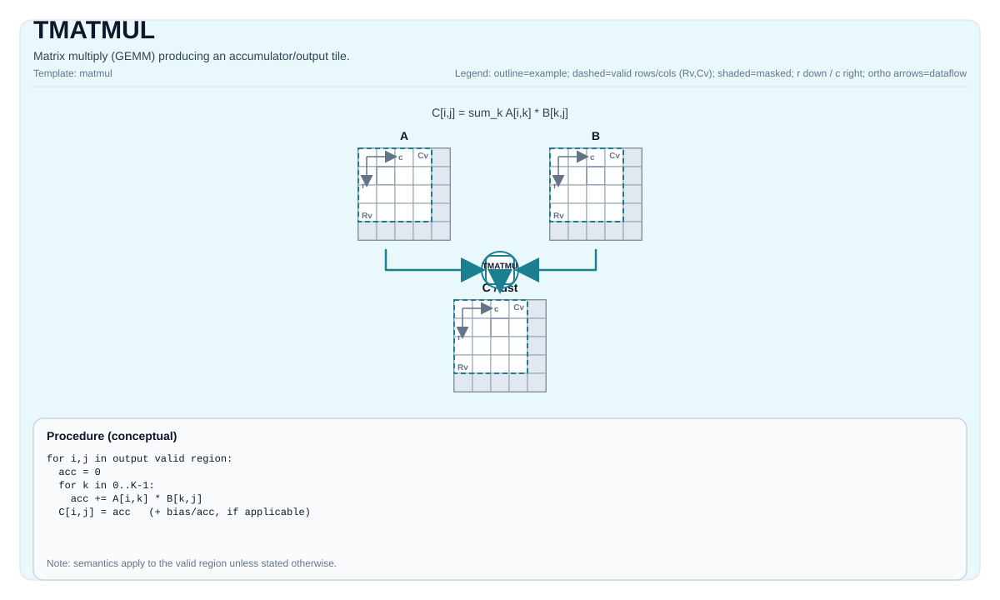

# TMATMUL

## 指令示意图



## 简介

矩阵乘法 (GEMM)，生成累加器/输出Tile。

## 数学语义

设：

- `M = aMatrix.GetValidRow()`
- `K = aMatrix.GetValidCol()`
- `N = bMatrix.GetValidCol()`

对于 `0 <= i < M` 和 `0 <= j < N`（有效矩阵乘法域中的输出元素）：

$$ \mathrm{C}_{i,j} = \sum_{k=0}^{K-1} \mathrm{A}_{i,k} \cdot \mathrm{B}_{k,j} $$

精确的累加器行为和数据类型提升由目标/实现定义。

## 汇编语法

同步形式：

```text
%acc = tmatmul %a, %b : (!pto.tile<...>, !pto.tile<...>) -> !pto.tile<...>
```

### AS Level 1（SSA）

```text
%c = pto.tmatmul %a, %b : (!pto.tile<...>, !pto.tile<...>) -> !pto.tile<...>
```

### AS Level 2（DPS）

```text
pto.tmatmul ins(%a, %b : !pto.tile_buf<...>, !pto.tile_buf<...>) outs(%c : !pto.tile_buf<...>)
```

## C++内建接口

声明于 `include/pto/common/pto_instr.hpp`：
> 公共包含头为 `<pto/pto-inst.hpp>`，内部声明位于 `pto/common/pto_instr.hpp`。

```cpp
template <typename TileRes, typename TileLeft, typename TileRight, typename... WaitEvents>
PTO_INST RecordEvent TMATMUL(TileRes &cMatrix, TileLeft &aMatrix, TileRight &bMatrix, WaitEvents &... events);

template <AccPhase Phase, typename TileRes, typename TileLeft, typename TileRight, typename... WaitEvents>
PTO_INST RecordEvent TMATMUL(TileRes &cMatrix, TileLeft &aMatrix, TileRight &bMatrix, WaitEvents &... events);
```

## 约束

- **累加器目的步幅（CPU、A2A3、A5、A6 和 Kirin9030）**：
    - `mad` 没有目的步幅操作数。对于超过一个 Acc 列基块的非 compact `TileRes`
      （`TileRes::Cols > FRACTAL_NZ_ROW`，其中 `FRACTAL_NZ_ROW` 为 16），仅当
      `align_up(M, 16) == TileRes::Rows` 时形状才合法。
    - 静态 `TileRes::ValidRow` 在编译期检查，并且必须与 `aMatrix.GetValidRow()` 表示相同的 `M`；
      不兼容的形状会触发 `static_assert`。
    - 动态 `TileRes::ValidRow` 在 NPU 上使用 `aMatrix.GetValidRow()` 得到的运行时 `M` 检查；
      不兼容的形状会执行 `trap()`，外部表现为 AI Core 异常。
    - 当 `TileRes::Cols <= 16` 或 `TileRes::Compact != CompactMode::Null` 时，不受此限制。
    - 处理行窗口时，应为每个窗口使用完整 Rows 的 Acc Tile（`Rows = align_up(M, 16)`）、改为按列
      window，或者在所有下游消费者都采用相同紧凑布局时使用 `TileAccCompact`。
- **实现检查 （Atlas A2/A3 训练系列产品/Atlas A2/A3 推理系列产品）**:
    - 支持的 `(CType, AType, BType)` 三元组：
    - `(int32_t, int8_t, int8_t)`
    - `(float, half, half)`
    - `(float, float, float)`
    - `(float, bfloat16_t, bfloat16_t)`
    - 静态形状约束：`TileLeft::Rows == TileRes::Rows`、`TileLeft::Cols == TileRight::Rows`、`TileRight::Cols == TileRes::Cols`。
    - Tile位置：`TileLeft::Loc == Left`、`TileRight::Loc == Right`、`TileRes::Loc == Acc`。
    - 运行时：`m/k/n`（取自 `aMatrix.GetValidRow()`、`aMatrix.GetValidCol()`、`bMatrix.GetValidCol()`）必须在 `[1, 4095]` 范围内。
- **实现检查 (Ascend 950PR/Ascend 950DT)**:
    - 累加器类型必须是 `int32_t` 或 `float`。
    - 如果是 `int32_t`：`AType == int8_t` 且 `BType == int8_t`。
    - 如果是 `float`：支持 `half/bfloat16_t/float`、选定的fp8对以及 `hifloat8_t/hifloat8_t`（目标定义）。
    - 静态形状约束：`TileLeft::Rows == TileRes::Rows`、`TileLeft::Cols == TileRight::Rows`、`TileRight::Cols == TileRes::Cols`。
    - 强制执行分形/布局约束：
    - Left：`Loc == Left`、`!isRowMajor`、`SFractal == RowMajor`
    - Right：`Loc == Right`、`isRowMajor`、`SFractal == ColMajor`
    - Acc：`Loc == Acc`、`!isRowMajor`、`SFractal == RowMajor`
    - 运行时：`m/k/n`（取自 `aMatrix.GetValidRow()`、`aMatrix.GetValidCol()`、`bMatrix.GetValidCol()`）必须在 `[1, 4095]` 范围内。

## 示例

### 自动（Auto）

```cpp
#include <pto/pto-inst.hpp>

using namespace pto;

void example_auto() {
  using A = TileLeft<half, 16, 16>;
  using B = TileRight<half, 16, 16>;
  using C = TileAcc<float, 16, 16>;
  A a;
  B b;
  C c;
  TMATMUL(c, a, b);
}
```

### 手动（Manual）

```cpp
#include <pto/pto-inst.hpp>

using namespace pto;

void example_manual() {
  using A = TileLeft<half, 16, 16>;
  using B = TileRight<half, 16, 16>;
  using C = TileAcc<float, 16, 16>;
  A a;
  B b;
  C c;
  TASSIGN(a, 0x1000);
  TASSIGN(b, 0x2000);
  TASSIGN(c, 0x3000);
  TMATMUL(c, a, b);
}
```

## 汇编示例（ASM）

### 自动模式

```text
# 自动模式：由编译器/运行时负责资源放置与调度。
%c = pto.tmatmul %a, %b : (!pto.tile<...>, !pto.tile<...>) -> !pto.tile<...>
```

### 手动模式

```text
# 手动模式：先显式绑定资源，再发射指令。
# 可选（当该指令包含 tile 操作数时）：
# pto.tassign %arg0, @tile(0x1000)
# pto.tassign %arg1, @tile(0x2000)
%c = pto.tmatmul %a, %b : (!pto.tile<...>, !pto.tile<...>) -> !pto.tile<...>
```

### PTO汇编形式

```text
%acc = tmatmul %a, %b : (!pto.tile<...>, !pto.tile<...>) -> !pto.tile<...>
# AS Level 2 (DPS)
pto.tmatmul ins(%a, %b : !pto.tile_buf<...>, !pto.tile_buf<...>) outs(%c : !pto.tile_buf<...>)
```
