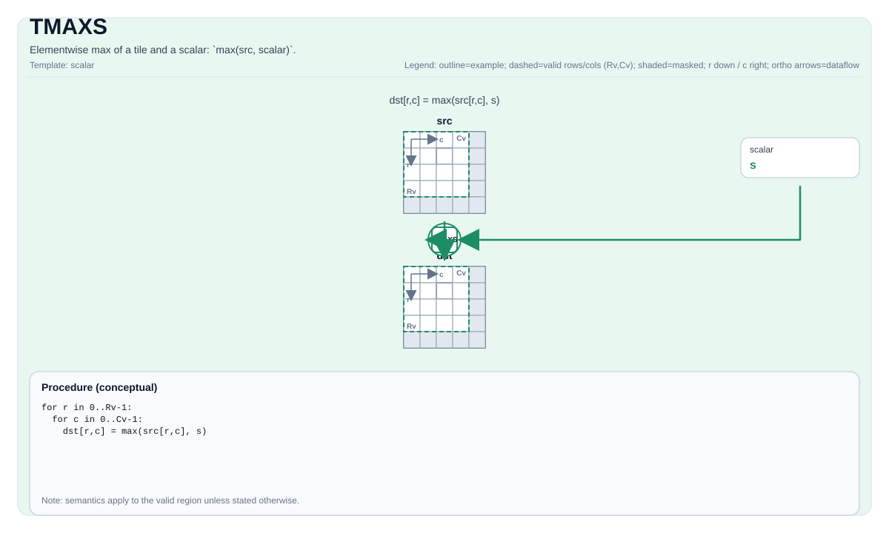

# TMAXS


## Tile Operation Diagram



## Introduction

Elementwise max of a tile and a scalar: `max(src, scalar)`.

## Math Interpretation

For each element `(i, j)` in the valid region:

$$ \mathrm{dst}_{i,j} = \max(\mathrm{src}_{i,j}, \mathrm{scalar}) $$

## C++ Intrinsic

Declared in `include/pto/common/pto_instr.hpp`:

```cpp
template <typename TileDataDst, typename TileDataSrc, typename... WaitEvents>
PTO_INST RecordEvent TMAXS(TileDataDst& dst, TileDataSrc& src, typename TileDataSrc::DType scalar, WaitEvents&... events);
```

## Constraints

- **Implementation checks (A2A3)**:
    - `TileData::DType` must be one of: `int32_t`, `int16_t`, `half`, `float`.
    - Tile layout must be row-major (`TileData::isRowMajor`).
- **Implementation checks (A5)**:
    - `TileData::DType` must be one of: `int32_t`, `uint32_t`, `int64_t`, `uint64_t`, `float`, `int16_t`, `uint16_t`, `half`, `bfloat16_t`, `uint8_t`, `int8_t`.
    - Tile layout must be row-major (`TileData::isRowMajor`).
- **Common constraints**:
    - Tile location must be vector (`TileData::Loc == TileType::Vec`).
    - Static valid bounds: `TileData::ValidRow <= TileData::Rows` and `TileData::ValidCol <= TileData::Cols`.
    - Runtime: `dst` and `src` must have the same valid row/col.
    - Scalar type must match the Tile data type.
- **Valid region**:
    - The op uses `dst.GetValidRow()` / `dst.GetValidCol()` as the iteration domain.

## Examples

```cpp
#include <pto/pto-inst.hpp>

using namespace pto;

void example() {
  using TileT = Tile<TileType::Vec, float, 16, 16>;
  TileT x, out;
  TMAXS(out, x, 0.0f);
}
```
