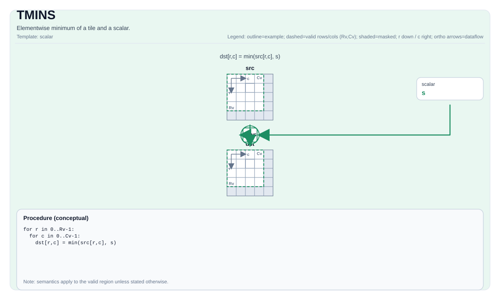

# TMINS

## 指令示意图



## 简介

Tile与标量的逐元素最小值。

## 数学语义

对每个元素 `(i, j)` 在有效区域内：

$$ \mathrm{dst}_{i,j} = \min(\mathrm{src}_{i,j}, \mathrm{scalar}) $$

## C++内建接口

声明于 `include/pto/common/pto_instr.hpp`：
> 公共包含头为 `<pto/pto-inst.hpp>`，内部声明位于 `pto/common/pto_instr.hpp`。

```cpp
template <typename TileDataDst, typename TileDataSrc, typename... WaitEvents>
PTO_INST RecordEvent TMINS(TileDataDst &dst, TileDataSrc &src, typename TileDataSrc::DType scalar, WaitEvents &... events);
```

## 约束

- **实现检查 （Atlas A2/A3 训练系列产品/Atlas A2/A3 推理系列产品）**:
    - `TileData::DType` 必须是以下之一：`int32_t`、`int`、`int16_t`、`half`、`float16_t`、`float`、`float32_t`。
    - 运行时：`src.GetValidRow() == dst.GetValidRow()` 且 `src.GetValidCol() == dst.GetValidCol()`。
- **实现检查 (Ascend 950PR/Ascend 950DT)**:
    - `TileData::DType` 必须是以下之一：`uint8_t`、`int8_t`、`uint16_t`、`int16_t`、`uint32_t`、`int32_t`、`int64_t`、`uint64_t`、`half`、`float`、`bfloat16_t`。
    - 运行时：`src.GetValidCol() == dst.GetValidCol()`。
- **通用约束**:
    - `dst` 和 `src` 必须使用相同的元素类型。
    - 标量类型必须与Tile数据类型一致。
    - Tile位置必须是向量（`TileData::Loc == TileType::Vec`）。
- **有效区域**:
    - 该操作使用 `dst.GetValidRow()` / `dst.GetValidCol()` 作为迭代域。

## 示例

### 自动（Auto）

```cpp
#include <pto/pto-inst.hpp>

using namespace pto;

void example_auto() {
  using TileT = Tile<TileType::Vec, float, 16, 16>;
  TileT src, dst;
  TMINS(dst, src, 0.0f);
}
```

### 手动（Manual）

```cpp
#include <pto/pto-inst.hpp>

using namespace pto;

void example_manual() {
  using TileT = Tile<TileType::Vec, float, 16, 16>;
  TileT src, dst;
  TASSIGN(src, 0x1000);
  TASSIGN(dst, 0x2000);
  TMINS(dst, src, 0.0f);
}
```
