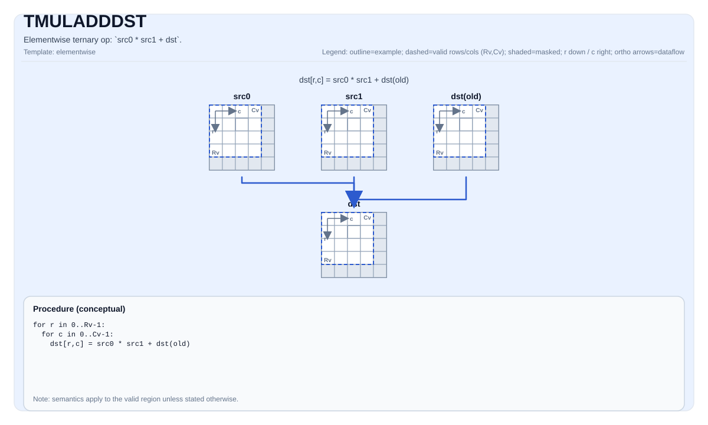

# TMULADDDST

## Tile Operation Diagram



## Introduction

Elementwise operation: `src0 * src1 + dst`.

## Math Interpretation

For each element `(i, j)` in the valid region:

$$ \mathrm{dst}_{i,j} = \mathrm{src0}_{i,j} \* \mathrm{src1}_{i,j} + \mathrm{dst}_{i,j} $$

## C++ Intrinsic

Declared in `include/pto/common/pto_instr.hpp`:

```cpp
template <typename TileDataDst, typename TileDataSrc0, typename TileDataSrc1, typename... WaitEvents>
PTO_INST RecordEvent TMULADDDST(TileDataDst &dst, TileDataSrc0 &src0, TileDataSrc1 &src1, WaitEvents &...events);
```

## Constraints

- **Implementation checks**:
    - `TileData::DType` must be one of: `float`, `half`.
    - Tile layout must be row-major (`TileData::isRowMajor`).
- **Valid region**:
    - The op uses `dst.GetValidRow()` / `dst.GetValidCol()` as the iteration domain; `src0/src1` are assumed to be compatible (not validated by explicit runtime checks in this op).
- The op iterates over `dst.GetValidRow()` / `dst.GetValidCol()`.

## Examples

```cpp
#include <pto/pto-inst.hpp>

using namespace pto;

void example() {
  using TileT = Tile<TileType::Vec, float, 16, 16>;
  TileT a, b, out;
  TMULADDDST(out, a, b);
}
```
