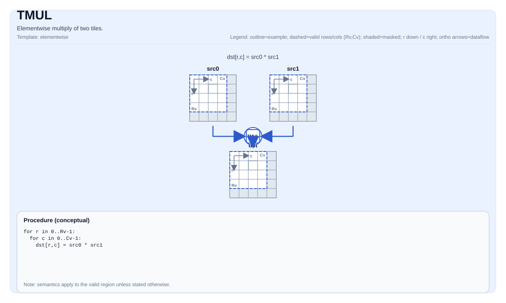

# TMUL

## 指令示意图



## 简介

两个 Tile 的逐元素乘法。

## 数学语义

对每个元素 `(i, j)` 在有效区域内：

$$ \mathrm{dst}_{i,j} = \mathrm{src0}_{i,j} \cdot \mathrm{src1}_{i,j} $$

## C++ 内建接口

声明于 `include/pto/common/pto_instr.hpp`：

```cpp
template <typename TileDataDst, typename TileDataSrc0, typename TileDataSrc1, typename... WaitEvents>
PTO_INST RecordEvent TMUL(TileDataDst &dst, TileDataSrc0 &src0, TileDataSrc1 &src1, WaitEvents&&... events);
```

## 约束

- **实现检查 (A2A3)**:
    - `TileData::DType` 必须是以下之一：`int32_t`、`int16_t`、`half`、`float`。
    - Tile 位置必须是向量（`TileData::Loc == TileType::Vec`）。
    - 静态有效边界：`TileData::ValidRow <= TileData::Rows` 且 `TileData::ValidCol <= TileData::Cols`。
    - Tile 布局必须是行主序（`TileData::isRowMajor`）。
    - 运行时：`src0`、`src1` 和 `dst` tiles 应具有相同的 `validRow/validCol`。
- **实现检查 (A5)**:
    - `TileData::DType` 必须是以下之一：`int32_t`、`uint32_t`、`float`、`int16_t`、`uint16_t`、`half`、`bfloat16`。
    - Tile 位置必须是向量（`TileData::Loc == TileType::Vec`）。
    - 静态有效边界：`TileData::ValidRow <= TileData::Rows` 且 `TileData::ValidCol <= TileData::Cols`。
    - Tile 布局必须是行主序（`TileData::isRowMajor`）。
    - 运行时：`src0`、`src1` 和 `dst` tiles 应具有相同的 `validRow/validCol`。
- **有效区域**:
    - 该操作使用 `dst.GetValidRow()` / `dst.GetValidCol()` 作为迭代域。

## 示例

### 自动（Auto）

```cpp
#include <pto/pto-inst.hpp>

using namespace pto;

void example_auto() {
  using TileT = Tile<TileType::Vec, float, 16, 16>;
  TileT src0, src1, dst;
  TMUL(dst, src0, src1);
}
```

### 手动（Manual）

```cpp
#include <pto/pto-inst.hpp>

using namespace pto;

void example_manual() {
  using TileT = Tile<TileType::Vec, float, 16, 16>;
  TileT src0, src1, dst;
  TASSIGN(src0, 0x1000);
  TASSIGN(src1, 0x2000);
  TASSIGN(dst,  0x3000);
  TMUL(dst, src0, src1);
}
```

