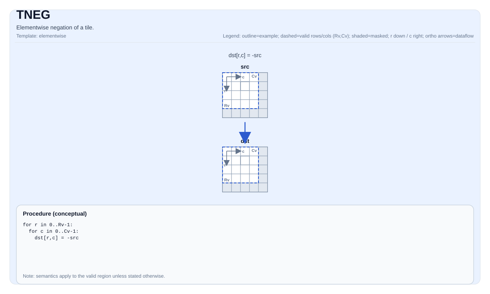

# TNEG

## 指令示意图



## 简介

Tile的逐元素取负。

## 数学语义

对每个元素 `(i, j)` 在有效区域内：

$$ \mathrm{dst}_{i,j} = -\mathrm{src}_{i,j} $$

## C++内建接口

声明于 `include/pto/common/pto_instr.hpp`：
> 公共包含头为 `<pto/pto-inst.hpp>`，内部声明位于 `pto/common/pto_instr.hpp`。

```cpp
template <typename TileDataDst, typename TileDataSrc, typename... WaitEvents>
PTO_INST RecordEvent TNEG(TileDataDst &dst, TileDataSrc &src, WaitEvents &... events);
```

## 约束

- 该操作在 `dst.GetValidRow()` / `dst.GetValidCol()` 上迭代。
- **实现检查 (Atlas A2/A3 训练系列产品/Atlas A2/A3 推理系列产品)**：`TileData::DType` 必须是以下之一：`int32_t`、`int16_t`、`half`、`float`。
- **实现检查 (Ascend 950PR/Ascend 950DT)**：`TileData::DType` 必须是以下之一：`int32_t`、`int16_t`、`uint32_t`、`uint16_t`、`half`、`float`、`bfloat16_t`。

## 示例

```cpp
#include <pto/pto-inst.hpp>

using namespace pto;

void example() {
  using TileT = Tile<TileType::Vec, float, 16, 16>;
  TileT x, out;
  TNEG(out, x);
}
```
