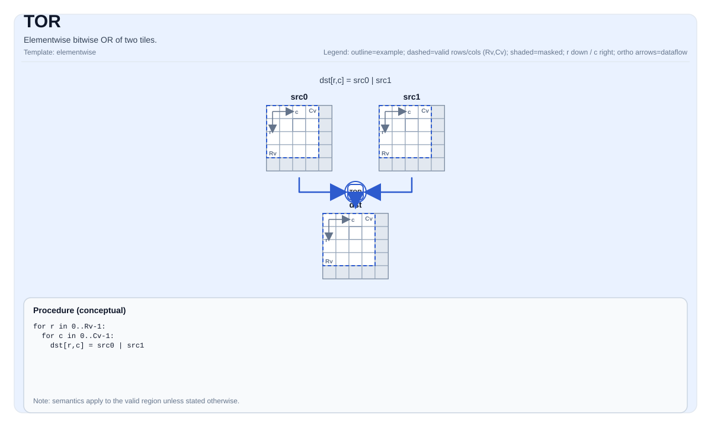

# TOR


## Tile Operation Diagram



## Introduction

Elementwise bitwise OR of two tiles.

## Math Interpretation

For each element `(i, j)` in the valid region:

$$ \mathrm{dst}_{i,j} = \mathrm{src0}_{i,j} \;|\; \mathrm{src1}_{i,j} $$

## C++ Intrinsic

Declared in `include/pto/common/pto_instr.hpp`:

```cpp
template <typename TileData, typename... WaitEvents>
PTO_INST RecordEvent TOR(TileData &dst, TileData &src0, TileData &src1, WaitEvents &... events);
```

## Constraints

- **Implementation checks (A2A3)**:
    - Supported element types are `uint8_t`, `int8_t`, `uint16_t`, `int16_t`, `uint32_t`, and `int32_t`.
    - `dst`, `src0`, and `src1` must use the same element type.
    - `dst`, `src0`, and `src1` must be row-major.
    - Runtime: `src0.GetValidRow()/GetValidCol()` and `src1.GetValidRow()/GetValidCol()` must match `dst`.
- **Implementation checks (A5)**:
    - Supported element types are `uint8_t`, `int8_t`, `uint16_t`, `int16_t`, `uint32_t`, `int32_t`, `int64_t`, `uint64_t`.
    - `dst`, `src0`, and `src1` must use the same element type.
    - `dst`, `src0`, and `src1` must be row-major.
    - Runtime: `src0.GetValidRow()/GetValidCol()` and `src1.GetValidRow()/GetValidCol()` must match `dst`.
- **Valid region**:
    - The op uses `dst.GetValidRow()` / `dst.GetValidCol()` as the iteration domain.

## Examples

```cpp
#include <pto/pto-inst.hpp>

using namespace pto;

void example() {
  using TileT = Tile<TileType::Vec, int32_t, 16, 16>;
  TileT a, b, out;
  TOR(out, a, b);
}
```
