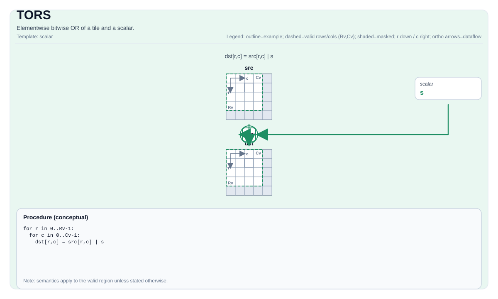

# TORS


## Tile Operation Diagram



## Introduction

Elementwise bitwise OR of a tile and a scalar.

## Math Interpretation

For each element `(i, j)` in the valid region:

$$ \mathrm{dst}_{i,j} = \mathrm{src}_{i,j} \;|\; \mathrm{scalar} $$

## C++ Intrinsic

Declared in `include/pto/common/pto_instr.hpp`:

```cpp
template <typename TileDataDst, typename TileDataSrc, typename... WaitEvents>
PTO_INST RecordEvent TORS(TileDataDst &dst, TileDataSrc &src, typename TileDataDst::DType scalar, WaitEvents &... events);
```

## Constraints

- **Implementation checks (A2A3)**:
    - Intended for integral element types.
    - `dst` and `src` must use the same element type.
    - `dst` and `src` must be vector tiles.
    - Runtime: `src.GetValidRow() == dst.GetValidRow()` and `src.GetValidCol() == dst.GetValidCol()`.
    - In manual mode, setting the source tile and destination tile to the same memory is unsupported.
- **Implementation checks (A5)**:
    - Intended for integral element types supported by `TEXPANDS` and `TOR`.
    - `dst` and `src` must use the same element type.
    - `dst` and `src` must be vector tiles.
    - In manual mode, setting the source tile and destination tile to the same memory is unsupported.
- **Valid region**:
    - The op uses `dst.GetValidRow()` / `dst.GetValidCol()` as the iteration domain.

## Examples

```cpp
#include <pto/pto-inst.hpp>

using namespace pto;

void example() {
  using TileDst = Tile<TileType::Vec, uint16_t, 16, 16>;
  using TileSrc = Tile<TileType::Vec, uint16_t, 16, 16>;
  TileDst dst;
  TileSrc src;
  TORS(dst, src, 0xffu);
}
```
