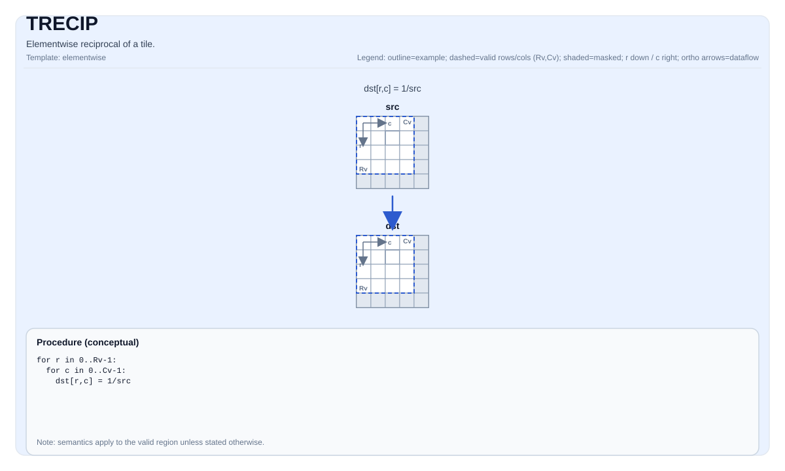

# TRECIP


## Tile Operation Diagram



## Introduction

Elementwise reciprocal of a tile.

## Math Interpretation

For each element `(i, j)` in the valid region:

$$ \mathrm{dst}_{i,j} = \frac{1}{\mathrm{src}_{i,j}} $$

## C++ Intrinsic

Declared in `include/pto/common/pto_instr.hpp`:

```cpp
template <auto PrecisionType = RecipAlgorithm::DEFAULT, typename TileDataDst, typename TileDataSrc,
          typename... WaitEvents>
PTO_INST RecordEvent TRECIP(TileDataDst &dst, TileDataSrc &src, WaitEvents &... events);
```

`PrecisionType` has the following values available:

* `RecipAlgorithm::DEFAULT`: Normal algorithm, faster but with lower precision.
* `RecipAlgorithm::HIGH_PRECISION`: High precision algorithm, but slower.

## Constraints

- **Implementation checks (NPU)**:
    - `TileData::DType` must be one of: `float`, `half`, `int32_t`, `int16_t` (the implementation delegates to `TDIVS(dst, 1, src)`, which also admits integer `1/x`);
    - Tile location must be vector (`TileData::Loc == TileType::Vec`);
    - Static valid bounds: `TileData::ValidRow <= TileData::Rows` and `TileData::ValidCol <= TileData::Cols`;
    - Runtime: `src.GetValidRow() == dst.GetValidRow()` and `src.GetValidCol() == dst.GetValidCol()`;
    - Tile layout must be row-major (`TileData::isRowMajor`).
    - A3's TRECIP instruction does not support setting the source Tile and destination Tile to the same memory.
- **Valid region**:
    - The op uses `dst.GetValidRow()` / `dst.GetValidCol()` as the iteration domain.
- **Domain / NaN**:
    - Division-by-zero behavior is target-defined; the CPU simulator asserts in debug builds.
- **High Precision Algorithm**
    - Only available on A5, `PrecisionType` option is ignored on A3.

## Examples

```cpp
#include <pto/pto-inst.hpp>

using namespace pto;

void example() {
  using TileT = Tile<TileType::Vec, float, 16, 16>;
  TileT x, out;
  TRECIP(out, x);
  TRECIP<RecipAlgorithm::HIGH_PRECISION>(out, x);
}
```
