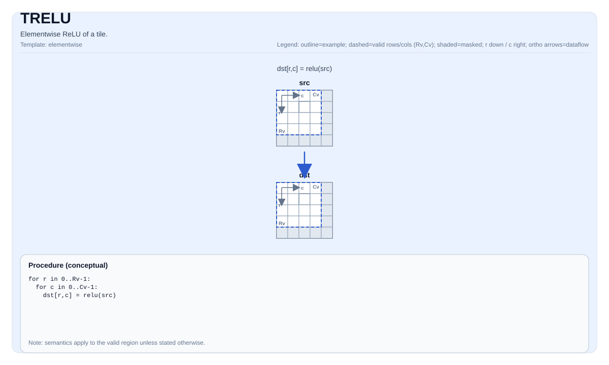

# TRELU

## 指令示意图



## 简介

Tile 的逐元素 ReLU。

## 数学语义

对每个元素 `(i, j)` 在有效区域内：

$$ \mathrm{dst}_{i,j} = \max(\mathrm{src}_{i,j}, 0) $$

## C++ 内建接口

声明于 `include/pto/common/pto_instr.hpp`：

```cpp
template <typename TileDataDst, typename TileDataSrc, typename... WaitEvents>
PTO_INST RecordEvent TRELU(TileDataDst &dst, TileDataSrc &src, WaitEvents &... events);
```

## 约束

- **实现检查 (A2A3)**:
    - `TileData::DType` 必须是以下之一： `half`, `float`, `int32_t`.
    - Tile 布局必须是行主序（`TileData::isRowMajor`）。
    - Tile 位置必须是向量（`TileData::Loc == TileType::Vec`）。
    - 静态有效边界： `TileData::ValidRow <= TileData::Rows`且`TileData::ValidCol <= TileData::Cols`.
    - 运行时： `src`且`dst` tiles 应具有相同的 `validRow/validCol`.
- **实现检查 (A5)**:
    - `TileData::DType` 必须是以下之一： `half`, `float`, `int32_t`（与 A2A3 一致）.
    - Tile 布局必须是行主序（`TileData::isRowMajor`）.
    - Tile 位置必须是向量（`TileData::Loc == TileType::Vec`）.
    - 静态有效边界： `TileData::ValidRow <= TileData::Rows`且`TileData::ValidCol <= TileData::Cols`.
    - 运行时： `src`且`dst` tiles 应具有相同的 `validRow/validCol`.
- **有效区域**:
    - 该操作使用 `dst.GetValidRow()` / `dst.GetValidCol()` 作为迭代域; `src/dst` 假定是兼容的 (此操作中不通过显式运行时检查进行验证).

## 示例

```cpp
#include <pto/pto-inst.hpp>

using namespace pto;

void example() {
  using TileT = Tile<TileType::Vec, float, 16, 16>;
  TileT x, out;
  TRELU(out, x);
}
```

