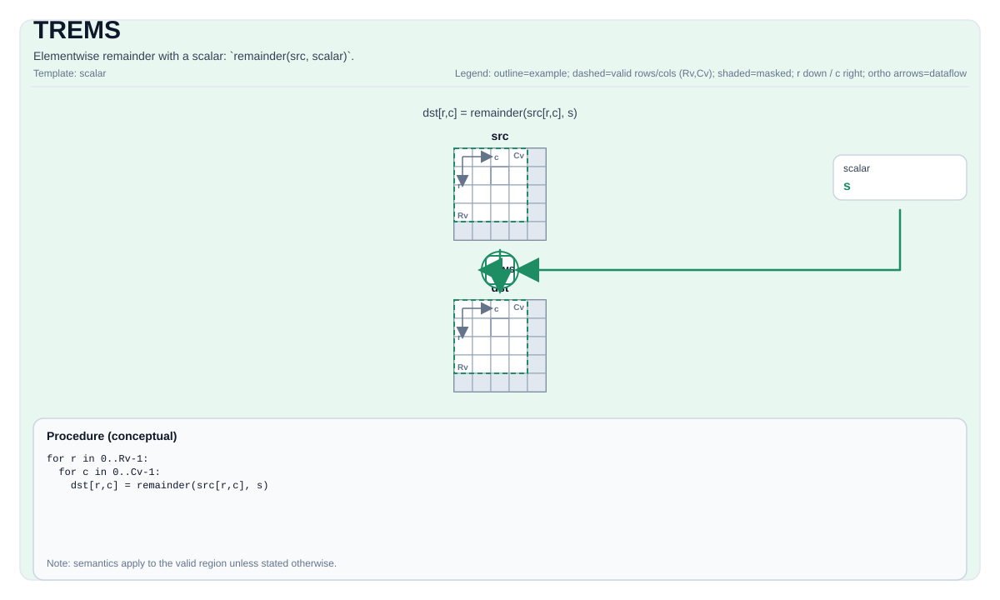

# TREMS

## 指令示意图



## 简介

与标量的逐元素余数：`remainder(src, scalar)`。

## 数学语义

对每个元素 `(i, j)` 在有效区域内：

$$\mathrm{dst}_{i,j} = \mathrm{src}_{i,j} \bmod \mathrm{scalar}$$

## C++ 内建接口

声明于 `include/pto/common/pto_instr.hpp`：

```cpp
template <auto PrecisionType = RemSAlgorithm::DEFAULT, typename TileDataDst, typename TileDataSrc, typename TileDataTmp,
          typename... WaitEvents>
PTO_INST RecordEvent TREMS(TileDataDst &dst, TileDataSrc &src, typename TileDataSrc::DType scalar, TileDataTmp &tmp,
                           WaitEvents &...events);
```

`PrecisionType`可指定以下值：

* `RemSAlgorithm::DEFAULT`：普通算法，速度快但精度较低。
* `RemSAlgorithm::HIGH_PRECISION`：高精度算法，速度较慢，仅支持`float`类型。

## 约束

- **实现检查 (A2A3)**:
    - `dst` 和 `src` 必须使用相同的元素类型。
    - 支持的元素类型：`float`、`float32_t` 和 `int32_t`。
    - `dst` 和 `src` 必须是向量 Tile。
    - `dst` 和 `src` 必须是行主序。
    - 运行时：`dst.GetValidRow() == src.GetValidRow() > 0` 且 `dst.GetValidCol() == src.GetValidCol() > 0`。
    - **tmp 缓冲区要求**：
      - `tmp.GetValidCol() >= dst.GetValidCol()`（至少与 dst 相同的列数）
      - `tmp.GetValidRow() >= 1`（至少 1 行）
      - 数据类型必须与 `TileDataDst::DType` 匹配。
- **实现检查 (A5)**:
    - `dst` 和 `src` 必须使用相同的元素类型。
    - 支持的元素类型为目标实现支持的 2 字节或 4 字节类型（包括 `half` 和 `float`）。
    - `dst` 和 `src` 必须是向量 Tile。
    - 两个 Tile 的静态有效边界都必须满足 `ValidRow <= Rows` 且 `ValidCol <= Cols`。
    - 运行时：`dst.GetValidRow() == src.GetValidRow()` 且 `dst.GetValidCol() == src.GetValidCol()`。
    - 注意：tmp 参数在 A5 上被接受但不进行验证或使用。
- **除零**:
    - 行为由目标定义；CPU 模拟器在调试构建中会断言。
- **有效区域**:
    - 该操作使用 `dst.GetValidRow()` / `dst.GetValidCol()` 作为迭代域。
- **对于 `int32_t` 输入（仅 A2A3）**：`src` 的元素和 `scalar` 必须在 `[-2^24, 2^24]` 范围内（即 `[-16777216, 16777216]`），以确保在计算过程中能精确转换为 float32。
- **高精度算法**
    - 仅在A5上有效，`PrecisionType`选项A3上将被忽略。

## 示例

```cpp
#include <pto/pto-inst.hpp>

using namespace pto;

void example() {
  using TileT = Tile<TileType::Vec, float, 16, 16>;
  TileT x, out;
  Tile<TileType::Vec, float, 16, 16> tmp;
  TREMS(out, x, 3.0f, tmp);
}
```

