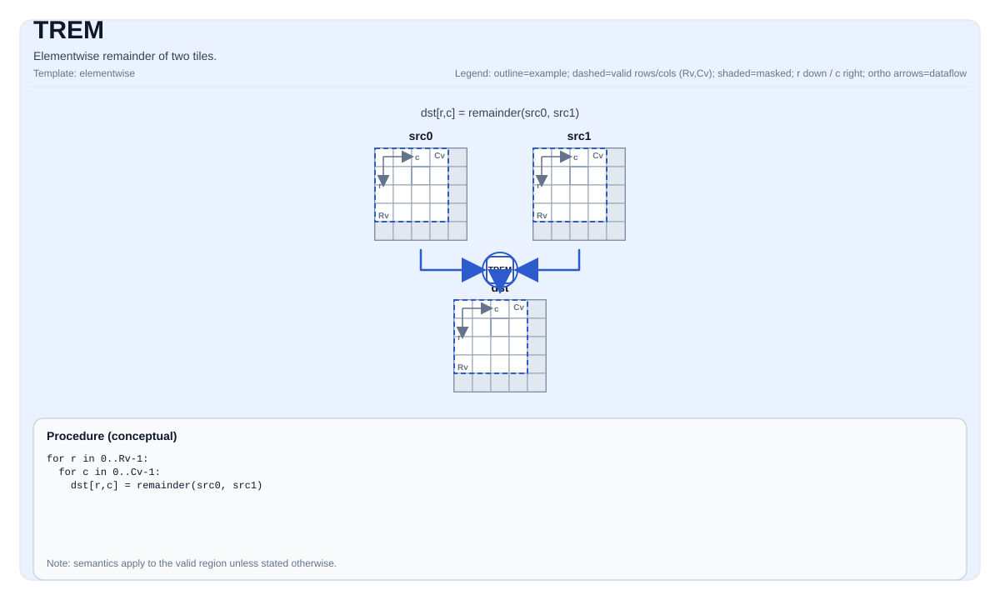

# TREM

## 指令示意图



## 简介

两个 Tile 的逐元素余数运算。结果符号与除数相同。

## 数学语义

对每个元素 `(i, j)` 在有效区域内：

$$\mathrm{dst}_{i,j} = \mathrm{remainder}(\mathrm{src0}_{i,j}, \mathrm{src1}_{i,j}) = \mathrm{src0}_{i,j} - \mathrm{floor}(\frac{\mathrm{src0}_{i,j}}{\mathrm{src1}_{i,j}}) \times \mathrm{src1}_{i,j}$$

结果符号会被修正为与除数（`src1`）的符号相同。

**注意**：这与 `TFMOD` 不同，`TFMOD` 的结果符号与被除数（`src0`）相同。

## C++ 内建接口

声明于 `include/pto/common/pto_instr.hpp`：

```cpp
template <auto PrecisionType = RemAlgorithm::DEFAULT, typename TileDataDst, typename TileDataSrc0,
          typename TileDataSrc1, typename TileDataTmp, typename... WaitEvents>
PTO_INST RecordEvent TREM(TileDataDst &dst, TileDataSrc0 &src0, TileDataSrc1 &src1, TileDataTmp &tmp, WaitEvents &... events);
```

## 约束

- **实现检查 (A2A3)**:
    - `TileData::DType` 必须是以下之一：`float`, `float32_t`, `int32_t`。
    - Tile 布局必须是行主序（`TileData::isRowMajor`）。
    - Tile 位置必须是向量（`TileData::Loc == TileType::Vec`）。
    - 运行时：`src0`、`src1` 和 `dst` tiles 应具有相同的 `validRow/validCol`。
    - `tmp` tile 必须至少有 2 行和 `validCols` 列（第 0 行用于中间结果，第 1 行用于比较掩码）。
- **实现检查 (A5)**:
    - `TileData::DType` 必须是以下之一：`half`, `float`, `int16_t`, `uint16_t`, `int32_t`, `uint32_t`。
    - Tile 布局必须是行主序（`TileData::isRowMajor`）。
    - Tile 位置必须是向量（`TileData::Loc == TileType::Vec`）。
    - 运行时：`src0`、`src1` 和 `dst` tiles 应具有相同的 `validRow/validCol`。
    - 注意：`tmp` 参数在 A5 上被接受但不使用。
- **有效区域**:
    - 该操作使用 `dst.GetValidRow()` / `dst.GetValidCol()` 作为迭代域。
- **除零**:
    - 行为由目标定义；CPU 仿真在调试构建中会断言。
- **高精度算法**:
    - 仅在 A5 上对 `float` 类型有效；`PrecisionType` 选项在 A2A3 上将被忽略。

## 示例

```cpp
#include <pto/pto-inst.hpp>

using namespace pto;

void example() {
  using TileT = Tile<TileType::Vec, float, 16, 16>;
  using TmpT = Tile<TileType::Vec, float, 2, 16>;
  TileT dst, src0, src1;
  TmpT tmp;
  TREM(dst, src0, src1, tmp);
}
```
