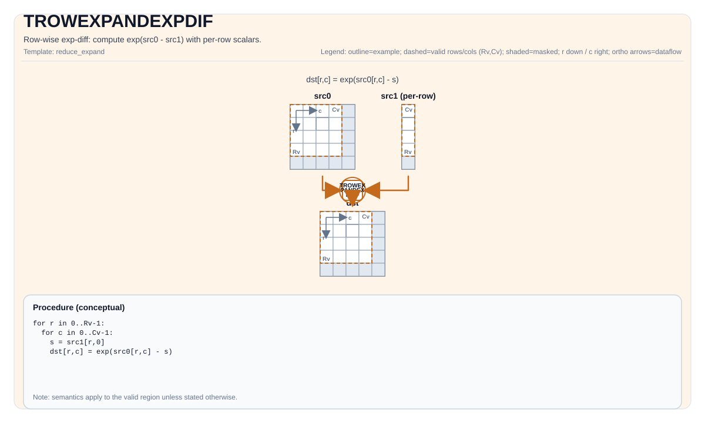

# TROWEXPANDEXPDIF


## Tile Operation Diagram



## Introduction

Row-wise exp-diff: compute `exp(src0 - src1)` where `src1` provides one scalar per row.

## Math Interpretation

Let `R = dst.GetValidRow()` and `C = dst.GetValidCol()`.

### Mode 1

Let `s_i` be the per-row scalar taken from the expanded operand (one value per row, ColMajor layout).

For `0 <= i < R` and `0 <= j < C`:

$$
\mathrm{dst}_{i,j} = \exp(\mathrm{src0}_{i,j} - s_i)
$$

### Mode 2

Let `b_i` be the 32-byte block for row `i` taken from the expanded operand (RowMajor, `32 / sizeof(T)` values per row). The block naturally repeats every `32 / sizeof(T)` elements within a row.

For `0 <= i < R` and `0 <= j < C`:

$$
\mathrm{dst}_{i,j} = \exp(\mathrm{src0}_{i,j} - b_i[\,j \bmod (32 / \mathit{sizeof}(T))\,])
$$

## Assembly Syntax

Synchronous form:

```text
%dst = trowexpandexpdif %src0, %src1 : !pto.tile<...>, !pto.tile<...> -> !pto.tile<...>
```

### AS Level 1 (SSA)

```text
%dst = pto.trowexpandexpdif %src0, %src1 : !pto.tile<...>, !pto.tile<...> -> !pto.tile<...>
```

### AS Level 2 (DPS)

```text
pto.trowexpandexpdif ins(%src0, %src1 : !pto.tile_buf<...>, !pto.tile_buf<...>) outs(%dst : !pto.tile_buf<...>)
```
## C++ Intrinsic

Declared in `include/pto/common/pto_instr.hpp`:

```cpp
template <typename TileDataDst, typename TileDataSrc0, typename TileDataSrc1, typename... WaitEvents>
PTO_INST RecordEvent TROWEXPANDEXPDIF(TileDataDst &dst, TileDataSrc0 &src0, TileDataSrc1 &src1, WaitEvents &... events);

template <typename TileDataDst, typename TileDataSrc0, typename TileDataSrc1, typename TileDataTmp,
          typename... WaitEvents>
PTO_INST RecordEvent TROWEXPANDEXPDIF(TileDataDst &dst, TileDataSrc0 &src0, TileDataSrc1 &src1, TileDataTmp &tmp, WaitEvents &... events);
```

## Constraints

- `TileDataDst::DType == TileDataSrc0::DType == TileDataSrc1::DType`
- `TileDataDst::DType`, `TileDataSrc0::DType`, `TileDataSrc1::DType` must be one of: `half`, `float`.
- Tile shape/layout constraint (compile-time): `TileDataDst::isRowMajor`.
- Exactly one of `src0` or `src1` must have the same valid shape as `dst` (i.e., `validRow == dst.validRow` and `validCol == dst.validCol`). That operand is the full-sized operand; the other is the **expanded operand** (row-broadcast source). The full-sized operand must be **RowMajor** (`isRowMajor == true`).
- Mode 1: the expanded operand is expected to provide **one scalar per row** (ColMajor, `validCol == 1`).
- Mode 2: the expanded operand is expected to provide **32 bytes data per row** (RowMajor, `validCol == 32 / sizeof(T)`).
- Exact layout/fractal constraints are target-specific; see backend headers under `include/pto/npu/*/TRowExpand*.hpp`.

### Temporary tile

The C++ API provides an overload with an explicit `TileDataTmp &tmp`. On A2A3 this overload only supports **Mode 1** (ColMajor expanded operand, scalar per row); on A5 it delegates to the 3-arg overload and supports both modes. On A2A3, `TROWEXPANDEXPDIF` is implemented as `TROWEXPANDSUB` followed by `TEXP`, so the tmp tile is used for the SUB step's broadcast buffer. On A5 it is implemented inline via `vexpdif` (for `float`) or `vsub` followed by `vexp` (for `half`), and the tmp tile is ignored.

- **A2A3**: The tmp tile is used as a broadcast buffer for the `TROWEXPANDSUB` step. The per-row scalar values from the ColMajor expanded operand are broadcast via the `vbrcb` instruction into the tmp buffer, creating a 32-byte block per row, which is then used as the expanded operand in the subtraction. The `vbrcb` instruction uses a repeat stride of 8 blocks (256 bytes) between repeat groups, processing 8 rows per repeat. Minimum tmp size calculation:
    - **Common parameters**:
        - `R = dst.GetValidRow()`, `T = TileDataDst::DType`.
    - For `R < 256`:
        $$ \text{tmpSize} = \left\lceil\frac{R}{8}\right\rceil \times 256 \text{ bytes} $$
    - For `R >= 256`:
        - The operation is looped, with at most 30 repeats (240 rows) per loop iteration. The tmp buffer is reused across loops, so the per-loop requirement is:
        $$ \text{tmpSize} = 30 \times 256 = 7680 \text{ bytes} $$
    - A compact shape-independent upper bound for any Mode 1 invocation is **8 KB** (8192 bytes).
    - The 3-arg overload (without `tmp`) supports both Mode 1 and Mode 2. For Mode 1, it uses an internal 8 KB buffer (`TMP_UB_OFFSET`). For Mode 2, no broadcast buffer is needed.
- **A5**: The `tmp` tile is accepted and ignored (`[[maybe_unused]]`). A5 hardware supports row-broadcast natively via the `vlds` instruction's broadcast modes, so no scratch buffer is required.

## Examples

See related examples in `docs/isa/` and `docs/coding/tutorials/`.

## ASM Form Examples

### Auto Mode

```text
# Auto mode: compiler/runtime-managed placement and scheduling.
%dst = pto.trowexpandexpdif %src0, %src1 : !pto.tile<...>, !pto.tile<...> -> !pto.tile<...>
```

### Manual Mode

```text
# Manual mode: resources must be bound explicitly before issuing the instruction.
# Optional for tile operands:
# pto.tassign %arg0, @tile(0x1000)
# pto.tassign %arg1, @tile(0x2000)
%dst = pto.trowexpandexpdif %src0, %src1 : !pto.tile<...>, !pto.tile<...> -> !pto.tile<...>
```

### PTO Assembly Form

```text
%dst = trowexpandexpdif %src0, %src1 : !pto.tile<...>, !pto.tile<...> -> !pto.tile<...>
# AS Level 2 (DPS)
pto.trowexpandexpdif ins(%src0, %src1 : !pto.tile_buf<...>, !pto.tile_buf<...>) outs(%dst : !pto.tile_buf<...>)
```

