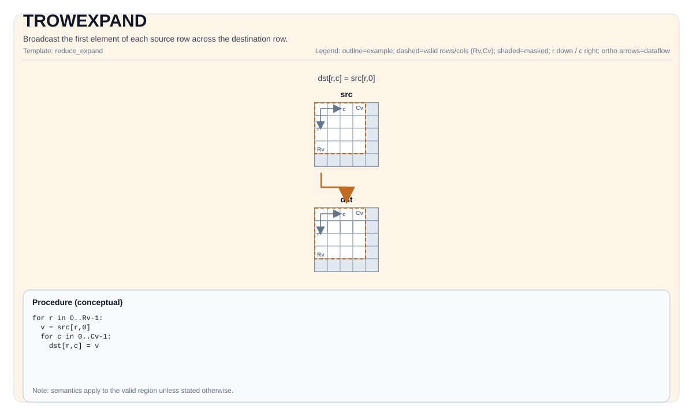

# TROWEXPAND

## 指令示意图



## 简介

将每个源行的第一个元素广播到目标行中。

## 数学语义

设 `R = dst.GetValidRow()`，`C = dst.GetValidCol()`。对 `0 <= i < R` 且 `0 <= j < C`：

$$ \mathrm{dst}_{i,j} = \mathrm{src}_{i,0} $$

## C++ 内建接口

声明于 `include/pto/common/pto_instr.hpp`：

```cpp
template <typename TileDataDst, typename TileDataSrc, typename... WaitEvents>
PTO_INST RecordEvent TROWEXPAND(TileDataDst &dst, TileDataSrc &src, WaitEvents &... events);
```

## 约束

实现检查 (NPU):

- Tile 类型：`dst` 和 `src` 必须是 `TileType::Vec`。
- Tile 布局：`src` 和 `dst` 均为 ND 分形（`isRowMajor` 且 `SLayout::NoneBox`）。
- 数据类型：A2A3/A5 元素类型必须是以下之一：`int8_t`、`uint8_t`、`int16_t`、`uint16_t`、`int32_t`、`uint32_t`、`half`、`bfloat16_t`、`float`。
- 运行期有效区域检查：
    - A2A3：断言 `srcValidRow == dstValidRow`，且断言 `dstValidRow`、`dstValidCol`、`srcValidRow`、`srcValidCol` 均不为零。
    - A5：断言 `srcValidRow == dstValidRow`，且断言 `srcValidRow != 0 && srcValidCol != 0`。

## 示例

### 自动（Auto）

```cpp
#include <pto/pto-inst.hpp>

using namespace pto;

void example_auto() {
  using SrcT = Tile<TileType::Vec, float, 16, 16>;
  using DstT = Tile<TileType::Vec, float, 16, 16>;
  SrcT src;
  DstT dst;
  TROWEXPAND(dst, src);
}
```

### 手动（Manual）

```cpp
#include <pto/pto-inst.hpp>

using namespace pto;

void example_manual() {
  using SrcT = Tile<TileType::Vec, float, 16, 16>;
  using DstT = Tile<TileType::Vec, float, 16, 16>;
  SrcT src;
  DstT dst;
  TASSIGN(src, 0x1000);
  TASSIGN(dst, 0x2000);
  TROWEXPAND(dst, src);
}
```
