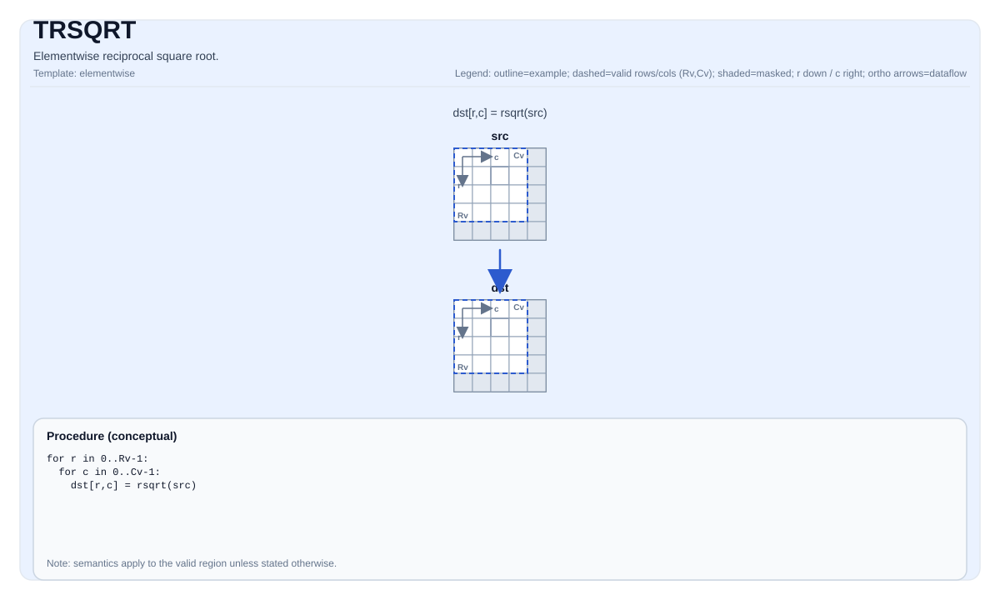

# TRSQRT


## Tile Operation Diagram



## Introduction

Elementwise reciprocal square root.

## Math Interpretation

For each element `(i, j)` in the valid region:

$$ \mathrm{dst}_{i,j} = \frac{1}{\sqrt{\mathrm{src}_{i,j}}} $$

## Assembly Syntax

Synchronous form:

```text
%dst = trsqrt %src : !pto.tile<...>
```

### AS Level 1 (SSA)

```text
%dst = pto.trsqrt %src : !pto.tile<...> -> !pto.tile<...>
```

### AS Level 2 (DPS)

```text
pto.trsqrt ins(%src : !pto.tile_buf<...>) outs(%dst : !pto.tile_buf<...>)
```
## C++ Intrinsic

Declared in `include/pto/common/pto_instr.hpp`:

```cpp
template <auto PrecisionType = RsqrtAlgorithm::DEFAULT, typename TileDataDst, typename TileDataSrc,
          typename... WaitEvents>
PTO_INST RecordEvent TRSQRT(TileDataDst &dst, TileDataSrc &src, WaitEvents &... events);

template <auto PrecisionType = RsqrtAlgorithm::DEFAULT, typename TileDataDst, typename TileDataSrc,
          typename TileDataTmp, typename... WaitEvents>
PTO_INST RecordEvent TRSQRT(TileDataDst &dst, TileDataSrc &src, TileDataTmp &tmp, WaitEvents &... events);
```

`PrecisionType` has the following values available:

* `RsqrtAlgorithm::DEFAULT`: Normal algorithm, faster but with lower precision.
* `RsqrtAlgorithm::HIGH_PRECISION`: High precision algorithm, but slower.

## Constraints

- **Implementation checks (NPU)**:
    - `TileData::DType` must be one of: `float` or `half`;
    - Tile location must be vector (`TileData::Loc == TileType::Vec`);
    - Static valid bounds: `TileData::ValidRow <= TileData::Rows` and `TileData::ValidCol <= TileData::Cols`;
    - Runtime: `src.GetValidRow() == dst.GetValidRow()` and `src.GetValidCol() == dst.GetValidCol()`;
    - Tile layout must be row-major (`TileData::isRowMajor`).
- **Valid region**:
    - The op uses `dst.GetValidRow()` / `dst.GetValidCol()` as the iteration domain.
- **Domain / NaN**:
    - Behavior is target-defined (e.g., for `src == 0` or negative inputs).

## Temporary Space

### Without `tmp` (2-argument overload: `TRSQRT(dst, src)`)

No `tmp` is required. On A2A3, the default implementation uses the `vrsqrt` hardware instruction. On A5, the implementation uses `vsqrt` + `vdiv`.

### With `tmp` (3-argument overload: `TRSQRT(dst, src, tmp)`)

On A2A3, passing `tmp` triggers the high-precision path, which fills `tmp` with `1.0`, computes `vsqrt` into `dst`, then computes `dst = tmp / dst`. On A5, `tmp` is accepted by the interface but **not used** — the 3-argument overload delegates to the 2-argument implementation (`TRSQRT_IMPL<PrecisionType>(dst, src)`). `tmp` is retained in the C++ intrinsic signature for API compatibility.

## Examples

### Auto

```cpp
#include <pto/pto-inst.hpp>

using namespace pto;

void example_auto() {
  using TileT = Tile<TileType::Vec, float, 16, 16>;
  TileT src, dst;
  TRSQRT(dst, src);
}
```

### Manual

```cpp
#include <pto/pto-inst.hpp>

using namespace pto;

void example_manual() {
  using TileT = Tile<TileType::Vec, float, 16, 16>;
  TileT src, dst;
  TASSIGN(src, 0x1000);
  TASSIGN(dst, 0x2000);
  TRSQRT(dst, src);
}
```

## ASM Form Examples

### Auto Mode

```text
# Auto mode: compiler/runtime-managed placement and scheduling.
%dst = pto.trsqrt %src : !pto.tile<...> -> !pto.tile<...>
```

### Manual Mode

```text
# Manual mode: resources must be bound explicitly before issuing the instruction.
# Optional for tile operands:
# pto.tassign %arg0, @tile(0x1000)
# pto.tassign %arg1, @tile(0x2000)
%dst = pto.trsqrt %src : !pto.tile<...> -> !pto.tile<...>
```

### PTO Assembly Form

```text
%dst = trsqrt %src : !pto.tile<...>
# AS Level 2 (DPS)
pto.trsqrt ins(%src : !pto.tile_buf<...>) outs(%dst : !pto.tile_buf<...>)
```

