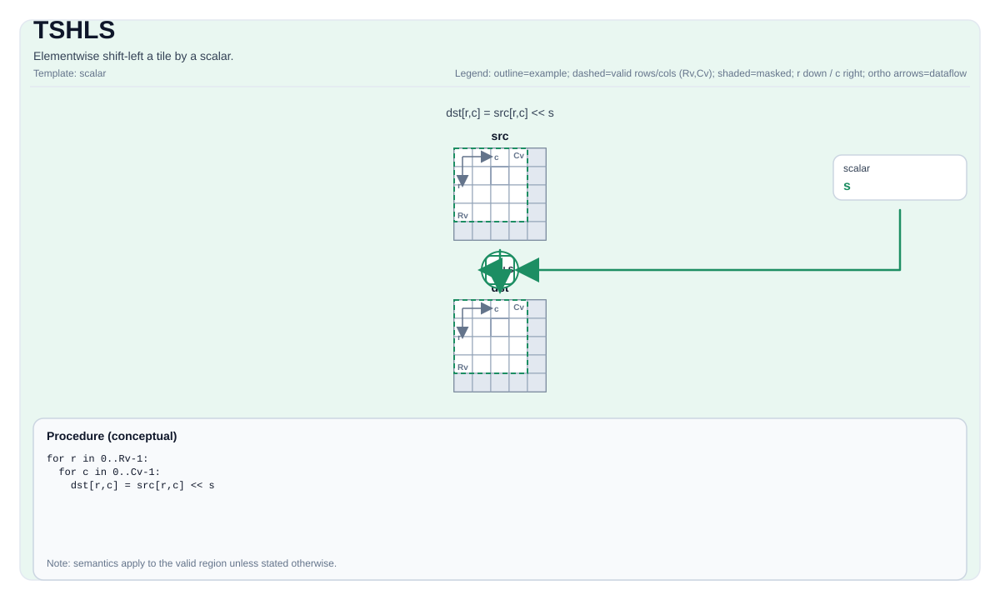

# TSHLS

## 指令示意图



## 简介

Tile按标量逐元素左移。

## 数学语义

对每个元素 `(i, j)` 在有效区域内：

$$ \mathrm{dst}_{i,j} = \mathrm{src}_{i,j} \ll \mathrm{scalar} $$

## C++内建接口

声明于 `include/pto/common/pto_instr.hpp`：
> 公共包含头为 `<pto/pto-inst.hpp>`，内部声明位于 `pto/common/pto_instr.hpp`。

```cpp
template <typename TileDataDst, typename TileDataSrc, typename... WaitEvents>
PTO_INST RecordEvent TSHLS(TileDataDst &dst, TileDataSrc &src, typename TileDataDst::DType scalar, WaitEvents &... events);
```

## 约束

- **实现检查 （Atlas A2/A3 训练系列产品/Atlas A2/A3 推理系列产品）**:
    - 支持的元素类型为 `int32_t`、`int`、`int16_t`、`uint32_t`、`unsigned int` 和 `uint16_t`。
    - `dst` 和 `src` 必须使用相同的元素类型。
    - `dst` 和 `src` 必须是向量Tile。
    - 运行时：`src.GetValidRow() == dst.GetValidRow()` 且 `src.GetValidCol() == dst.GetValidCol()`。
    - 标量仅支持零和正值。
- **实现检查 (Ascend 950PR/Ascend 950DT)**:
    - 支持的元素类型为 `int32_t`、`int16_t`、`int8_t`、`uint32_t`、`int64_t`、`uint64_t`、`uint16_t` 和 `uint8_t`。
    - `dst` 和 `src` 必须使用相同的元素类型。
    - `dst` 和 `src` 必须是向量Tile。
    - 两个Tile的静态有效边界都必须满足 `ValidRow <= Rows` 且 `ValidCol <= Cols`。
    - 运行时：`src.GetValidRow() == dst.GetValidRow()` 且 `src.GetValidCol() == dst.GetValidCol()`。
    - 标量仅支持零和正值。
    - 对于 `int64_t` 和 `uint64_t`，实际移位量为 `scalar & 63`。
- **实现检查 (A6)**:
    - 支持的元素类型为 `int32_t`、`int16_t`、`int8_t`、`uint32_t`、`int64_t`、`uint64_t`、`uint16_t` 和 `uint8_t`。
    - `dst` 和 `src` 必须使用相同的元素类型。
    - `dst` 和 `src` 必须是向量Tile。
    - 两个Tile的静态有效边界都必须满足 `ValidRow <= Rows` 且 `ValidCol <= Cols`。
    - 运行时：`src.GetValidRow() == dst.GetValidRow()` 且 `src.GetValidCol() == dst.GetValidCol()`。
    - 标量按有符号数解释：负值会使移位方向反转（按 `|scalar|` 右移）。
    - 对于 `int64_t` 和 `uint64_t`，实际移位量为 `scalar & 63`。
- **有效区域**:
    - 该操作使用 `dst.GetValidRow()` / `dst.GetValidCol()` 作为迭代域。

## 示例

```cpp
#include <pto/pto-inst.hpp>

using namespace pto;

void example() {
  using TileDst = Tile<TileType::Vec, uint16_t, 16, 16>;
  using TileSrc = Tile<TileType::Vec, uint16_t, 16, 16>;
  TileDst dst;
  TileSrc src;
  TSHLS(dst, src, 0x2);
}
```
