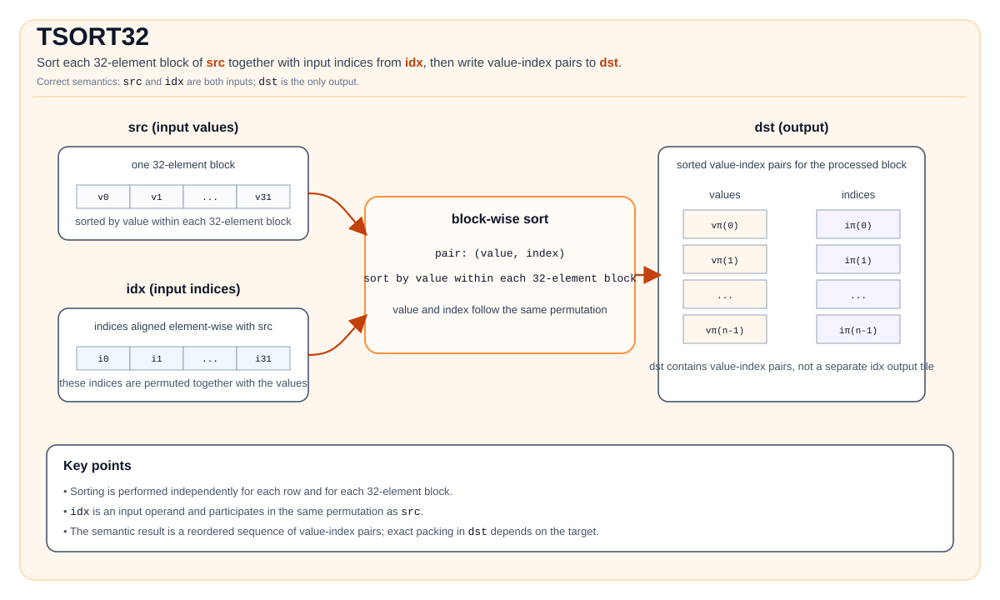

# TSORT32

## 指令示意图



## 简介

对 `src` 的每个32元素块，与 `idx` 中对应的索引一起进行排序，并将排序后的值-索引对写入 `dst`。底层SFU指令为 **VBS32**（`vbitsort`），单次调用可排序一个或多个独立的32元素列表。

## 硬件：VBS32（`vbitsort`）

VBS32运行在 **SFU** 上。PTO将 `TSORT32` 映射到 `PIPE_V`，用于事件同步。一次调用排序 `repeat` 个连续的32元素块，每个块由32个值 + 32个索引组成，打包为值-索引对：

```cpp
void vbitsort(__ubuf__ T *dst,        // 排序后的值-索引对输出
              __ubuf__ T *src0,        // 每块 32 个值 × repeat
              __ubuf__ uint32_t *src1, // 每块 32 个索引 × repeat
              uint8_t repeat);         // 32 元素块的数量（1..255）
```

- `repeat`（上限 `REPEAT_MAX = 255`）打包到 `config[63:56]`。
- 块在内存中**连续分布，步长为32个元素**：块 `b` 读取 `src0[b*32 : b*32+32]` 和 `src1[b*32 : b*32+32]`，写入 `dst[b*32*coef : ...]`，其中 `coef` = 2（float）或4（half）——值-索引对的扩展因子。
- 排序顺序：按值**降序**；相同值时索引小者优先。

## 数学语义

对每一行 `r`，`src` 按独立的32元素块处理。设块 `b` 覆盖列 `32b … 32b+31`，`n_b = min(32, C - 32b)` 为其有效元素数。

$$
(v_k, i_k) = (\mathrm{src}_{r,32b+k},\; \mathrm{idx}_{r,32b+k}), \quad 0 \le k < n_b
$$

按值降序排序，输出重排后的序列：

$$
[(v_{\pi(0)}, i_{\pi(0)}),\; (v_{\pi(1)}, i_{\pi(1)}),\; \ldots]
$$

其中 `π` 为该块的排序置换。

注：

- `idx` 是输入Tile（索引随值一起被重排），不是输出。
- `dst` 存储排序后的值-索引对，而非仅排序后的值。

## C++内建接口

声明于 `include/pto/common/pto_instr.hpp`：
> 公共包含头为 `<pto/pto-inst.hpp>`，内部声明位于 `pto/common/pto_instr.hpp`。

```cpp
// 3 参数：src 必须 32 对齐（validCol % 32 == 0）
template <typename DstTileData, typename SrcTileData, typename IdxTileData>
PTO_INST RecordEvent TSORT32(DstTileData& dst, SrcTileData& src, IdxTileData& idx);

// 4 参数：支持非 32 对齐尾部（validCol % 32 != 0），通过 tmp 填充
template <typename DstTileData, typename SrcTileData, typename IdxTileData, typename TmpTileData>
PTO_INST RecordEvent TSORT32(DstTileData& dst, SrcTileData& src, IdxTileData& idx, TmpTileData& tmp);
```

## Tile尺寸与数据类型

对于 `src` 形状为 $R \times C$（有效区域）、块大小32：

| Tile | dtype | 尺寸（元素数） | 说明 |
|------|-------|----------------|-------|
| `src` | `half` 或 `float`（$T$） | $R \times C$ | 待排序的值 |
| `idx` | `uint32_t` | $R \times C$（或 $1 \times C$ 广播） | 随值重排的索引 |
| `dst` | $T$ | $R \times (2C)$ float，$R \times (4C)$ half | 排序后的值-索引对（见下方扩展因子） |
| `tmp`（仅4参数） | $T$ | 见下方tmp尺寸公式 | 尾部填充scratch |

**`dst` 扩展因子**（`typeCoef`）：每个输入元素生成一个8Byte的tuple `[value (4Byte), index (4Byte)]`——`float` 的value占满4Byte；`half` 的2Byte value零扩展至4Byte。因此每行有效输出占 $C \times 8$ 字节；物理存储还必须覆盖填充后的尾块。

| dtype | 每个 `src` 列对应的 `dst` 列数（dtype单位） | tuple布局 | 字节/tuple |
|-------|-------------------------------------------|--------------|------------|
| `float` | ×2（2个float槽位） | `[value_f32, index_u32]` | 8 |
| `half` | ×4（4个half槽位） | `[value_f16, 0x0000, index_u32]` | 8 |

对于物理存储，令 $P = \mathrm{ceil}_{32}(C)$。为 `src` 和 `idx` 分配 $P$ 列，为 `dst` 分配 $2P$（`float`）或 $4P$（`half`）列，可覆盖完整尾块并满足32Byte行对齐要求。有效列数须单独设置：`src`/`idx` 为 $C$，`dst` 为 $2C$ 或 $4C$。NPU会读取最后一个块全部32个位置的索引，并写出完整块；填充位置不属于有效结果。

## 约束

| 约束 | 原因 |
|------------|------|
| `dst`/`src` dtype = `half` 或 `float`（须一致）；`idx` = `uint32_t` | VBS32类型分派 |
| 所有Tile为 `TileType::Vec`、`BLayout::RowMajor`、`SLayout::NoneBox`；`tmp` 与 `src` 的dtype相同 | 行内连续存储，临时元素大小一致 |
| `src` 与 `dst` 的有效行数相同；`idx` 为相同行数或单行广播 | NPU按 `dst.GetValidRow()` 遍历 |
| `validCol % 32 == 0`（3参数） | 每块恰为32个元素 |
| `validCol` 任意（4参数） | 尾块通过 `tmp` 填充至32 |
| `repeat = validCol/32`（3参数）或 `ceil(validCol/32)`（4参数） | VBS32 repeat计数，每次调用 ≤ 255；更大的 `validCol` 拆分为多次 `vbitsort` 调用 |
| `tmp`（4参数）≥ `tmpSize` 元素（见下方公式） | 保存填充后的行/尾块副本 |
| 无 `WaitEvents&...` / 无内部 event synchronization | 如需同步须显式调用 |

### `tmp` 尺寸公式（4参数）

该公式适用于 `validCol % 32 != 0`；否则4参数重载走对齐路径，不使用 `tmp`。所有源行复用同一行临时空间。

设 $C$ = `validCol`，$b$ = `sizeof(T)` 字节数，$G$ = 32（块大小）。实现根据整行大小是否满足 `MAX_UB_TMP = 8160` 进行分支（Atlas A2/A3 训练系列产品/Atlas A2/A3 推理系列产品按元素数，Ascend 950PR/Ascend 950DT按字节数）：

$$
\mathrm{tmpSize} =
\begin{cases}
\mathrm{ceil}_{G}(C) & \text{Atlas A2/A3 训练系列产品/Atlas A2/A3 推理系列产品：} C \le 8160 \text{（元素数）} \;\; \text{（Ascend 950PR/Ascend 950DT：} C \cdot b \le 8160 \text{（字节））} \\
G = 32 & \text{Atlas A2/A3 训练系列产品/Atlas A2/A3 推理系列产品：} C > 8160 \text{（元素数）} \;\; \text{（Ascend 950PR/Ascend 950DT：} C \cdot b > 8160 \text{（字节））}
\end{cases}
$$

- `ceil_G(C)` = $C$ 向上取整到32的倍数。
- **Atlas A2/A3 训练系列产品/Atlas A2/A3 推理系列产品**：阈值单位为**元素数**（`srcShapeBytesPerRow / sizeof(T) <= MAX_UB_TMP`），即 $C \le 8160$，与dtype无关（float → $C \le 8160$，half → $C \le 8160$）。
- **Ascend 950PR/Ascend 950DT**：阈值单位为**字节**（`srcShapeBytesPerRow <= MAX_UB_TMP`），即 $C \cdot b \le 8160$（float → $C \le 2040$，half → $C \le 4080$）。该阈值为 `pto_copy_ubuf_to_ubuf`（MOV_UB_TO_UB）的repeat上限 = 255块 × 32Byte。
- 尾块 = $t = C \bmod G$ 个元素（末尾不完整块），扩展至 $G$，填充值见下方说明。
- Path A（不超过上方对应架构的阈值，小行）：从行首**整行**复制到tmp，然后仅填充最后一个32元素块中的无效位置。
- Path B（超过上方对应架构的阈值，大行）：仅复制**尾块**到tmp；完整块直接从 `src` 排序。
- VBS32硬件上限：每次调用 `repeat ≤ REPEAT_MAX = 255` 块（≤ 8160元素）；超过255块的行拆分为多次 `vbitsort` 调用。
- **UB布局：** 为 `tmp` 分配独立的32Byte对齐区域，至少包含 `tmpSize * sizeof(T)` 字节。若放置在 `dst` 之后，应从完整物理输出区域（含填充后的尾块）末尾开始。例如，`C = 100`、`T = half` 需要128个临时元素（256字节）；仅将 `C * sizeof(T)` 向上取整到32字节得到224字节，空间不足。

### 4参数尾部处理

当 `validCol % 32 != 0` 时，末尾不完整块（$t = C \bmod 32$ 个元素）须填充为完整的32元素块后才能送入 `vbitsort`。两条路径：

- **Atlas A2/A3 训练系列产品/Atlas A2/A3 推理系列产品：$C \le 8160$（元素数）** / **Ascend 950PR/Ascend 950DT：$C \cdot b \le 8160$（字节）**（小行）：**整行**复制到 `tmp`，然后仅填充最后一个32元素块中的无效位置；从 `tmp` 排序整行。
- **Atlas A2/A3 训练系列产品/Atlas A2/A3 推理系列产品：$C > 8160$（元素数）** / **Ascend 950PR/Ascend 950DT：$C \cdot b > 8160$（字节）**（大行）：仅复制**尾块**到 `tmp` 并填充；完整块直接从 `src` 排序，仅尾块从 `tmp` 排序。

当前Atlas A2/A3 训练系列产品/Atlas A2/A3 推理系列产品和Ascend 950PR/Ascend 950DT实现使用 `T minVal = -(0.0 / 0.0)` 作为填充值。该表达式产生NaN，并非负无穷；`std::numeric_limits<T>::lowest()` 是有限值，同样不能与之等同。填充位置不能作为有效输出值-索引对使用。若 `validCol > 32 × 255`，行按 `REPEAT_MAX` 大小的组拆分，每组通过独立的 `vbitsort` 调用排序。

## 汇编语法

### AS Level 1（SSA）

```text
%dst = pto.tsort32 %src, %idx : (!pto.tile<...>, !pto.tile<...>) -> !pto.tile<...>
```

### AS Level 2（DPS）

```text
pto.tsort32 ins(%src, %idx : !pto.tile_buf<...>, !pto.tile_buf<...>) outs(%dst : !pto.tile_buf<...>)
```

## 示例

以下核函数骨架展示手动UB分配和两种重载，省略输入加载、输出存储和流水线同步。每次调用 `TSORT32` 前，应加载有效的 `src`/`idx` 数据并完成生产者同步；读取 `dst` 前也须完成相应同步。下列UB区域均为32Byte对齐且互不重叠。

```cpp
#include <cstdint>
#include <pto/pto-inst.hpp>
using namespace pto;

extern "C" __global__ AICORE void exampleAligned()
{
    // 32 对齐：每行单个块
    using SrcTile = Tile<TileType::Vec, float, 1, 32>;
    using IdxTile = Tile<TileType::Vec, uint32_t, 1, 32>;
    using DstTile = Tile<TileType::Vec, float, 1, 64>; // 2× srcTile 列数（float）
    SrcTile srcTile;
    IdxTile idxTile;
    DstTile dstTile;
    TASSIGN(srcTile, 0x0000);
    TASSIGN(idxTile, 0x0080);
    TASSIGN(dstTile, 0x0100);
    // 加载 srcTile 和 idxTile，并在排序前完成同步。
    TSORT32(dstTile, srcTile, idxTile);
}

extern "C" __global__ AICORE void exampleTail()
{
    // 有效列数 100，物理列数 128：4 参数 + tmpTile
    using SrcTile = Tile<TileType::Vec, half, 1, 128, BLayout::RowMajor, 1, 100>;
    using IdxTile = Tile<TileType::Vec, uint32_t, 1, 128, BLayout::RowMajor, 1, 100>;
    // 每个 half 值-索引对占四个 half 元素。
    using DstTile = Tile<TileType::Vec, half, 1, 512, BLayout::RowMajor, 1, 400>;
    // 临时空间覆盖 ceil32(100) = 128 个元素。
    using TmpTile = Tile<TileType::Vec, half, 1, 128>;
    SrcTile srcTile;
    IdxTile idxTile;
    DstTile dstTile;
    TmpTile tmpTile;
    TASSIGN(srcTile, 0x0200);
    TASSIGN(idxTile, 0x0300);
    TASSIGN(dstTile, 0x0500);
    TASSIGN(tmpTile, 0x0900);
    // 加载 srcTile 和 idxTile，并在排序前完成同步。
    TSORT32(dstTile, srcTile, idxTile, tmpTile);
}
```

## ASM形式示例

### Auto模式

```text
%dst = pto.tsort32 %src, %idx : (!pto.tile<...>, !pto.tile<...>) -> !pto.tile<...>
```

### Manual模式

```text
# pto.tassign %arg0, @tile(0x1000)
# pto.tassign %arg1, @tile(0x2000)
# pto.tassign %arg2, @tile(0x3000)
%dst = pto.tsort32 %src, %idx : (!pto.tile<...>, !pto.tile<...>) -> !pto.tile<...>
```

### PTO汇编形式

```text
%dst = tsort32 %src, %idx : (!pto.tile<...>, !pto.tile<...>) -> !pto.tile<...>
# AS Level 2（DPS）
pto.tsort32 ins(%src, %idx : !pto.tile_buf<...>, !pto.tile_buf<...>) outs(%dst : !pto.tile_buf<...>)
```
