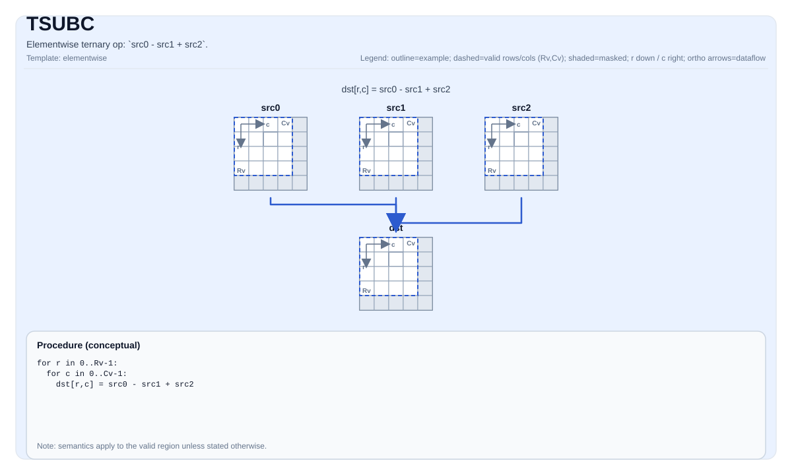

# TSUBC

## Tile Operation Diagram



## Introduction

Elementwise ternary op: `src0 - src1 + src2`.

## Math Interpretation

For each element `(i, j)` in the valid region:

$$ \mathrm{dst}_{i,j} = \mathrm{src0}_{i,j} - \mathrm{src1}_{i,j} + \mathrm{src2}_{i,j} $$

## C++ Intrinsic

Declared in `include/pto/common/pto_instr.hpp`:

```cpp
template <typename TileData, typename... WaitEvents>
PTO_INST RecordEvent TSUBC(TileData &dst, TileData &src0, TileData &src1, TileData &src2, WaitEvents &... events);
```

## Constraints

- The op iterates over `dst.GetValidRow()` / `dst.GetValidCol()`.

## Examples

```cpp
#include <pto/pto-inst.hpp>

using namespace pto;

void example() {
  using TileT = Tile<TileType::Vec, float, 16, 16>;
  TileT a, b, c, out;
  TSUBC(out, a, b, c);
}
```
