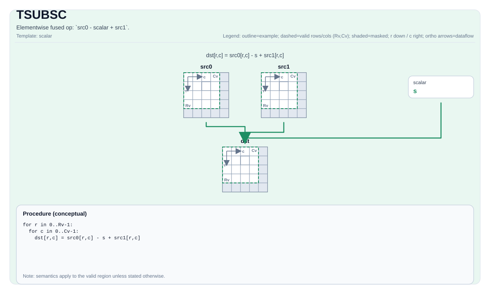

# TSUBSC

## 指令示意图



## 简介

融合逐元素运算：`src0 - scalar + src1`。

## 数学语义

对每个元素 `(i, j)` 在有效区域内：

$$ \mathrm{dst}_{i,j} = \mathrm{src0}_{i,j} - \mathrm{scalar} + \mathrm{src1}_{i,j} $$

## C++ 内建接口

声明于 `include/pto/common/pto_instr.hpp`：

```cpp
template <typename TileData, typename... WaitEvents>
PTO_INST RecordEvent TSUBSC(TileData& dst, TileData& src0, typename TileData::DType scalar, TileData& src1,
                            WaitEvents&... events);
```

## 约束

- **实现检查 (CPU)**:
    - 无显式的数据类型、位置或布局检查；实现使用通用 Tile 迭代。
- **无 NPU 实现**: TSUBSC 目前仅在 CPU 模拟器上支持，没有 A2A3 或 A5 后端。
- **有效区域**:
    - 该操作使用 `dst.GetValidRow()` / `dst.GetValidCol()` 作为迭代域。

## 示例

```cpp
#include <pto/pto-inst.hpp>

using namespace pto;

void example() {
  using TileT = Tile<TileType::Vec, float, 16, 16>;
  TileT a, b, out;
  TSUBSC(out, a, 2.0f, b);
}
```


