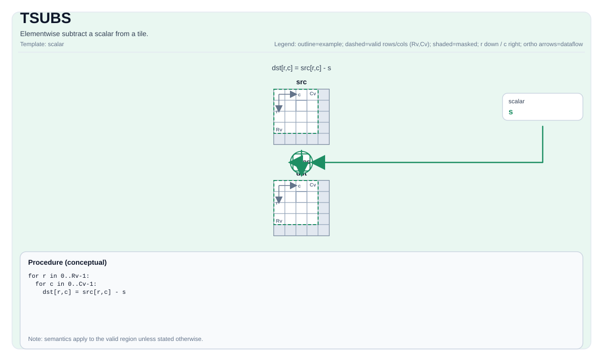

# TSUBS

## 指令示意图



## 简介

从 Tile 中逐元素减去一个标量。

## 数学语义

对每个元素 `(i, j)` 在有效区域内：

$$ \mathrm{dst}_{i,j} = \mathrm{src}_{i,j} - \mathrm{scalar} $$

## C++ 内建接口

声明于 `include/pto/common/pto_instr.hpp`：

```cpp
template <typename TileDataDst, typename TileDataSrc, typename... WaitEvents>
PTO_INST RecordEvent TSUBS(TileDataDst &dst, TileDataSrc &src0, typename TileDataSrc::DType scalar, WaitEvents &... events);
```

## 约束

- **实现检查 (A2A3)**:
    - `TileData::DType` 必须是以下之一：`int32_t`、`int`、`int16_t`、`half`、`float16_t`、`float`、`float32_t`。
    - Tile 位置必须是向量（`TileData::Loc == TileType::Vec`）。
    - 运行时：`src0.GetValidRow() == dst.GetValidRow()` 且 `src0.GetValidCol() == dst.GetValidCol()`。
- **实现检查 (A5)**:
    - `TileData::DType` 必须是以下之一：`uint8_t`、`int8_t`、`uint16_t`、`int16_t`、`uint32_t`、`int32_t`、`half`、`float`、`bfloat16_t`。
    - Tile 位置必须是向量（`TileDataDst::Loc == TileType::Vec` 且 `TileDataSrc::Loc == TileType::Vec`）。
    - 静态有效边界：`TileDataDst::ValidRow <= TileDataDst::Rows`、`TileDataDst::ValidCol <= TileDataDst::Cols`、`TileDataSrc::ValidRow <= TileDataSrc::Rows`，且 `TileDataSrc::ValidCol <= TileDataSrc::Cols`。
    - 运行时：`src0.GetValidRow() == dst.GetValidRow()` 且 `src0.GetValidCol() == dst.GetValidCol()`。
- **通用约束**:
    - `dst` 和 `src0` 必须使用相同的元素类型。
    - 标量类型必须与 `TileDataSrc::DType` 一致。
- **有效区域**:
    - 该操作使用 `dst.GetValidRow()` / `dst.GetValidCol()` 作为迭代域。

## 示例

```cpp
#include <pto/pto-inst.hpp>

using namespace pto;

void example() {
  using TileT = Tile<TileType::Vec, float, 16, 16>;
  TileT x, out;
  TSUBS(out, x, 1.0f);
}
```

