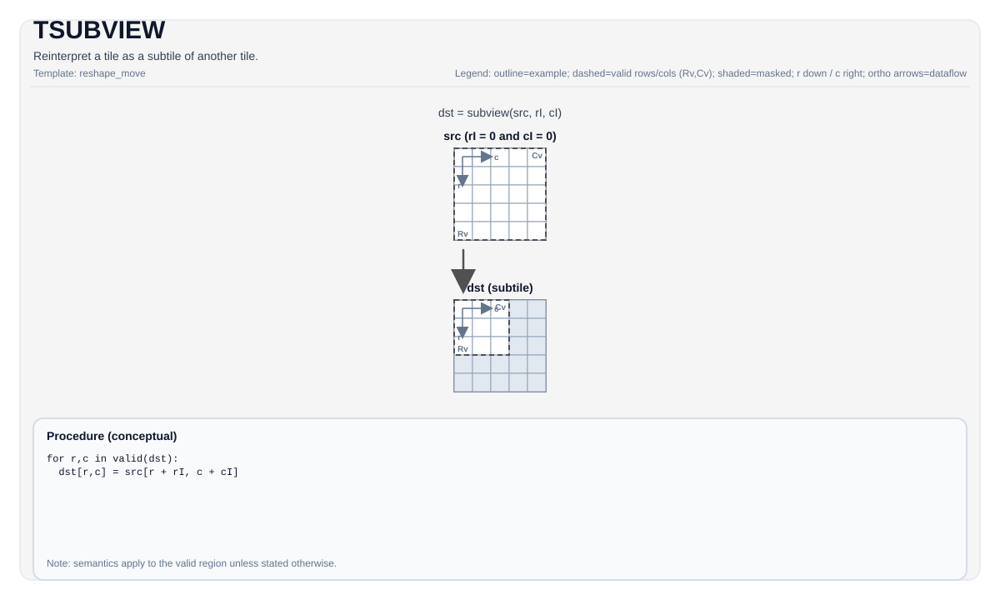

# TSUBVIEW


## Tile Operation Diagram
TODO
<!--  -->

## Introduction

Reinterpret a tile as a subtile of another tile.

## Assembly Syntax

PTO-AS form: see [PTO-AS Specification](../assembly/PTO-AS.md).


### IR Level 1 (SSA)
TODO

### IR Level 2 (DPS)
TODO


## C++ Intrinsic

Declared in `include/pto/common/pto_instr.hpp`:

```cpp
template <typename TileDataDst, typename TileDataSrc, typename... WaitEvents>
PTO_INST RecordEvent TSUBVIEW(TileDataDst &dst, TileDataSrc &src, uint16_t rowIdx, uint16_t colIdx, WaitEvents&... events);
```

## Constraints

Enforced by `TSUBVIEW_IMPL`:

- **Tile type must match**: `TileDataSrc::Loc == TileDataDst::Loc`.
- **Both tiles must have the same static capacity**: `TileDataSrc::Rows == TileDataDst::Rows` and `TileDataSrc::Cols == TileDataDst::Cols`.
- **Both tiles must have the same BLayout**: `TileDataSrc::BFractal == TileDataDst::BFractal`.
- **The source tile's validRow (validCol) is at least as big as the destination tile's validRow (validCol)**

## Examples

```cpp
#include <pto/pto-inst.hpp>

using namespace pto;

void example() {
  using Src = Tile<TileType::Vec, float, 4, 64, BLayout::RowMajor, 4, 64>;
  using Dst = Tile<TileType::Vec, float, 4, 64, BLayout::RowMajor, 2, 32>;

  Src src;
  Dst dst0;
  Dst dst1;
  Dst dst2;
  Dst dst3;

  // e.g. split into four 2x32 subtiles
  TSUBVIEW(dst0, src, 0, 0);
  TSUBVIEW(dst1, src, 0, 32);
  TSUBVIEW(dst2, src, 2, 0);
  TSUBVIEW(dst3, src, 2, 32);
}
```

## Math Interpretation

- `rowIdx`: the starting row index of the subtile in units of `dst.GetValidRow()`.
- `colIdx`: the starting column index of the subtile in units of `dst.GetValidCol()`.

## ASM Form Examples

### Auto Mode

TODO

### Manual Mode

TODO

### PTO Assembly Form

TODO

