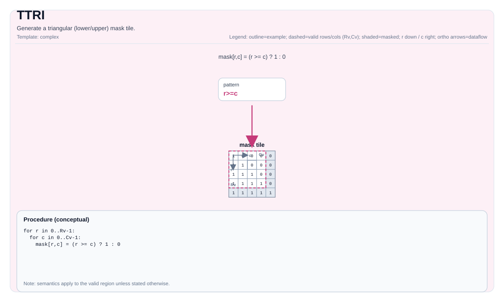

# TTRI

## 指令示意图



## 简介

生成三角（下/上）掩码 Tile。

## 数学语义

设 `R = dst.GetValidRow()`，`C = dst.GetValidCol()`，`d = diagonal`。

下三角（`isUpperOrLower=0`）概念上产生：

$$
\mathrm{dst}_{i,j} = \begin{cases}1 & j \le i + d \\\\ 0 & \text{否则}\end{cases}
$$

上三角（`isUpperOrLower=1`）概念上产生：

$$
\mathrm{dst}_{i,j} = \begin{cases}0 & j < i + d \\\\ 1 & \text{否则}\end{cases}
$$

## C++ 内建接口

声明于 `include/pto/common/pto_instr.hpp`：

```cpp
template <typename TileData, int isUpperOrLower, typename... WaitEvents>
PTO_INST RecordEvent TTRI(TileData &dst, int diagonal, WaitEvents &... events);
```

## 约束

- `isUpperOrLower` 必须是 `0`（下三角）或 `1`（上三角）。
- 目标 Tile 在某些目标上必须是行主序（参见 `include/pto/npu/*/TTri.hpp`）。

## 示例

参见 `docs/isa/` 和 `docs/coding/tutorials/` 中的相关示例。
