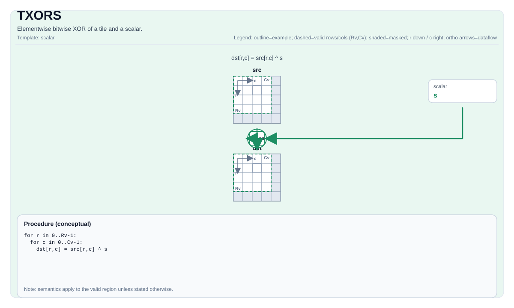

# TXORS

## 指令示意图



## 简介

Tile 与标量的逐元素按位异或。

## 数学语义

对每个元素 `(i, j)` 在有效区域内：

$$ \mathrm{dst}_{i,j} = \mathrm{src}_{i,j} \oplus \mathrm{scalar} $$

## C++ 内建接口

声明于 `include/pto/common/pto_instr.hpp`：

```cpp
template <typename TileDataDst, typename TileDataSrc, typename TileDataTmp, typename... WaitEvents>
PTO_INST RecordEvent TXORS(TileDataDst &dst, TileDataSrc &src0, typename TileDataSrc::DType scalar, TileDataTmp &tmp, WaitEvents &... events);
```

## 约束

- **实现检查 (A2A3)**:
    - 支持的元素类型为 `uint8_t`、`int8_t`、`uint16_t`、`int16_t`、`uint32_t`、`int32_t`。
    - `dst`、`src` 和 `tmp` 必须使用相同的元素类型。
    - 在手动模式下，源、目标和临时存储的内存区域不得重叠。
- **实现检查 (A5)**:
    - 支持的元素类型为 `uint8_t`、`int8_t`、`uint16_t`、`int16_t`、`uint32_t`、`int32_t`。
    - `dst` 和 `src` 的元素类型必须一致。
    - `dst` 和 `src` 必须使用行主序布局。
    - `src.GetValidRow()/GetValidCol()` 必须与 `dst` 一致。
- **有效区域**:
    - 该操作使用 `dst.GetValidRow()` / `dst.GetValidCol()` 作为迭代域。

## 临时空间

### A2A3

`tmp` **被使用**作为标量 XOR 分解的中间暂存存储。`tmp` 必须与 `dst` 具有相同的元素类型和有效形状。

### A5

`tmp` 被接口接受但 A5 实现**不使用**。A5 后端使用 `vxor` 向量指令配合广播标量寄存器，不需要暂存 Tile 存储。`tmp` 仅为了与 A2A3 的 API 兼容性而保留在 C++ 内建接口签名中。

## 示例

```cpp
#include <pto/pto-inst.hpp>

using namespace pto;

void example() {
  using TileDst = Tile<TileType::Vec, uint32_t, 16, 16>;
  using TileSrc = Tile<TileType::Vec, uint32_t, 16, 16>;
  using TileTmp = Tile<TileType::Vec, uint32_t, 16, 16>;
  TileDst dst;
  TileSrc src;
  TileTmp tmp;
  TXORS(dst, src, 0x1u, tmp);
}
```


